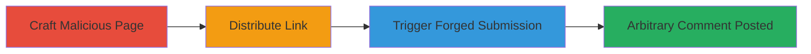

# WordPress CSRF in Comment Posting to Forge Arbitrary Comments

Multi-stage attack chain demonstrating a complete CSRF workflow to forge comments on a WordPress site.

## Chain Metrics Dashboard

| Metric | Value |
|--------|-------|
| Chain Status | Unverified |
| Total Steps | 3 |
| Execution Time | ~5 minutes |
| Skill Level | Intermediate |
| Complexity | Medium |
| Impact Level | Medium |

## Attack Flow Visualization

## Prerequisites & Requirements

### Required Tools

- None (relies on HTML crafting and social engineering)

### Target Environment

- WordPress site (version 5.4.2 or similar vulnerable versions)
- PHP backend
- Web platform with comment functionality enabled

### Initial Access Requirements

- Victim must be authenticated (logged in) to the target WordPress site
- Attacker needs a way to deliver the malicious link (e.g., email, social media)
- No direct network access to the target required; exploits user browser

## Detailed Attack Procedures

### Step 1: Craft Malicious Page
procedure: [[procedures/Craft-Malicious-CSRF-HTML-Page-for-WordPress-Comments]]

**Objective**: Create an HTML page that forges a POST request to the WordPress comment endpoint without CSRF token.

**Instructions**: Develop an HTML file with a hidden form targeting the wp-comments-post.php endpoint. Include JavaScript to push state and prevent navigation issues. Set form fields for comment content, post ID, and parent.

**Expected Output**: A self-contained HTML file ready for hosting or direct delivery.

**Success Indicators**:
- HTML page loads without errors
- Form fields match legitimate comment parameters

### Step 2: Distribute Link
procedure: [[procedures/Distribute-CSRF-Attack-Link-to-Authenticated-Victim]]

**Objective**: Deliver the malicious page to a logged-in user to initiate the attack.

**Instructions**: Host the HTML page on an attacker-controlled server or send it via email/DM. Ensure the victim is logged into the target WordPress site when they access the link.

**Expected Output**: Victim visits the page, triggering the form.

**Success Indicators**:
- Victim clicks the link
- Page loads in victim's browser while authenticated

### Step 3: Trigger Forgery
procedure: [[procedures/Execute-CSRF-Comment-Forgery-via-Browser-Submission]]

**Objective**: Submit the forged request to post unauthorized content.

**Instructions**: The victim's browser automatically or via prompt submits the POST to wp-comments-post.php, bypassing token checks due to the vulnerability.

**Expected Output**: Arbitrary comment appears on the target post.

**Success Indicators**:
- Comment posted successfully on post ID (e.g., 29)
- No CSRF errors in server logs

## Attack Chain Summary

### Key Achievements

1. Bypassed CSRF protection in WordPress comment submission
2. Forged arbitrary comments as the victim
3. Enabled spam or misinformation via user interaction

## Technique & Tactic Coverage

### MITRE ATT&CK Techniques

- [[Drive-by Compromise]]
- [[Exploit Public-Facing Application]]

### MITRE ATT&CK Tactics

- [[Initial Access]]

---
*Last updated: 2023-10-01T12:00:00Z*
