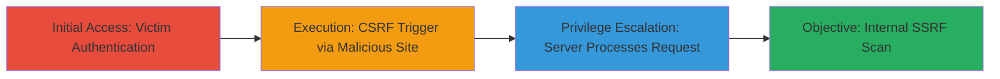

---
tags:
  - ssrf
  - csrf
  - wordpress
  - internal-scan
type: attack_chain
tools: []
tactics:
  - '[[Initial Access]]'
  - '[[Discovery]]'
verified: false
platforms:
  - Web
submitted: true
complexity: medium
created_at: '2024-10-01T00:00:00Z'
procedures:
  - '[[procedures/Trigger-CSRF-for-Press-This-Endpoint]]'
  - '[[procedures/Exploiting-SSRF-via-Internal-URL-Scan]]'
step_count: 4
techniques:
  - '[[Drive-by Compromise]]'
  - '[[Network Service Scanning]]'
updated_at: '2025-12-14T17:27:15.617Z'
description: >-
  A multi-stage attack leveraging CSRF to trigger SSRF in WordPress's Press This
  feature, allowing internal network scanning from an authenticated user's
  browser.
skill_level: intermediate
impact_level: high
id: 70a2d403-2f55-48fe-a68e-fce9f9d2c1e4
validated: true
mitre_tactics:
  - '[[Initial Access]]'
  - '[[Discovery]]'
mitre_techniques:
  - '[[Drive-by Compromise]]'
  - '[[Network Service Scanning]]'
---
# WordPress Internal SSRF Exploitation via CSRF in Press This Scan Feature

Multi-stage attack chain demonstrating a complete attack workflow exploiting CSRF to induce SSRF in WordPress, enabling attackers to scan internal services without direct access.

## Chain Metrics Dashboard

| Metric | Value |
|--------|-------|
| Chain Status | Unverified |
| Total Steps | 4 |
| Execution Time | ~5 minutes |
| Skill Level | Intermediate |
| Complexity | Medium |
| Impact Level | High |

## Attack Flow Visualization



## Prerequisites & Requirements

### Required Tools

- None (relies on HTML crafting and browser interaction)

### Target Environment

- WordPress instance with Press This feature enabled
- Required services/ports: Internal services on ports like 8080
- Network access requirements: Attacker controls a website; victim must be authenticated to target WordPress

### Initial Access Requirements

- No direct credentials needed; relies on victim's active session
- Network position: External attacker with victim visit to controlled site
- Prior access needed: None, but victim must be logged in

## Detailed Attack Procedures

### Step 1: Victim Authentication

procedure: [[procedures/Trigger-CSRF-for-Press-This-Endpoint]]

**Objective**: Ensure the victim has an active authenticated session on the target WordPress site, establishing the necessary cookies for CSRF exploitation.

**Instructions**: Instruct or wait for the victim to log in to their WordPress admin panel at http://myWordpress.com/wp-admin. No direct action from attacker; this step relies on social engineering or phishing to lure the victim to authenticate.

**Expected Output**: Victim's browser maintains session cookies for the WordPress domain.

**Success Indicators**:
- Victim confirms login or attacker observes session via subsequent interactions
- Browser developer tools show active WP cookies

### Step 2: Lure Victim to Malicious Site

procedure: [[procedures/Trigger-CSRF-for-Press-This-Endpoint]]

**Objective**: Trick the authenticated victim into visiting an attacker-controlled site that embeds a malicious img tag to trigger the CSRF request.

**Instructions**: Host a simple HTML page on attacker-controlled domain (e.g., evil.com) with the following img tag:

```html

```

Use protocol-relative URL (//) to inherit the victim's protocol and leverage their session. Distribute the link via phishing email or social engineering.

**Expected Output**: When the page loads, the browser automatically fetches the img src, sending the GET request to the victim's WordPress server.

**Success Indicators**:
- Network tab in browser dev tools shows the request to press-this.php
- No visible popup or alert to victim due to hidden img dimensions

### Step 3: Server Processes CSRF Request

procedure: [[procedures/Exploiting-SSRF-via-Internal-URL-Scan]]

**Objective**: The victim's WordPress server receives the unauthenticated GET request and parses the 'u' parameter without CSRF validation.

**Instructions**: The endpoint /wp-admin/press-this.php handles the query parameters 'u' and 'url-scan-submit=Scan'. Due to lack of CSRF token requirement for GET, it proceeds to process the scan.

**Expected Output**: Server internally triggers a scrape request to the provided URL in 'u'.

**Success Indicators**:
- Server logs (if accessible) show processing of press-this.php
- No error response; request succeeds silently

### Step 4: Execute Internal SSRF Scan

procedure: [[procedures/Exploiting-SSRF-via-Internal-URL-Scan]]

**Objective**: Force the WordPress server to send a GET request to an internal/private address, enabling reconnaissance of sensitive services.

**Instructions**: The 'u' parameter (e.g., http://0.0.0.0:8080) resolves to localhost:8080 on the server, bypassing external firewall restrictions. Test payloads like 127.0.0.1:8080 or localhost:8080 for different internal services.

**Expected Output**: Server-side GET request to internal endpoint; potential response data scraped back to WordPress (visible in logs or error outputs).

**Success Indicators**:
- Internal service logs show incoming request from WordPress server IP
- Attacker infers success via timing or follow-up probes if response leaks

## Attack Chain Summary

### Key Achievements

1. Bypassed CSRF protections via GET method exposure in Press This scan
2. Induced SSRF to access private IPs like 0.0.0.0:8080 without server-side validation
3. Enabled stealthy internal network scanning from external attacker position

## Technique & Tactic Coverage

### MITRE ATT&CK Techniques

- [[Drive-by Compromise]] Drive-by Compromise
- [[Network Service Scanning]] Network Service Scanning

### MITRE ATT&CK Tactics

- [[Initial Access]] Initial Access
- [[Discovery]] Discovery

---

*Last updated: 2024-10-01T00:00:00Z*
