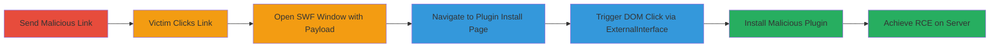

# WordPress Plupload Flash SOME Exploit Leading to RCE via Malicious Plugin Installation

Multi-stage attack chain demonstrating a complete attack workflow exploiting a Same-Origin Method Execution (SOME) vulnerability in WordPress's plupload.flash.swf file. Discovered in April 2016 by Cure53, this issue allows bypassing URL sanitization to execute arbitrary DOM methods via ExternalInterface callbacks, enabling remote code execution by automating the installation of a malicious plugin on an authenticated user's browser.

## Chain Metrics Dashboard

| Metric | Value |
|--------|-------|
| Chain Status | Unverified |
| Total Steps | 6 |
| Execution Time | ~2 minutes |
| Skill Level | Advanced |
| Complexity | High |
| Impact Level | High |

## Attack Flow Visualization

## Prerequisites & Requirements

### Required Tools

- None (relies on browser and WordPress environment)

### Target Environment

- WordPress site with admin access
- plupload.flash.swf present (pre-WordPress 4.6)
- Authenticated admin user

### Initial Access Requirements

- Ability to send phishing links to authenticated WordPress users
- Malicious plugin ZIP file hosted (e.g., wp-super-cache modified for RCE)
- No special credentials beyond social engineering

## Detailed Attack Procedures

### Step 1: Craft Malicious Link
procedure: [[procedures/Craft-Malicious-Link-for-WordPress-SOME-Exploit]]

**Objective**: Create a phishing link that, when clicked by an authenticated user, initiates the exploit by opening a new window with the crafted SWF payload.

**Instructions**: Prepare an HTML page or email with a button that executes JavaScript to open the exploit window. The link targets the plupload.flash.swf with encoded parameters to bypass sanitization.

**Expected Output**: A clickable link or button that triggers the fire() function upon interaction.

**Success Indicators**:
- Link generated and sent to victim
- Victim receives and opens the link

### Step 2: Victim Interaction to Trigger Exploit
procedure: [[procedures/Trigger-Exploit-via-Victim-Click]]

**Objective**: Lure the authenticated user to click the malicious link, starting the exploitation chain.

**Instructions**: Send the crafted link via email or chat, encouraging the user to click it while logged into the WordPress admin dashboard. Upon click, the onclick handler calls the fire() function, which opens a new window.

**Expected Output**: New browser window opens briefly before setting location to the SWF URL.

**Success Indicators**:
- Victim clicks the link
- New window opens

### Step 3: Open SWF Window with Crafted Payload
procedure: [[procedures/Open-SWF-Window-with-Crafted-Payload]]

**Objective**: Load the plupload.flash.swf in a new window with encoded flashVars to set malicious callbacks.

**Instructions**: The fire() function uses setTimeout to delay and set the window location to the SWF URL with payload like '%#target%g=opener.document.body.firstElementChild.nextElementSibling.nextElementSibling.nextElementSibling.firstElementChild.click&uid%g=hello&'. This bypasses the GET Killer sanitization.

**Expected Output**: SWF loads in new window with unsanitized parameters setting the target callback.

**Success Indicators**:
- SWF loads without errors
- Parameters are processed

### Step 4: Navigate to WordPress Plugin Install Page
procedure: [[procedures/Navigate-to-WordPress-Plugin-Install-Page]]

**Objective**: Redirect the original window to the plugin installation page to establish same-origin context for the SWF.

**Instructions**: Use setTimeout in the original script to navigate to 'http://example.com/wp-admin/plugin-install.php?tab=plugin-information&plugin=wp-super-cache&TB_iframe=true&width=600&height=550', ensuring the SWF can access the DOM.

**Expected Output**: Original window loads the plugin info page in an iframe-like view.

**Success Indicators**:
- Page loads with install button visible
- Same-origin established

### Step 5: Execute ExternalInterface Call for DOM Click
procedure: [[procedures/Execute-ExternalInterface-Call-for-DOM-Click]]

**Objective**: Use the SWF's ExternalInterface to execute a click() method on the install button via DOM traversal.

**Instructions**: The SWF's _fireEvent method processes the payload, calling opener.document.body.firstElementChild.nextElementSibling.nextElementSibling.nextElementSibling.firstElementChild.click() to simulate clicking the install button.

**Expected Output**: Install process initiates automatically.

**Success Indicators**:
- Button click event fires
- Plugin download starts

### Step 6: Install Malicious Plugin for RCE
procedure: [[procedures/Install-Malicious-Plugin-for-RCE]]

**Objective**: Complete the plugin installation, uploading and activating malicious code for server-side execution.

**Instructions**: The automated click triggers the WordPress plugin installer to download and install the malicious wp-super-cache plugin, which contains arbitrary PHP code for RCE.

**Expected Output**: Plugin installed and activated, executing backdoor code.

**Success Indicators**:
- Plugin appears in admin list
- Server-side code executes (e.g., shell access)

## Attack Chain Summary

### Key Achievements

1. Bypassed Flash sanitization using encoded payloads
2. Executed arbitrary DOM methods across windows
3. Automated admin actions leading to RCE

## Technique & Tactic Coverage

### MITRE ATT&CK Techniques

- [[Exploitation for Client Execution]] Exploitation for Client Software
- [[JavaScript]] JavaScript
- [[T1566.002]] Phishing: Spearphishing Link
- [[Exploit Public-Facing Application]] Exploit Public-Facing Application

### MITRE ATT&CK Tactics

- [[Initial Access]] Initial Access
- [[Execution]] Execution
- [[Persistence]] Persistence

---

*Last updated: 2024-01-01T00:00:00Z*
