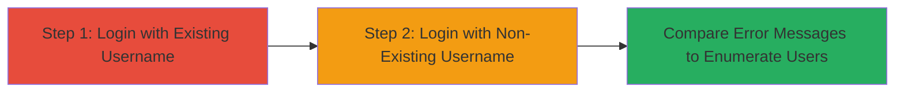

---
tags:
  - user-enumeration
  - wordpress
  - authentication
  - reconnaissance
type: attack_chain
tools: []
tactics:
  - '[[Discovery]]'
commands: []
verified: false
platforms:
  - Web
submitted: true
complexity: low
procedures:
  - '[[procedures/Attempt-Login-with-Existing-WordPress-Username]]'
  - '[[procedures/Attempt-Login-with-Non-Existing-WordPress-Username]]'
step_count: 2
techniques:
  - '[[Account Discovery]]'
description: >-
  A reconnaissance attack that exploits differences in WordPress wp-admin login
  error messages to identify valid usernames on the system.
skill_level: beginner
impact_level: low
id: 31d9a5af-ed71-4bff-bece-25cc329622bf
created_at: '2025-12-14T17:28:36.667Z'
updated_at: '2025-12-14T17:28:36.667Z'
validated: true
mitre_tactics:
  - '[[Discovery]]'
mitre_techniques:
  - '[[Account Discovery]]'
---
# WordPress User Enumeration via Inconsistent Login Error Messages

Multi-stage attack chain demonstrating a complete attack workflow for enumerating valid usernames in WordPress through login attempts.

## Chain Metrics Dashboard

| Metric | Value |
|--------|-------|
| Chain Status | Unverified |
| Total Steps | 2 |
| Execution Time | ~1 minutes |
| Skill Level | Beginner |
| Complexity | Low |
| Impact Level | Low |

## Attack Flow Visualization

## Prerequisites & Requirements

### Required Tools

- Web browser (e.g., Firefox or Chrome)

### Target Environment

- WordPress installation with wp-admin accessible
- HTTP/HTTPS access to the login page

### Initial Access Requirements

- Public network access to the WordPress site
- No credentials required

## Detailed Attack Procedures

### Step 1: Attempt Login with Existing Username
procedure: [[procedures/Attempt-Login-with-Existing-WordPress-Username]]

**Objective**: Trigger the specific error message for a valid username to confirm its existence.

**Instructions**: Navigate to the WordPress wp-admin login page and submit a login form using a suspected valid username (e.g., 'admin') paired with an incorrect password. Observe the error response.

**Expected Output**: Error message indicating "ERROR: The password you entered for the username [username] is incorrect."

**Success Indicators**:
- Specific password error for the username
- No generic invalid username message

### Step 2: Attempt Login with Non-Existing Username
procedure: [[procedures/Attempt-Login-with-Non-Existing-WordPress-Username]]

**Objective**: Trigger the generic error for invalid usernames to differentiate from valid ones.

**Instructions**: Using the same wp-admin login page, submit a login form with a fabricated non-existing username (e.g., 'nonexistentuser') and any password. Compare the response to the previous attempt.

**Expected Output**: Error message "Invalid username."

**Success Indicators**:
- Generic invalid username error
- Clear distinction from valid username response

## Attack Chain Summary

### Key Achievements

1. Identification of valid usernames through error message differences
2. Potential setup for further attacks like brute-force or phishing
3. Confirmation of WordPress's default authentication behavior

## Technique & Tactic Coverage

### MITRE ATT&CK Techniques

- [[Account Discovery]]

### MITRE ATT&CK Tactics

- [[Discovery]]

---
*Last updated: 2023-10-01T00:00:00Z*
