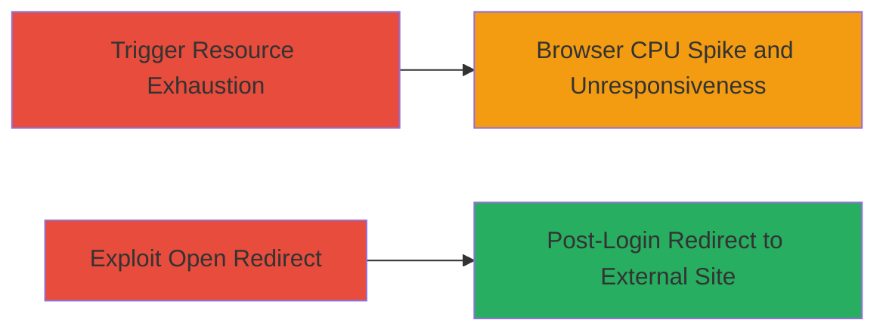

---
tags:
  - wordpress
  - resource-exhaustion
  - open-redirect
  - dos
  - client-side
type: attack_chain
tools: []
tactics:
  - '[[Impact]]'
  - '[[Initial Access]]'
commands: []
platforms:
  - Web
complexity: low
procedures:
  - >-
    [[procedures/Trigger-Client-Side-Resource-Exhaustion-via-Oversized-Numeric-IDs]]
  - '[[procedures/Exploit-Open-Redirect-in-WordPress-Login-Endpoint]]'
step_count: 2
techniques:
  - '[[Endpoint Denial of Service]]'
  - '[[Drive-by Compromise]]'
description: >-
  A multi-vulnerability attack chain exploiting resource exhaustion through
  oversized numeric IDs in WordPress.com URLs and an open redirect in the login
  endpoint to degrade user experience and potentially expose users to malicious
  external sites.
skill_level: beginner
impact_level: medium
id: 7a25a08f-3821-4f69-990c-a567b87f38a8
created_at: '2025-12-14T17:24:23.427Z'
updated_at: '2025-12-14T17:24:23.427Z'
verified: false
validated: true
submitted: true
mitre_tactics:
  - '[[Impact]]'
  - '[[Initial Access]]'
mitre_techniques:
  - '[[Endpoint Denial of Service]]'
  - '[[Drive-by Compromise]]'
---
# WordPress.com Client-Side Resource Exhaustion via Oversized IDs and Post-Login Open Redirect

Multi-stage attack chain demonstrating exploitation of two vulnerabilities in WordPress.com: a client-side resource exhaustion issue triggered by oversized numeric IDs leading to excessive tracking pixel requests and browser unresponsiveness, and an open redirect in the login process that allows redirection to arbitrary external sites after authentication. This chain can be used to degrade trusted user experiences or facilitate phishing-like attacks by luring victims to seemingly legitimate WordPress URLs.

## Chain Metrics Dashboard

| Metric | Value |
|--------|-------|
| Chain Status | Unverified |
| Total Steps | 2 |
| Execution Time | ~2 minutes |
| Skill Level | Beginner |
| Complexity | Low |
| Impact Level | Medium |

## Attack Flow Visualization

## Prerequisites & Requirements

### Required Tools

- Web browser (e.g., Chrome, Firefox)

### Target Environment

- WordPress.com web platform
- No specific services or ports required beyond standard HTTPS (443)
- Public access to WordPress.com URLs

### Initial Access Requirements

- No credentials needed for resource exhaustion
- Valid WordPress.com account for open redirect exploitation
- Victim must trust and open WordPress.com links

## Detailed Attack Procedures

### Step 1: Trigger Resource Exhaustion
procedure: [[procedures/Trigger-Client-Side-Resource-Exhaustion-via-Oversized-Numeric-IDs]]

**Objective**: Cause a denial-of-service-like effect on the victim's browser by triggering an exception that leads to unlimited requests to the pixel tracking endpoint, spiking CPU usage.

**Instructions**: Open a web browser and navigate to a crafted WordPress.com URL with an oversized numeric ID, such as:

https://wordpress.com/post/20000000000000000000000000000000000000000000000000000000000000000000000000000000000000000000000000000000000

Alternative URLs include https://wordpress.com/design/1000000000000000000000 or https://wordpress.com/pages/anurag.wordpress.com/-10000000000000000000000000000000000000000000000. The oversized ID exceeds variable limits, causing an exception and infinite loops of requests to https://pixel.wp.com/g.gif.

**Expected Output**: Browser becomes slow and unresponsive; task manager shows CPU usage reaching 99% due to repeated pixel requests.

**Success Indicators**:
- CPU utilization spikes to 99%
- Browser hangs or becomes unresponsive
- Network tab in developer tools shows unlimited requests to pixel.wp.com

### Step 2: Exploit Open Redirect
procedure: [[procedures/Exploit-Open-Redirect-in-WordPress-Login-Endpoint]]

**Objective**: Redirect an authenticated user to an arbitrary external site after login, potentially exposing them to malicious content or phishing.

**Instructions**: In a web browser, construct and visit the login URL with a manipulated redirect_to parameter, such as:

https://wordpress.com/wp-login.php?redirect_to=https%3A%2F%2Fgoogle.com%2Fsearch%3Fq%3DmyFakeSite&reauth=1

Complete the authentication process using valid credentials.

**Expected Output**: After login, the user is redirected to the specified external URL, e.g., https://www.google.co.in/search?q=myFakeSite&gws_rd=cr&ei=WLYGV8fUHIq8uATj56uIBA.

**Success Indicators**:
- Successful login completion
- Automatic redirect to the external domain
- No validation errors on the redirect parameter

## Attack Chain Summary

### Key Achievements

1. Induced client-side denial of service affecting browser performance on trusted WordPress.com links
2. Bypassed redirect validation to send authenticated users to external sites, enabling potential phishing or exposure to vulnerabilities
3. Demonstrated combined impact on user experience degradation and security risks without server-side compromise

## Technique & Tactic Coverage

### MITRE ATT&CK Techniques

- [[Endpoint Denial of Service]]
- [[Drive-by Compromise]]

### MITRE ATT&CK Tactics

- [[Impact]]
- [[Initial Access]]

---
*Last updated: 2023-10-01T00:00:00Z*
