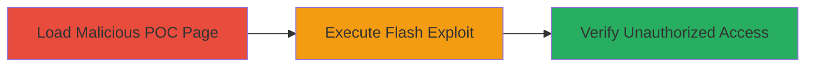

---
tags:
  - cross-site-flashing
  - oauth-bypass
  - flash-exploit
  - wordpress
type: attack_chain
tools:
  - '[[tools/Flash-SWF-Malicious]]'
tactics:
  - '[[Initial Access]]'
verified: false
platforms:
  - Web
submitted: true
complexity: medium
created_at: '2023-10-01T00:00:00Z'
procedures:
  - '[[procedures/Exploit-Cross-Site-Flashing-for-OAuth-Bypass]]'
step_count: 3
techniques:
  - '[[Exploit Public-Facing Application]]'
  - '[[Exploitation for Client Execution]]'
updated_at: '2025-12-14T17:32:10.869Z'
description: >-
  Exploits misconfigured crossdomain.xml to inject malicious Flash code from
  yimg.com, bypassing OAuth for unauthorized access to WordPress.com accounts.
skill_level: intermediate
impact_level: high
id: 0b2e8d9a-626e-46a1-811d-a83ad3c86eed
validated: true
mitre_tactics:
  - '[[Initial Access]]'
mitre_techniques:
  - '[[Exploit Public-Facing Application]]'
  - '[[Exploitation for Client Execution]]'
---
# WordPress.com OAuth Bypass via Cross-Site Flashing

Multi-stage attack chain demonstrating a complete attack workflow exploiting a misconfigured crossdomain.xml file to enable Cross-Site Flashing attacks on WordPress.com's public API.

## Chain Metrics Dashboard

| Metric | Value |
|--------|-------|
| Chain Status | Unverified |
| Total Steps | 3 |
| Execution Time | ~1 minute |
| Skill Level | Intermediate |
| Complexity | Medium |
| Impact Level | High |

## Attack Flow Visualization

## Prerequisites & Requirements

### Required Tools

- [[tools/Flash-SWF-Malicious]]

### Target Environment

- Web platform
- WordPress.com public API services
- Flash-enabled browser

### Initial Access Requirements

- Victim logged into WordPress.com
- Access to a webpage hosting the malicious SWF (e.g., via phishing or drive-by)
- No special credentials needed beyond victim's session

## Detailed Attack Procedures

### Step 1: Load the POC Webpage
procedure: [[procedures/Exploit-Cross-Site-Flashing-for-OAuth-Bypass]]

**Objective**: Deliver the malicious Flash content to the victim's browser to initiate cross-domain requests.

**Instructions**: Direct the victim to access the proof-of-concept webpage at http://opnsec.com/wp/hunger.html. This page loads a malicious SWF file hosted on a yimg.com domain, leveraging the permissive crossdomain.xml policy at https://public-api.wordpress.com/crossdomain.xml.

**Expected Output**: The SWF file embeds and begins execution in the browser, potentially producing audio noise (mute system sound recommended).

**Success Indicators**:
- SWF loads without errors
- Browser console or network tab shows requests to yimg.com

### Step 2: Wait for the Flash Exploit to Execute
procedure: [[procedures/Exploit-Cross-Site-Flashing-for-OAuth-Bypass]]

**Objective**: Allow the injected Flash code to perform unauthorized cross-domain requests to WordPress.com's OAuth endpoints.

**Instructions**: Wait 10-20 seconds for the Flash code to send arbitrary requests to https://public-api.wordpress.com/oauth2/ endpoints and read the responses, bypassing the standard OAuth flow.

**Expected Output**: Network traffic shows requests from the yimg.com-hosted SWF to WordPress.com API, including OAuth token exchanges.

**Success Indicators**:
- Requests observed in browser dev tools to public-api.wordpress.com
- No user prompts for authorization

### Step 3: Verify Unauthorized Access
procedure: [[procedures/Exploit-Cross-Site-Flashing-for-OAuth-Bypass]]

**Objective**: Confirm that the attacker's application has gained full access to the victim's WordPress.com account.

**Instructions**: Check the attacker's registered app (e.g., 'OauthBypasss') for granted scopes and access tokens. If the victim was logged in, the app now has full authorization without further interaction.

**Expected Output**: Attacker's app dashboard shows active tokens and access to victim data.

**Success Indicators**:
- Unauthorized app listed in victim's connected apps
- Attacker can read/write victim account data

## Attack Chain Summary

### Key Achievements

1. Bypassed OAuth authorization using Cross-Site Flashing
2. Gained full access to victim WordPress.com account
3. Exploited crossdomain.xml misconfiguration for cross-origin API access

## Technique & Tactic Coverage

### MITRE ATT&CK Techniques

- [[Exploit Public-Facing Application]]
- [[Exploitation for Client Execution]]

### MITRE ATT&CK Tactics

- [[Initial Access]]

---

*Last updated: 2023-10-01T00:00:00Z*
