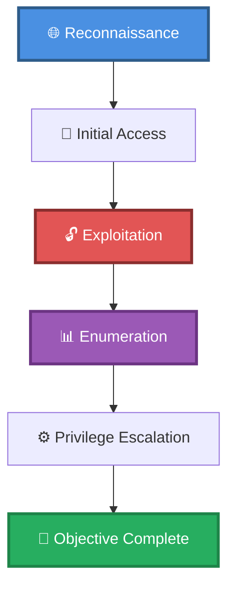

# 🎯 Wordpress RCE Chain w/ Reverse Shell & Linux Priv Esc

> **Enhanced Attack Chain Dashboard** — Privilege Escalation Chain

---

## 📊 Chain Metrics Dashboard

| Metric | Value |
|--------|-------|
| **Chain Status** | ⚠️ **UNVERIFIED** |
| **Total Steps** | `8` |
| **Execution Time** | ~2-4 hours |
| **Skill Level** | 🟡 Intermediate-Advanced |
| **Complexity** | High |
| **Impact Level** | 🔴 **CRITICAL** |

---

## 🎭 Attack Flow Visualization



---

## 🛠️ Prerequisites & Requirements

### Required Tools
```bash path=null start=null
wordpress            # CMS enumeration
```

### Target Environment
- ✅ Linux target system
- ✅ Web application target
- ✅ Network connectivity to target

### Initial Access Requirements
- 🔓 Requirements based on first step of chain
- 🔓 See detailed procedures below

---

## 🔬 Detailed Attack Procedures

### **[Step 1]** Thorough Port Scan with Service Enumeration

**Progress:** `█░░░░░░░░░` 12% | **Risk:** 🟢 Low

**Procedure:** [[Thorough Port Scan with Service Enumeration]]

> 📝 **Objective:** Query a computer's services by probing the ports on which it listens. Since each system potentially has 65,535 ports for TCP and UDP, it's often best to perform multiple scans, each focusing on a different technique or port range.

**Expected Output:**
- Refer to procedure documentation for details

**Success Indicators:** ✅ Objective achieved

---

### **[Step 2]** Directory Brute Force a Web App (Wfuzz)

**Progress:** `██░░░░░░░░` 25% | **Risk:** 🟢 Low

**Procedure:** [[Directory Brute Force a Web App (Wfuzz)]]

> 📝 **Objective:** Enumerate a webs app's files and folders by performing a dictionary brute force attack.

**Expected Output:**
- Refer to procedure documentation for details

**Success Indicators:** ✅ Objective achieved

---

### **[Step 3]** Extract a Hidden File In an Image Using Steghide

**Progress:** `███░░░░░░░` 37% | **Risk:** 🟡 Medium

**Procedure:** [[Extract a Hidden File In an Image Using Steghide]]

> 📝 **Objective:** Extract a file hidden in an image (or audio file) using Steghide's steganography tools.

**Expected Output:**
- Refer to procedure documentation for details

**Success Indicators:** ✅ Objective achieved

---

### **[Step 4]** Enumerate a Web CMS for Usernames and Passwords

**Progress:** `█████░░░░░` 50% | **Risk:** 🟢 Low

**Procedure:** [[Enumerate a Web CMS for Usernames and Passwords]]

> 📝 **Objective:** Many websites reveal usernames and potential passwords in the pages themselves, hidden files, and configuration files. By enumerating a site's content with tools, username and password lists can be generated and used for login brute forcing.

**Expected Output:**
- Refer to procedure documentation for details

**Success Indicators:** ✅ Objective achieved

---

### **[Step 5]** Add and Execute Code on a WordPress Site (Authenticated)

**Progress:** `██████░░░░` 62% | **Risk:** 🟡 Medium

**Procedure:** [[Add and Execute Code on a WordPress Site (Authenticated)]]

> 📝 **Objective:** Authenticated users with the ability to edit themes can easily add PHP code to a WordPress site, which will be executed as the web application's user.

**Expected Output:**
- Refer to procedure documentation for details

**Success Indicators:** ✅ Objective achieved

---

### **[Step 6]** Upgrade from a Website RCE to Reverse Shell (Linux)

**Progress:** `███████░░░` 75% | **Risk:** 🔴 High

**Procedure:** [[Upgrade from a Website RCE to Reverse Shell (Linux)]]

> 📝 **Objective:** In cases where Remote Code Execution (RCE) is achieved on a web application, the next step is usually to launch a reverse shell for terminal access. This procedure will outline a few common approaches.

**Expected Output:**
- Refer to procedure documentation for details

**Success Indicators:** ✅ Objective achieved

---

### **[Step 7]** Enumerate Linux Privilege Escalation Paths (LinEnum)

**Progress:** `████████░░` 87% | **Risk:** 🟢 Low

**Procedure:** [[Enumerate Linux Privilege Escalation Paths (LinEnum)]]

> 📝 **Objective:** Automatically enumerate a Linux or Unix file environment, scanning for vulnerabilities such as permission issues, security misconfigurations, vulnerable software versions, etc.

**Expected Output:**
- Refer to procedure documentation for details

**Success Indicators:** ✅ Objective achieved

---

### **[Step 8]** Change Password in a Writable /etc/passwd

**Progress:** `██████████` 100% | **Risk:** 🟡 Medium

**Procedure:** [[Change Password in a Writable /etc/passwd]]

> 📝 **Objective:** When /etc/passwd is writable, it is possible to change a user's password by entering the password hash. Passwords in /etc/passwd take priority over those found in /etc/shadow  for legacy reasons, though the same technique can be applied when /etc/shadow is writable.

**Expected Output:**
- Refer to procedure documentation for details

**Success Indicators:** ✅ Objective achieved

---

## 🎯 Attack Chain Summary

### Key Achievements
- ✅ Directory Brute Force a Web App (Wfuzz)
- ✅ Upgrade from a Website RCE to Reverse Shell (Linux)
- ✅ Enumerate Linux Privilege Escalation Paths (LinEnum)
- ✅ Change Password in a Writable /etc/passwd
- ✅ Extract a Hidden File In an Image Using Steghide
- ... and 3 more procedures

---

## 📈 Technique & Tactic Coverage

---

**Last Updated:** 2023-05-29T16:48:53.162677+00:00 | **Chain Version:** 2.0 Enhanced | **Status:** ⚠️ Draft
