# 🎯 Wordpress RCE Chain w/ Reverse Shell (auth)

> **Enhanced Attack Chain Dashboard**

---

## 📊 Chain Metrics Dashboard

| Metric | Value |
|--------|-------|
| **Chain Status** | ⚠️ **UNVERIFIED** |
| **Total Steps** | `8` |
| **Execution Time** | ~2-4 hours |
| **Skill Level** | 🔴 Advanced |
| **Complexity** | High |
| **Impact Level** | 🟠 **HIGH** |

---

## 🎭 Attack Flow Visualization

```mermaid
graph TD
    A[🌐 Reconnaissance]
    B[🎯 Initial Access]
    C[🔓 Exploitation]
    D[📊 Enumeration]
    E[⚙️ Privilege Escalation]
    F[👑 Objective Complete]
    A --> B
    B --> C
    C --> D
    D --> E
    E --> F
    
    style A fill:#4a90e2,stroke:#2e5c8a,stroke-width:3px,color:#fff
    style C fill:#e25555,stroke:#8a2e2e,stroke-width:3px,color:#fff
    style D fill:#9b59b6,stroke:#6c3483,stroke-width:3px,color:#fff
    style F fill:#27ae60,stroke:#1e8449,stroke-width:3px,color:#fff
```



---

## 🛠️ Prerequisites & Requirements

### Required Tools
```bash path=null start=null
nmap                 # Port scanning
wordpress            # CMS enumeration
```

### Target Environment
- ✅ Linux target system
- ✅ Web application target
- ✅ Network connectivity to target

### Initial Access Requirements
- 🔓 Requirements based on first step of chain
- 🔓 See detailed procedures below

---

## 🔬 Detailed Attack Procedures

### **[Step 1]** Basic Port Scan with Service Enumeration

**Progress:** `█░░░░░░░░░` 12% | **Risk:** 🟢 Low

**Procedure:** [[Basic Port Scan with Service Enumeration]]

> 📝 **Objective:** Perform an Nmap port scan on a target and enumerate banners of ports 1-1024, as well as popular services (a full list can be found in /usr/share/nmap/nmap-services).

**Expected Output:**
- Refer to procedure documentation for details

**Success Indicators:** ✅ Objective achieved

---

### **[Step 2]** Directory Brute Force a Web App (Wfuzz)

**Progress:** `██░░░░░░░░` 25% | **Risk:** 🟢 Low

**Procedure:** [[Directory Brute Force a Web App (Wfuzz)]]

> 📝 **Objective:** Enumerate a webs app's files and folders by performing a dictionary brute force attack.

**Expected Output:**
- Refer to procedure documentation for details

**Success Indicators:** ✅ Objective achieved

---

### **[Step 3]** Brute Force Valid Users from a Forgotten Password Form

**Progress:** `███░░░░░░░` 37% | **Risk:** 🔴 High

**Procedure:** [[Brute Force Valid Users from a Forgotten Password Form]]

> 📝 **Objective:** Website login forms often include a 'Forgot Your Password' feature to help users retrieve their passwords. Many of these forms display a different message depending on whether a valid username was entered, allowing attackers to enumerate valid usernames.

**Expected Output:**
- Refer to procedure documentation for details

**Success Indicators:** ✅ Objective achieved

---

### **[Step 4]** Brute Force a Web Login Form

**Progress:** `█████░░░░░` 50% | **Risk:** 🔴 High

**Procedure:** [[Brute Force a Web Login Form]]

> 📝 **Objective:** In order to brute force a web login, required fields such as Cookies, HTTP methods, and additional parameters must be verified. This can be done using an HTTP proxy such as Burp Suite's proxy.

**Expected Output:**
- Refer to procedure documentation for details

**Success Indicators:** ✅ Objective achieved

---

### **[Step 5]** Add and Execute Code on a WordPress Site (Authenticated)

**Progress:** `██████░░░░` 62% | **Risk:** 🟡 Medium

**Procedure:** [[Add and Execute Code on a WordPress Site (Authenticated)]]

> 📝 **Objective:** Authenticated users with the ability to edit themes can easily add PHP code to a WordPress site, which will be executed as the web application's user.

**Expected Output:**
- Refer to procedure documentation for details

**Success Indicators:** ✅ Objective achieved

---

### **[Step 6]** Upgrade from a Website RCE to Reverse Shell (Linux)

**Progress:** `███████░░░` 75% | **Risk:** 🔴 High

**Procedure:** [[Upgrade from a Website RCE to Reverse Shell (Linux)]]

> 📝 **Objective:** In cases where Remote Code Execution (RCE) is achieved on a web application, the next step is usually to launch a reverse shell for terminal access. This procedure will outline a few common approaches.

**Expected Output:**
- Refer to procedure documentation for details

**Success Indicators:** ✅ Objective achieved

---

### **[Step 7]** Find Linux Files with Elevated Privileges

**Progress:** `████████░░` 87% | **Risk:** 🟡 Medium

**Procedure:** [[Find Linux Files with Elevated Privileges]]

> 📝 **Objective:** Linux and *nix systems include features which allow certain programs to run with elevated privileges. This is a requirement for many system services, but occasionally these programs may allow attackers to execute arbitrary commands. Setuid - Programs with this permission set can run commands as the

**Expected Output:**
- Refer to procedure documentation for details

**Success Indicators:** ✅ Objective achieved

---

### **[Step 8]** Nmap Interactive Mode Shell Escape

**Progress:** `██████████` 100% | **Risk:** 🔴 High

**Procedure:** [[Nmap Interactive Mode Shell Escape]]

> 📝 **Objective:** Older versions of Nmap (2.02 to 5.21) include an interactive mode which can allow attackers to escape to a shell. This vulnerability can lead to privilege escalation, as Nmap is occasionally configured with SUID access rights in order for low privilege users access to features requiring root privil

**Expected Output:**
- Refer to procedure documentation for details

**Success Indicators:** ✅ Objective achieved

---

## 🎯 Attack Chain Summary

### Key Achievements
- ✅ Directory Brute Force a Web App (Wfuzz)
- ✅ Upgrade from a Website RCE to Reverse Shell (Linux)
- ✅ Nmap Interactive Mode Shell Escape
- ✅ Find Linux Files with Elevated Privileges
- ✅ Basic Port Scan with Service Enumeration
- ... and 3 more procedures

---

## 📈 Technique & Tactic Coverage

---

**Last Updated:** 2023-05-29T16:48:53.162677+00:00 | **Chain Version:** 2.0 Enhanced | **Status:** ⚠️ Draft
