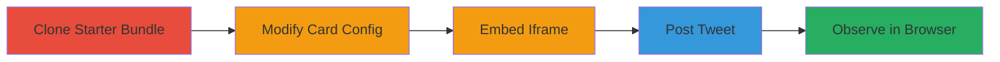

# Wormable Clickjacking via Twitter Player Cards

Multi-stage attack chain demonstrating a complete clickjacking workflow exploiting Twitter's Player Card feature to frame Twitter pages in iframes within tweets, bypassing protections and enabling wormable attacks where users are tricked into performing actions like tweeting arbitrary content.

## Chain Metrics Dashboard

| Metric | Value |
|--------|-------|
| Chain Status | Unverified |
| Total Steps | 5 |
| Execution Time | ~15 minutes |
| Skill Level | Intermediate |
| Complexity | Medium |
| Impact Level | High |

## Attack Flow Visualization

## Prerequisites & Requirements

### Required Tools

- Web browser (Safari or IE for exploitation)
- Text editor for HTML modification
- Twitter account with whitelisted domain access

### Target Environment

- Twitter (now X) platform
- Web-based, no specific ports required
- Requires a whitelisted domain for Player Card rendering

### Initial Access Requirements

- Valid Twitter account
- Access to a whitelisted domain for hosting custom HTML
- No prior network access needed beyond internet connectivity

## Detailed Attack Procedures

### Step 1: Clone Starter Bundle
procedure: [[procedures/Clone-Twitter-Player-Card-Starter-Bundle]]

**Objective**: Obtain the official Twitter Player Card starter bundle to analyze and modify for embedding custom content.

**Instructions**: Download the starter bundle from the official GitHub repository. Unzip and review the documentation to understand the _twitter:player_ property configuration.

**Expected Output**: Local copy of the starter bundle files, including sample HTML and configuration examples.

**Success Indicators**:
- Bundle downloaded successfully
- Documentation accessible for review

### Step 2: Modify Card Config
procedure: [[procedures/Modify-Player-Card-to-Point-to-Custom-HTML]]

**Objective**: Alter the Player Card configuration to reference a custom HTML file hosted on a whitelisted domain, setting up for iframe embedding.

**Instructions**: Edit the card's metadata, specifically the _twitter:player_ property, to point to your custom HTML URL. Ensure the domain is whitelisted by Twitter for card rendering.

**Expected Output**: Updated configuration file ready for hosting.

**Success Indicators**:
- Property modified without syntax errors
- URL points to controllable custom HTML

### Step 3: Embed Iframe in HTML
procedure: [[procedures/Embed-Twitter-Iframe-in-Custom-HTML]]

**Objective**: Insert an iframe sourcing a Twitter page into the custom HTML, using sandbox attributes to disable frame-busting JavaScript.

**Instructions**: In the custom HTML file, add an <iframe src="//twitter.com/some-page"></iframe> element. Apply sandbox="allow-scripts allow-same-origin" to prevent JS frame-busters while allowing basic functionality. Overlay transparent bait elements for clickjacking.

**Expected Output**: HTML file with embedded, sandboxed Twitter iframe ready for overlay attacks.

**Success Indicators**:
- Iframe loads Twitter content without frame-busting
- Sandbox disables protections

### Step 4: Post Tweet with Link
procedure: [[procedures/Post-Modified-Link-as-Tweet]]

**Objective**: Share the custom Player Card URL as a tweet to trigger rendering of the embedded iframe on Twitter timelines.

**Instructions**: Log into Twitter and post a tweet containing the URL to the modified Player Card. Verify the tweet renders the card correctly.

**Expected Output**: Tweet published with expandable Player Card visible.

**Success Indicators**:
- Tweet posted successfully
- Card expands to show custom HTML content

### Step 5: Observe in Unsupported Browsers
procedure: [[procedures/Observe-Clickjacking-in-Unsupported-Browsers]]

**Objective**: Demonstrate the clickjacking by expanding the tweet in browsers lacking CSP frame-ancestors support, confirming overlay and action hijacking.

**Instructions**: Open the tweet in Safari or Internet Explorer, expand the Player Card, and interact with overlaid bait to trigger unintended Twitter actions like following or tweeting.

**Expected Output**: Framed Twitter page visible, with clicks redirected to malicious actions.

**Success Indicators**:
- Twitter page framed without restrictions
- User actions (e.g., tweet, follow) performed unknowingly
- Potential for wormable spread via auto-tweeting

## Attack Chain Summary

### Key Achievements

1. Bypassed X-Frame-Options via nested origins and sandboxing
2. Exploited lack of CSP frame-ancestors in Safari/IE
3. Enabled wormable attacks through subtle UI redressing on tweets
4. Demonstrated high impact on user interactions and promoted content

## Technique & Tactic Coverage

### MITRE ATT&CK Techniques

- [[Drive-by Compromise]]

### MITRE ATT&CK Tactics

- [[Initial Access]]

---
*Last updated: 2023-10-01T00:00:00Z*
