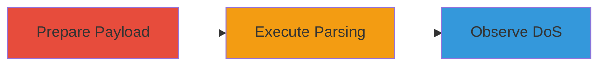

---
tags:
  - xxe
  - dos
  - billion-laughs
  - java
type: attack_chain
tools:
  - '[[tools/Java-JDK]]'
tactics:
  - '[[Reconnaissance]]'
  - '[[Lateral Movement]]'
commands:
  - '[[commands/run-java-client]]'
platforms:
  - Java
complexity: medium
procedures:
  - '[[procedures/Prepare-Malicious-XML-Payload]]'
  - '[[procedures/Execute-Java-Client-to-Parse-XML]]'
  - '[[procedures/Observe-JVM-Memory-Exhaustion]]'
step_count: 3
techniques:
  - '[[Endpoint Denial of Service]]'
  - '[[Exploit Public-Facing Application]]'
description: >-
  Exploits XML entity expansion vulnerability in Pippo JAXB engine to cause
  denial-of-service through memory exhaustion.
skill_level: intermediate
impact_level: high
id: a277c6a6-cfb3-433b-bbca-608429e4c2b4
created_at: '2025-12-13T09:00:27.238Z'
updated_at: '2025-12-13T09:00:27.238Z'
verified: false
validated: true
submitted: true
mitre_tactics:
  - '[[Reconnaissance]]'
  - '[[Lateral Movement]]'
mitre_techniques:
  - '[[Endpoint Denial of Service]]'
  - '[[Exploit Public-Facing Application]]'
---
# XML Entity Expansion DoS via Pippo JAXB Engine

Multi-stage attack chain demonstrating exploitation of an XML entity expansion vulnerability (Billion Laughs Attack) in the Pippo JAXB engine, leading to denial-of-service by exhausting JVM heap memory.

## Chain Metrics Dashboard

| Metric | Value |
|--------|-------|
| Chain Status | Unverified |
| Total Steps | 3 |
| Execution Time | ~5 minutes |
| Skill Level | Intermediate |
| Complexity | Medium |
| Impact Level | High |

## Attack Flow Visualization



## Prerequisites & Requirements

### Required Tools

- [[tools/Java-JDK]]

### Target Environment

- Java-based application using Pippo JAXB engine
- No specific ports required
- Local or direct access to run the Java client

### Initial Access Requirements

- Ability to supply XML input to the JAXB engine via a client program
- No credentials needed
- Local execution environment

## Detailed Attack Procedures

### Step 1: Prepare Malicious XML Payload
procedure: [[procedures/Prepare-Malicious-XML-Payload]]

**Objective**: Create an XML file with recursive entity definitions to trigger the Billion Laughs Attack.

**Instructions**: Craft an XML payload containing recursive entity expansions, such as defining entities PERSON1 to PERSON9 that build up exponential expansions. Save this as a resource file for the Java client.

**Expected Output**: A valid XML file with DTD entities ready for parsing.

**Success Indicators**:
- XML payload file created
- Entities defined recursively

### Step 2: Execute Java Client to Parse XML
procedure: [[procedures/Execute-Java-Client-to-Parse-XML]]

**Objective**: Run a Java program that loads and parses the malicious XML using JaxbEngine.fromString().

**Instructions**: Compile and run the Java client using [[commands/run-java-client]]:

```bash
java -cp .:pippo-jaxb.jar ClientProgram malicious.xml Person.class
```

The code should load the XML from a resource stream, instantiate JaxbEngine, and call fromString(payload, Person.class).

**Expected Output**: The parsing process begins, triggering entity expansion.

**Success Indicators**:
- Java program executes without initial errors
- Parsing initiates

### Step 3: Observe JVM Memory Exhaustion
procedure: [[procedures/Observe-JVM-Memory-Exhaustion]]

**Objective**: Monitor the JVM for memory consumption and crash due to OutOfMemoryError.

**Instructions**: Watch the process memory usage as the recursive expansion consumes heap memory, leading to exhaustion and termination.

**Expected Output**: JVM throws OutOfMemoryError and crashes.

**Success Indicators**:
- Memory usage spikes
- Process terminates with error

## Attack Chain Summary

### Key Achievements

1. Successful creation of malicious XML payload
2. Triggering of unsafe XML parsing in Pippo JAXB
3. Achievement of denial-of-service through memory exhaustion

## Technique & Tactic Coverage

### MITRE ATT&CK Techniques

- [[Endpoint Denial of Service]]
- [[Exploit Public-Facing Application]]

### MITRE ATT&CK Tactics

- [[Reconnaissance]]
- [[Lateral Movement]]

*Last updated: 2023-10-01*
