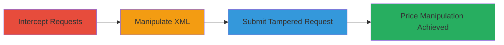

---
tags:
  - parameter-tampering
  - xml
  - e-commerce
  - price-manipulation
  - web-vulnerability
type: attack_chain
tools:
  - '[[tools/Burp-Suite]]'
tactics:
  - '[[Initial Access]]'
  - '[[Impact]]'
verified: false
platforms:
  - Web
submitted: true
complexity: medium
created_at: '2023-10-01T00:00:00Z'
procedures:
  - '[[procedures/Intercept-Checkout-POST-Requests-Using-Proxy]]'
  - '[[procedures/Modify-XML-Payload-to-Alter-Prices]]'
  - '[[procedures/Forward-Tampered-Checkout-Request]]'
step_count: 3
techniques:
  - '[[Exploit Public-Facing Application]]'
updated_at: '2025-12-14T17:28:28.464Z'
description: >-
  Multi-stage attack exploiting insufficient server-side validation of XML
  payloads in Adobe's shopping cart checkout to manipulate product prices and
  enable unauthorized discounts or free purchases.
skill_level: intermediate
impact_level: high
id: 353b4151-465a-40a2-9b38-f62d841d373b
validated: true
mitre_tactics:
  - '[[Initial Access]]'
  - '[[Impact]]'
mitre_techniques:
  - '[[Exploit Public-Facing Application]]'
---
# XML Parameter Tampering in Adobe E-Commerce Checkout for Price Manipulation

Multi-stage attack chain demonstrating exploitation of parameter tampering in Adobe's shopping cart checkout workflow via unvalidated XML payloads, allowing arbitrary price manipulation for financial gain.

## Chain Metrics Dashboard

| Metric | Value |
|--------|-------|
| Chain Status | Unverified |
| Total Steps | 3 |
| Execution Time | ~5 minutes |
| Skill Level | Intermediate |
| Complexity | Medium |
| Impact Level | High |

## Attack Flow Visualization

## Prerequisites & Requirements

### Required Tools

- [[tools/Burp-Suite]]

### Target Environment

- Web-based e-commerce platform (e.g., Adobe systems)
- Active shopping cart checkout workflow with XML POST requests
- Network access to the target site

### Initial Access Requirements

- Valid session or ability to add items to cart
- Proxy interception capability
- No special credentials beyond user-level access

## Detailed Attack Procedures

### Step 1: Intercept Checkout POST Requests
procedure: [[procedures/Intercept-Checkout-POST-Requests-Using-Proxy]]

**Objective**: Capture the POST request containing the XML payload during the shopping cart checkout process to identify price parameters.

**Instructions**: Configure a proxy tool like Burp Suite to intercept traffic. Navigate to the target's shopping cart, add items, and proceed to checkout to trigger the POST request. Inspect the request for XML structure with price elements.

**Expected Output**: Intercepted POST request body showing XML with product details and price tags.

**Success Indicators**:
- Proxy captures the checkout POST request
- XML payload visible with modifiable price parameters

### Step 2: Manipulate XML Payload
procedure: [[procedures/Modify-XML-Payload-to-Alter-Prices]]

**Objective**: Alter the price values within the XML payload to set arbitrary amounts, such as zero or reduced prices.

**Instructions**: In the proxy tool, edit the intercepted request's XML body. Locate price-related tags (e.g., <price> tags) and change their values (e.g., from "100.00" to "0.00"). Ensure the XML remains well-formed to avoid parsing errors.

**Expected Output**: Modified XML payload with tampered price values.

**Success Indicators**:
- XML edited without syntax errors
- Price parameters successfully changed to desired values

### Step 3: Submit Tampered Request
procedure: [[procedures/Forward-Tampered-Checkout-Request]]

**Objective**: Forward the modified request to the server to process the order with manipulated prices, resulting in unauthorized discounts.

**Instructions**: From the proxy interface, forward the tampered POST request to the server. Monitor the response for successful order confirmation and verify the applied prices in the order summary.

**Expected Output**: Server response confirming order placement with the altered prices.

**Success Indicators**:
- Order processes without errors
- Checkout completes with manipulated prices, leading to financial impact

## Attack Chain Summary

### Key Achievements

1. Successful interception and identification of vulnerable XML payloads
2. Arbitrary price manipulation without server-side validation
3. Completion of fraudulent purchase at reduced or zero cost

## Technique & Tactic Coverage

### MITRE ATT&CK Techniques

- [[Exploit Public-Facing Application]]

### MITRE ATT&CK Tactics

- [[Initial Access]]
- [[Impact]]

---
*Last updated: 2023-10-01T00:00:00Z*
