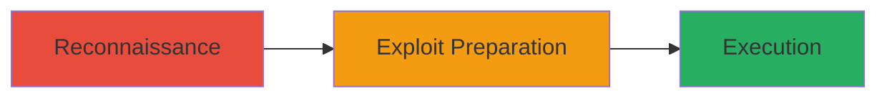

---
tags:
  - xml-signature-wrapping
  - saml-bypass
  - auth-bypass
  - github-enterprise
type: attack_chain
tools:
  - '[[tools/Burp-Suite]]'
  - '[[tools/XML-Editor]]'
tactics:
  - '[[Initial Access]]'
  - '[[Privilege Escalation]]'
commands:
  - '[[commands/fetch-saml-metadata]]'
  - '[[commands/modify-xml-signature]]'
  - '[[commands/submit-saml-response]]'
platforms:
  - Web
  - GitHub Enterprise Server
complexity: high
procedures:
  - '[[procedures/Identify-Vulnerable-GHES-Instance]]'
  - '[[procedures/Craft-Forged-SAML-Response]]'
  - '[[procedures/Submit-Forged-SAML-Response]]'
step_count: 3
techniques:
  - '[[Exploit Public-Facing Application]]'
  - '[[Valid Accounts]]'
description: >-
  Exploitation of XML signature wrapping vulnerability in GitHub Enterprise
  Server to forge SAML responses and gain unauthorized access to user accounts
skill_level: advanced
impact_level: critical
id: e2ba4c85-3e62-449e-9fd5-b702eaf4d85f
created_at: '2025-12-13T09:01:26.780Z'
updated_at: '2025-12-13T09:01:26.780Z'
verified: false
validated: true
submitted: true
mitre_tactics:
  - '[[Initial Access]]'
  - '[[Privilege Escalation]]'
mitre_techniques:
  - '[[Exploit Public-Facing Application]]'
  - '[[Valid Accounts]]'
---
# XML Signature Wrapping in GitHub Enterprise Server for Unauthorized Access

## Overview

This attack chain exploits an XML signature wrapping vulnerability in GitHub Enterprise Server (GHES) versions prior to 3.14, allowing attackers to bypass SAML signature verification when using specific identity providers with publicly exposed signed federation metadata XML. By forging a SAML response, attackers can provision or access any user account, including site administrators, without authentication, leading to critical unauthorized access to the GHES instance.

## Attack Flow Visualization



## Prerequisites & Requirements

### Required Tools
- [[tools/Burp-Suite]]
- [[tools/XML-Editor]]

### Target Environment
- GitHub Enterprise Server prior to version 3.14
- SAML authentication with specific IdPs using publicly exposed signed federation metadata XML
- Network access to the GHES instance

### Initial Access Requirements
- No prior credentials needed
- Access to publicly exposed metadata XML
- Ability to intercept or submit SAML responses

## Detailed Attack Procedures

### Step 1: Identify Vulnerable GHES Instance
procedure: [[procedures/Identify-Vulnerable-GHES-Instance]]

**Objective**: Locate a vulnerable GitHub Enterprise Server instance with exposed SAML metadata and verify the conditions for XML signature wrapping.

**Instructions**: Fetch the publicly exposed signed federation metadata XML using [[commands/fetch-saml-metadata]]:

```bash
curl -s https://target-ghes.example.com/saml/metadata -o metadata.xml
```

Analyze the metadata to confirm the use of specific IdPs and signed XML that can be wrapped. Check for improper validation in SAML authentication.

**Expected Output**: Downloaded metadata.xml file containing signed federation details.

**Success Indicators**:
- Metadata XML successfully retrieved
- Confirmation of vulnerable IdP configuration

### Step 2: Craft Forged SAML Response
procedure: [[procedures/Craft-Forged-SAML-Response]]

**Objective**: Create a forged SAML response by exploiting the XML signature wrapping vulnerability to bypass signature verification.

**Instructions**: Modify the XML structure to wrap the signature using [[commands/modify-xml-signature]] (inferred via XML editing tools):

```bash
xmlstarlet ed -u '//Assertion/ID' -v 'forged-id' metadata.xml > forged.xml
```

Insert malicious attributes to target a specific user account, such as a site administrator, while preserving the original signature.

**Expected Output**: A forged SAML response XML file that appears valid but contains unauthorized access claims.

**Success Indicators**:
- Forged XML passes basic structural validation
- Signature remains intact but wraps malicious content

### Step 3: Submit Forged SAML Response
procedure: [[procedures/Submit-Forged-SAML-Response]]

**Objective**: Submit the forged SAML response to the GHES instance to gain unauthorized access to the target user account.

**Instructions**: Use a proxy or direct submission to send the forged response using [[commands/submit-saml-response]]:

```bash
curl -X POST https://target-ghes.example.com/saml/acs -d @forged.xml --header 'Content-Type: application/xml'
```

Monitor the response for successful authentication and access provisioning.

**Expected Output**: Successful login response granting access to the targeted user account.

**Success Indicators**:
- Unauthorized access granted without credentials
- Ability to perform actions as the targeted user, such as site administration

## Attack Chain Summary

### Key Achievements
1. Bypassed SAML signature verification
2. Forged access to arbitrary user accounts
3. Achieved critical unauthorized access to GHES instance

## Technique & Tactic Coverage

### MITRE ATT&CK Techniques
- [[Exploit Public-Facing Application]]
- [[Valid Accounts]]

### MITRE ATT&CK Tactics
- [[Initial Access]]
- [[Privilege Escalation]]
