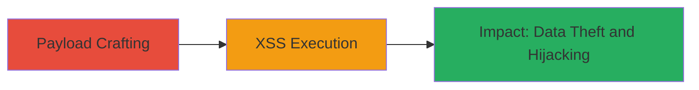

---
tags:
  - xss
  - rails
  - svg
  - sanitize-bypass
  - injection
type: attack_chain
tools: []
tactics:
  - '[[Execution]]'
  - '[[Collection]]'
verified: false
platforms:
  - Web
submitted: true
complexity: medium
created_at: '2023-10-01T00:00:00Z'
procedures:
  - '[[procedures/Craft-and-Inject-SVG-Use-Tag-XSS-Payload]]'
step_count: 1
techniques:
  - '[[JavaScript]]'
  - '[[Exploit Public-Facing Application]]'
updated_at: '2025-12-13T23:52:43.543Z'
description: >-
  Demonstrates an XSS vulnerability in Ruby on Rails ActionView sanitize helper
  by bypassing sanitization with a crafted SVG payload using base64-encoded data
  URI in a use tag.
skill_level: intermediate
impact_level: high
id: 77f2ff8d-b086-4c1e-a168-74893447ef48
validated: true
mitre_tactics:
  - '[[Execution]]'
  - '[[Collection]]'
mitre_techniques:
  - '[[JavaScript]]'
  - '[[Exploit Public-Facing Application]]'
---
# XSS Bypass in Rails ActionView Sanitize Helper Using SVG Use Tag

Multi-stage attack chain demonstrating a complete attack workflow exploiting a sanitization bypass in Ruby on Rails to achieve cross-site scripting.

## Chain Metrics Dashboard

| Metric | Value |
|--------|-------|
| Chain Status | Unverified |
| Total Steps | 1 |
| Execution Time | ~5 minutes |
| Skill Level | Intermediate |
| Complexity | Medium |
| Impact Level | High |

## Attack Flow Visualization

## Prerequisites & Requirements

### Required Tools

- None (requires access to Rails application code or template injection point)

### Target Environment

- Ruby on Rails application with ActionView
- Sanitize helper configured to allow 'svg' and 'use' tags (e.g., via config.action_view.sanitized_allowed_tags or inline tags argument)
- ERB templates enabled

### Initial Access Requirements

- Ability to inject or modify ERB templates (e.g., developer access, template injection vulnerability, or admin panel)
- No specific credentials beyond code access
- Local or development environment for testing

## Detailed Attack Procedures

### Step 1: Craft and Inject Payload
procedure: [[procedures/Craft-and-Inject-SVG-Use-Tag-XSS-Payload]]

**Objective**: Bypass the ActionView sanitize helper to inject executable JavaScript via an SVG use tag with a base64-encoded data URI, triggering an XSS alert on load.

**Instructions**: Create a base64-encoded SVG containing an image tag with an onerror JavaScript handler. Embed this in a data URI within the href of a use tag inside an allowed svg element. Inject into an ERB template using the sanitize helper with svg and use tags permitted.

The payload decodes to an SVG that loads a broken image (href="1"), triggering onerror="alert(window.origin)" to execute JavaScript and reveal the origin for proof-of-concept.

**Expected Output**: When the sanitized HTML is rendered in the browser, the alert pops up displaying the window origin, confirming XSS execution.

**Success Indicators**:
- Alert dialog appears with the application's origin
- No sanitization errors in Rails logs
- JavaScript executes without being stripped

## Attack Chain Summary

### Key Achievements

1. Bypassed Rails HTML sanitization for SVG content
2. Executed arbitrary JavaScript in the victim's browser context
3. Demonstrated potential for data theft, session hijacking, and malicious actions

## Technique & Tactic Coverage

### MITRE ATT&CK Techniques

- [[JavaScript]]
- [[Exploit Public-Facing Application]]

### MITRE ATT&CK Tactics

- [[Execution]]
- [[Collection]]

---
*Last updated: 2023-10-01T00:00:00Z*
