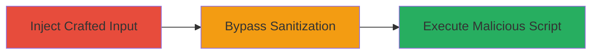

# XSS Bypass in Rails HTML Sanitizer via Crafted Input

Multi-stage attack chain demonstrating a complete attack workflow for exploiting a sanitization bypass in Ruby on Rails applications.

## Chain Metrics Dashboard

| Metric | Value |
|--------|-------|
| Chain Status | Unverified |
| Total Steps | 1 |
| Execution Time | ~5 minutes |
| Skill Level | Intermediate |
| Complexity | Medium |
| Impact Level | High |

## Attack Flow Visualization



## Prerequisites & Requirements

### Required Tools

- Browser developer tools for testing
- Vulnerable Ruby on Rails application

### Target Environment

- Ruby on Rails web application using rails-html-sanitizer gem (vulnerable versions prior to 1.0.3)
- Web platform with user input processed via sanitize method

### Initial Access Requirements

- Access to a form or input field that uses the sanitize method with limited tags (e.g., tags: %w(em))
- No special credentials needed if input is unauthenticated

## Detailed Attack Procedures

### Step 1: Inject Malicious Payload
procedure: [[procedures/Exploit-XSS-Bypass-in-Rails-HTML-Sanitizer]]

**Objective**: Craft and submit input that bypasses the white list sanitizer to inject executable JavaScript, leading to XSS execution in the victim's browser.

**Instructions**: Identify an input field sanitized with the Rails::Html::WhiteListSanitizer, such as a comment or bio field using `<%= sanitize user_input, tags: %w(em) %>`. Craft a payload exploiting the flaw in handling certain inputs for allowed tags like 'em', such as embedding script attributes in a way that evades filtering (e.g., using SVG or other vector graphics with event handlers). Submit the payload via the web form and observe the rendered output.

For testing, use browser developer tools to inspect the sanitized HTML:

```javascript
// In browser console, simulate or check the output
console.log(document.querySelector('em').innerHTML);
```

If the application echoes the input, the payload will execute on load.

**Expected Output**: Malicious script executes, e.g., an alert box or data exfiltration to attacker-controlled server.

**Success Indicators**:
- Sanitized output contains unfiltered script elements
- JavaScript executes in the context of the victim's session
- Potential session hijacking or arbitrary code execution observed

## Attack Chain Summary

### Key Achievements

1. Successful bypass of HTML sanitization in rails-html-sanitizer
2. Injection and execution of arbitrary JavaScript in the browser
3. Compromise of user sessions or data theft via XSS

## Technique & Tactic Coverage

### MITRE ATT&CK Techniques

- [[JavaScript]]

### MITRE ATT&CK Tactics

- [[Execution]]

---
*Last updated: 2023-10-01T12:00:00Z*
