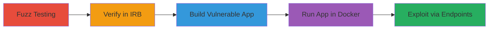

---
tags:
  - xss
  - rails
  - html-sanitizer
  - bypass
  - ruby
type: attack_chain
tools:
  - '[[tools/IRB]]'
  - '[[tools/Docker]]'
  - '[[tools/Rails]]'
tactics:
  - '[[Execution]]'
verified: false
platforms:
  - Web
  - Linux
submitted: true
complexity: medium
created_at: '2023-10-01T00:00:00Z'
procedures:
  - '[[procedures/Perform-Fuzz-Testing-on-Rails-HTML-Sanitizer-Allow-Lists]]'
  - '[[procedures/Verify-XSS-Vulnerability-Using-IRB-Session]]'
  - '[[procedures/Build-Sample-Vulnerable-Rails-Application-Using-Dockerfile]]'
  - '[[procedures/Run-Vulnerable-Rails-Application-in-Docker]]'
  - '[[procedures/Exploit-XSS-Vulnerability-via-POC-Endpoints]]'
step_count: 5
techniques:
  - '[[JavaScript]]'
  - '[[Exploit Public-Facing Application]]'
updated_at: '2025-12-14T00:11:16.361Z'
description: >-
  Demonstrates exploitation of CVE-2022-23519 in Rails::Html::SafeListSanitizer
  by allowing specific tag combinations to inject and execute arbitrary
  JavaScript, leading to cross-site scripting attacks.
skill_level: intermediate
impact_level: high
id: 04b1c075-03f1-48a4-ae70-9cdc227ae786
validated: true
mitre_tactics:
  - '[[Execution]]'
mitre_techniques:
  - '[[JavaScript]]'
  - '[[Exploit Public-Facing Application]]'
---
# XSS Bypass in Rails HTML Sanitizer via Math+Style or SVG+Style Tag Combinations

Multi-stage attack chain demonstrating exploitation of an XSS vulnerability in Rails::Html::SafeListSanitizer when developers allow 'math' and 'style' or 'svg' and 'style' tags, enabling arbitrary JavaScript injection.

## Chain Metrics Dashboard

| Metric | Value |
|--------|-------|
| Chain Status | Unverified |
| Total Steps | 5 |
| Execution Time | ~15 minutes |
| Skill Level | Intermediate |
| Complexity | Medium |
| Impact Level | High |

## Attack Flow Visualization



## Prerequisites & Requirements

### Required Tools

- [[tools/IRB]]
- [[tools/Docker]]
- [[tools/Rails]]

### Target Environment

- Ruby on Rails application using rails-html-sanitizer gem (version 1.4.3 affected)
- Required services/ports: Port 3000 (container), 8888 (host)
- Network access requirements: Localhost access for Docker

### Initial Access Requirements

- No credentials needed; assumes developer or tester access to Rails config
- Local development environment with Ruby and Docker installed
- Prior access needed: Ability to modify Rails sanitize allowlists

## Detailed Attack Procedures

### Step 1: Perform Fuzz Testing

procedure: [[procedures/Perform-Fuzz-Testing-on-Rails-HTML-Sanitizer-Allow-Lists]]

**Objective**: Identify improper handling in the sanitizer by testing tag combinations like 'svg' and 'style', or 'math' and 'style'.

**Instructions**: Conduct fuzz testing on various tag allowlists to find bypasses, inspired by prior reports on 'select' and 'style'. Focus on nested elements and attributes that could inject scripts.

**Expected Output**: Identification of vulnerable combinations where malicious HTML is not stripped.

**Success Indicators**:
- Detection of unfiltered payloads in tested combinations
- Confirmation of potential XSS vectors

### Step 2: Verify Vulnerability Using IRB Session

procedure: [[procedures/Verify-XSS-Vulnerability-Using-IRB-Session]]

**Objective**: Confirm the bypass by loading the sanitizer and testing PoC payloads in an interactive Ruby shell.

**Instructions**: Start IRB and execute commands to require the gem, sanitize payloads with vulnerable tags, and check outputs. Use [[commands/require-rails-html-sanitizer]] to load, then [[commands/sanitize-svg-style-poc]] and [[commands/sanitize-math-style-poc]] to test, followed by [[commands/print-sanitizer-version]] to verify version.

```bash
require 'rails-html-sanitizer'
Rails::Html::SafeListSanitizer.new.sanitize("<svg><style><script>alert(1)</script></style></svg>", tags: ["svg", "style"]).to_s
Rails::Html::SafeListSanitizer.new.sanitize("<math><style></style></math>", tags: ["math", "style"]).to_s
puts Rails::Html::Sanitizer::VERSION
```

**Expected Output**: Payloads remain unfiltered, version 1.4.3 printed.

**Success Indicators**:
- Sanitized output retains script tags
- Version confirms affected gem

### Step 3: Build a Sample Vulnerable Rails Application

procedure: [[procedures/Build-Sample-Vulnerable-Rails-Application-Using-Dockerfile]]

**Objective**: Create a reproducible environment with a Rails app configured to allow vulnerable tag combinations.

**Instructions**: Use Dockerfile to set up Ruby, install Rails, create app, and customize with vulnerable endpoints via script. Execute [[commands/docker-build-railspoc]] to build the image.

```bash
docker build -t local/railspoc:latest .
```

**Expected Output**: Docker image built successfully with precompiled assets.

**Success Indicators**:
- Image tagged as local/railspoc:latest
- Controllers and views generated for PoCs

### Step 4: Run the Vulnerable Rails Application

procedure: [[procedures/Run-Vulnerable-Rails-Application-in-Docker]]

**Objective**: Start the app in a container to host exploitable endpoints.

**Instructions**: Run the Docker container with port mapping using [[commands/docker-run-railspoc]] to expose the server on localhost:8888.

```bash
docker run -it --rm -p 127.0.0.1:8888:3000 local/railspoc:latest
```

**Expected Output**: Rails server starts in production mode, listening on port 3000 inside container.

**Success Indicators**:
- Server logs show startup
- App accessible at http://127.0.0.1:8888

### Step 5: Exploit the Vulnerability by Accessing PoC Endpoints

procedure: [[procedures/Exploit-XSS-Vulnerability-via-POC-Endpoints]]

**Objective**: Inject malicious payloads via URL-encoded inputs to trigger JavaScript execution.

**Instructions**: Access endpoints like /poc1 and /poc2 with payloads using 'svg+style' or 'math+style' to bypass sanitization and execute alerts.

**Expected Output**: JavaScript alert(1) or onerror alert triggers in browser.

**Success Indicators**:
- Arbitrary JS execution confirmed
- Potential for session hijacking or data theft

## Attack Chain Summary

### Key Achievements

1. Identified and verified XSS bypass in rails-html-sanitizer via fuzzing and IRB testing
2. Built and ran a vulnerable Rails app in Docker for demonstration
3. Exploited the flaw to execute JS, simulating real-world impact like data theft

## Technique & Tactic Coverage

### MITRE ATT&CK Techniques

- [[JavaScript]]
- [[Exploit Public-Facing Application]]

### MITRE ATT&CK Tactics

- [[Execution]]

---

*Last updated: 2023-10-01T00:00:00Z*
