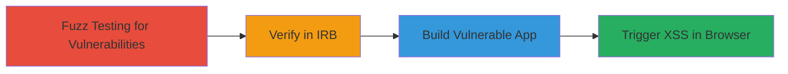

# XSS Bypass in Rails HTML Sanitizer via SVG+Style and Math+Style Tag Combinations

Multi-stage attack chain demonstrating exploitation of a cross-site scripting vulnerability in Rails::Html::SafeListSanitizer, where combinations of 'svg' with 'style' or 'math' with 'style' tags fail to sanitize nested malicious content, allowing arbitrary JavaScript execution in Rails web applications.

## Chain Metrics Dashboard

| Metric | Value |
|--------|-------|
| Chain Status | Unverified |
| Total Steps | 4 |
| Execution Time | ~30 minutes |
| Skill Level | Intermediate |
| Complexity | Medium |
| Impact Level | High |

## Attack Flow Visualization



## Prerequisites & Requirements

### Required Tools

- [[tools/IRB]]
- [[tools/Docker]]
- [[tools/Ruby]]
- [[tools/Rails]]
- [[tools/rails-html-sanitizer]]

### Target Environment

- Ruby on Rails application using rails-html-sanitizer gem (version 1.4.3 or vulnerable equivalents)
- Required services/ports: Port 3000 (Rails server), mapped to 8888
- Network access requirements: Localhost access for testing

### Initial Access Requirements

- No credentials needed for local testing
- Network position: Local development environment
- Prior access needed: Ruby and Docker installed

## Detailed Attack Procedures

### Step 1: Fuzz Testing for Vulnerabilities
procedure: [[procedures/Fuzz-Test-Rails-Sanitizer-for-Vulnerable-Tags]]

**Objective**: Identify vulnerable tag combinations in Rails::Html::SafeListSanitizer through automated fuzzing to discover bypass opportunities for HTML sanitization.

**Instructions**: Perform fuzz testing on the sanitizer by generating various HTML tag combinations and checking for unsanitized malicious payloads like script tags or event handlers.

**Expected Output**: Identification of 'svg' + 'style' and 'math' + 'style' as vulnerable, where payloads like <script>alert(1)</script> or  persist.

**Success Indicators**:
- Fuzz results show unsanitized output for specific tag pairs
- Confirmation of potential XSS vectors

### Step 2: Verify in IRB
procedure: [[procedures/Verify-XSS-in-Rails-Sanitizer-Using-IRB]]

**Objective**: Confirm the vulnerability by directly testing PoC payloads in an interactive Ruby shell using the rails-html-sanitizer gem.

**Instructions**: Load the gem and execute sanitize calls with vulnerable tags and payloads. Use [[commands/load-rails-html-sanitizer-gem]] to prepare the environment:

```ruby
require 'rails-html-sanitizer'
```

Then test SVG+style with [[commands/test-svg-style-xss-payload]]:

```ruby
Rails::Html::SafeListSanitizer.new.sanitize("<svg><style><script>alert(1)</script></style></svg>", tags: ["svg", "style"]).to_s
```

And math+style with [[commands/test-math-style-xss-payload]]:

```ruby
Rails::Html::SafeListSanitizer.new.sanitize("<math><style></style></math>", tags: ["math", "style"]).to_s
```

Check version with [[commands/check-rails-sanitizer-version]]:

```ruby
puts Rails::Html::Sanitizer::VERSION
```

**Expected Output**: Unsanitized payloads returned as strings, e.g., "<svg><style><script>alert(1)</script></style></svg>", and version 1.4.3.

**Success Indicators**:
- Sanitizer output includes malicious code
- Version confirms vulnerability

### Step 3: Build Vulnerable App
procedure: [[procedures/Build-Sample-Vulnerable-Rails-Application-with-Docker]]

**Objective**: Create a reproducible Rails application that demonstrates the vulnerability using Docker for isolated testing.

**Instructions**: Use a Dockerfile and scripts to set up the app. Build the image with [[commands/docker-build-rails-poc]]:

```bash
docker build -t local/railspoc:latest .
```

Run the container with [[commands/docker-run-rails-poc]]:

```bash
docker run -it --rm -p 127.0.0.1:8888:3000 local/railspoc:latest
```

Inside the build process, generate controllers with [[commands/rails-generate-poc1-controller]] and set routes/views using cat commands as per scripts.

**Expected Output**: Rails server running on port 8888 with PoC endpoints /poc1 and /poc2.

**Success Indicators**:
- Container builds successfully
- Server logs show startup without errors

### Step 4: Trigger XSS in Browser
procedure: [[procedures/Trigger-Reflected-XSS-via-PoC-Endpoints]]

**Objective**: Exploit the vulnerability by accessing endpoints with malicious payloads to execute JavaScript in a web browser.

**Instructions**: Visit http://127.0.0.1:8888/poc1?name=%3Csvg%3E%3Cstyle%3E%3Cscript%3Ealert(1)%3C/script%3E%3C/style%3E%3C/svg%3E or similar for /poc2 with math payload. The reflected input passes through vulnerable sanitize calls.

**Expected Output**: Alert box pops up executing alert(1).

**Success Indicators**:
- JavaScript executes in browser
- XSS confirmed via payload reflection

## Attack Chain Summary

### Key Achievements

1. Identified vulnerable tag combinations via fuzzing
2. Verified XSS payloads in IRB
3. Built and ran a Dockerized PoC Rails app
4. Triggered reflected XSS in browser

## Technique & Tactic Coverage

### MITRE ATT&CK Techniques

- [[Exploit Public-Facing Application]]
- [[JavaScript]]

### MITRE ATT&CK Tactics

- [[Initial Access]]
- [[Execution]]

---

*Last updated: 2023-10-01T00:00:00Z*
