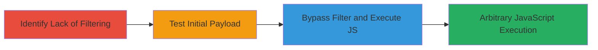

# XSS Bypass in VK.com Goods Search for Arbitrary JavaScript Execution

Multi-stage attack chain demonstrating a complete XSS exploitation workflow in VK.com's goods search feature, from identifying weak sanitization to bypassing filters for JavaScript execution.

## Chain Metrics Dashboard

| Metric | Value |
|--------|-------|
| Chain Status | Unverified |
| Total Steps | 3 |
| Execution Time | ~5 minutes |
| Skill Level | Intermediate |
| Complexity | Medium |
| Impact Level | High |

## Attack Flow Visualization

## Prerequisites & Requirements

### Required Tools

- Web browser with developer tools (e.g., Chrome DevTools for inspecting responses)
- No specialized tools required; manual testing via browser suffices

### Target Environment

- Web platform
- Access to VK.com's public-facing goods/products search functionality
- No specific services/ports needed beyond standard HTTPS (443)

### Initial Access Requirements

- Public internet access to VK.com
- No credentials required for unauthenticated search testing
- Basic knowledge of XSS payloads and browser-based testing

## Detailed Attack Procedures

### Step 1: Identify Insufficient Input Sanitization
procedure: [[procedures/Identify-Insufficient-Input-Sanitization-in-Goods-Search]]

**Objective**: Detect weaknesses in the input handling of the goods search feature to identify potential XSS entry points.

**Instructions**: Navigate to the VK.com goods/products search page and input various special characters (e.g., <, >, ", ') into the search field. Observe the search results page for unfiltered output of these characters, indicating lack of proper sanitization.

**Expected Output**: Special characters appear unaltered in the search results HTML, suggesting incomplete filtering.

**Success Indicators**:
- Input characters like <script> or img tags are reflected without neutralization
- No immediate errors or blocks on basic special character input

### Step 2: Test Initial XSS Payload
procedure: [[procedures/Test-Initial-XSS-Payload-in-Search-Input]]

**Objective**: Attempt to inject a standard XSS payload to confirm vulnerability and understand existing defenses.

**Instructions**: Enter the payload `` directly into the goods search input field and submit. Inspect the resulting search page source to see how the payload is processed.

**Expected Output**: The payload is reflected but neutralized, with attributes forced to empty strings (e.g., =""), preventing onerror execution.

**Success Indicators**:
- Payload reflected in HTML but JavaScript does not execute (no alert box)
- Filter behavior observed: attributes equalized to empty strings

### Step 3: Bypass Filter and Execute JavaScript
procedure: [[procedures/Bypass-XSS-Filter-for-JavaScript-Execution]]

**Objective**: Circumvent the built-in filter to achieve successful XSS and arbitrary code execution.

**Instructions**: Based on the filter's behavior from Step 2, craft and inject a bypass payload into the search input (specific bypass details derived from same-day discovery; e.g., variations avoiding attribute equalization like using event handlers or encoding). Submit and verify execution via alert or console log.

**Expected Output**: JavaScript executes, such as an alert dialog popping up in the victim's browser.

**Success Indicators**:
- Arbitrary JS runs in the context of the search results page
- Potential for session hijacking or data theft confirmed

## Attack Chain Summary

### Key Achievements

1. Identified unfiltered characters in goods search input
2. Analyzed and understood the built-in filter's limitation
3. Successfully bypassed the filter for high-impact XSS execution

## Technique & Tactic Coverage

### MITRE ATT&CK Techniques

- [[JavaScript]]
- [[Exploit Public-Facing Application]]

### MITRE ATT&CK Tactics

- [[Execution]]
- [[Initial Access]]

---
*Last updated: 2023-10-01T00:00:00Z*
