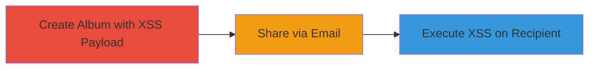

---
id: ac-uzbey-xss-sharethis-001
name: XSS Execution via ShareThis Plugin in Uzbey Album Sharing
type: attack_chain
description: A multi-stage attack exploiting a Cross-Site Scripting (XSS) vulnerability in the ShareThis plugin integrated with Uzbey's album sharing feature, allowing arbitrary JavaScript execution in the browsers of recipients who interact with shared album links.
verified: false
submitted: false
step_count: 3
created_at: 2023-10-01T12:00:00Z
updated_at: 2023-10-01T12:00:00Z
procedures: [[procedures/Create-Malicious-Album-with-XSS-Payload]], [[procedures/Share-Album-via-ShareThis-Email]], [[procedures/Trigger-XSS-on-Recipient-Browser]]
techniques: [[JavaScript]]
tactics: [[Execution]]
tags: xss, sharethis, web, album-sharing
platforms: Web
tools: []
---

# XSS Execution via ShareThis Plugin in Uzbey Album Sharing

Multi-stage attack chain demonstrating a complete attack workflow exploiting XSS in the ShareThis plugin for Uzbey's album sharing.

## Chain Metrics Dashboard

| Metric | Value |
|--------|-------|
| Chain Status | Unverified |
| Total Steps | 3 |
| Execution Time | ~5 minutes |
| Skill Level | Intermediate |
| Complexity | Medium |
| Impact Level | High |

## Attack Flow Visualization

## Prerequisites & Requirements

### Required Tools

- Web browser (e.g., Chrome with developer tools for payload testing)

### Target Environment

- Uzbey platform (web application)
- ShareThis plugin integration for album sharing
- No specific ports required; operates over standard HTTPS (port 443)

### Initial Access Requirements

- Attacker account on Uzbey platform to create albums
- Valid email address for sharing
- Recipient must be a ShareThis user interacting with the shared link
- No prior network access beyond public internet

## Detailed Attack Procedures

### Step 1: Create Malicious Album
procedure: [[procedures/Create-Malicious-Album-with-XSS-Payload]]

**Objective**: Embed an XSS payload in an album's content or metadata on the Uzbey platform to prepare for sharing.

**Instructions**: Log in to the Uzbey platform, navigate to the album creation interface, and input an XSS payload such as `` in the album title, description, or metadata fields. Save the album to persist the payload.

**Expected Output**: Album created successfully with the payload embedded, visible in the platform's interface without immediate execution.

**Success Indicators**:
- Album is listed in the user's dashboard
- Payload is reflected in the album details without sanitization

### Step 2: Share Album via Email
procedure: [[procedures/Share-Album-via-ShareThis-Email]]

**Objective**: Use the ShareThis plugin's email sharing function to distribute the malicious album link to a target recipient.

**Instructions**: From the album page, click the email sharing icon (letter icon) provided by the ShareThis plugin. Enter the recipient's email address and send the share invitation. The plugin processes the album content, including the unsanitized payload, into the email or linked content.

**Expected Output**: Email sent to the recipient containing a link to the shared album, with the payload propagated through ShareThis.

**Success Indicators**:
- Confirmation email or notification of successful share
- Recipient receives the email with the album link

### Step 3: Trigger XSS Execution
procedure: [[procedures/Trigger-XSS-on-Recipient-Browser]]

**Objective**: Cause the XSS payload to execute in the recipient's browser when they interact with the shared content.

**Instructions**: The recipient opens the email and clicks the link or views the shared content. Upon loading in their browser, the ShareThis integration renders the album, executing the embedded JavaScript payload in the context of the ShareThis domain or the recipient's session.

**Expected Output**: Arbitrary JavaScript runs, such as an alert popup or data exfiltration to an attacker-controlled server.

**Success Indicators**:
- Alert or scripted behavior observed in recipient's browser
- Potential theft of cookies or session data if payload is crafted for that

## Attack Chain Summary

### Key Achievements

1. Successful embedding of XSS payload in album content without sanitization
2. Propagation of the payload via ShareThis email sharing to external recipients
3. Execution of JavaScript in the victim's browser, enabling client-side attacks like session hijacking

## Technique & Tactic Coverage

### MITRE ATT&CK Techniques

- [[JavaScript]]

### MITRE ATT&CK Tactics

- [[Execution]]

---
*Last updated: 2023-10-01T12:00:00Z*
