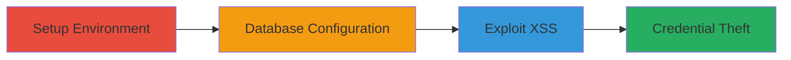

# XSS Exploitation in Acronis Cloud Manager Admin Portal via Swagger UI URL Parameter

Multi-stage attack chain demonstrating a complete attack workflow exploiting XSS in the default Swagger UI of Acronis Cloud Manager.

## Chain Metrics Dashboard

| Metric | Value |
|--------|-------|
| Chain Status | Unverified |
| Total Steps | 3 |
| Execution Time | ~30 minutes |
| Skill Level | Intermediate |
| Complexity | Medium |
| Impact Level | High |

## Attack Flow Visualization

## Prerequisites & Requirements

### Required Tools

- Web browser (e.g., Chrome)
- SQL Server Management Studio

### Target Environment

- Windows OS
- Ports: 16080
- Services: SQL Server, Acronis Cloud Manager web portal
- Network access: Localhost access to admin portal

### Initial Access Requirements

- Download access to Acronis Cloud Manager trial
- Administrative privileges on Windows for installation
- No prior credentials needed for local setup

## Detailed Attack Procedures

### Step 1: Environment Setup
procedure: [[procedures/Install-Acronis-Cloud-Manager]]

**Objective**: Install Acronis Cloud Manager console and web portal to replicate the vulnerable environment.

**Instructions**: Download the Acronis Cloud Manager free trial from the official site and follow the installation guide to set up on a Windows system. Unzip the installer and run the setup, ensuring the web portal is configured to listen on port 16080.

**Expected Output**: Successful installation with web portal accessible at https://localhost:16080.

**Success Indicators**:
- Acronis Cloud Manager console launches without errors
- Web portal loads in browser

### Step 2: Database Configuration
procedure: [[procedures/Set-Up-SQL-Server-Database]]

**Objective**: Configure a SQL Server database for Acronis Cloud Manager connectivity.

**Instructions**: Install SQL Server Express and Management Studio, then create a dedicated user account for database connections as outlined in the Acronis setup guide. Configure the connection string in Acronis settings to point to the local SQL Server instance.

**Expected Output**: Database connection test succeeds in Acronis console.

**Success Indicators**:
- SQL Server service running
- User created and permissions granted
- Acronis connects to database without errors

### Step 3: Vulnerability Exploitation
procedure: [[procedures/Exploit-XSS-in-Swagger-UI]]

**Objective**: Inject a malicious URL parameter into Swagger UI to trigger XSS and execute arbitrary JavaScript.

**Instructions**: Navigate to the Swagger UI endpoint at https://localhost:16080/swagger/index.html and append a malicious URL to the 'url' parameter, such as https://localhost:16080/swagger/index.html?url=javascript:alert('XSS'). When an admin interacts with the Authorize button or tests APIs, the payload executes, potentially stealing entered credentials.

**Expected Output**: JavaScript alert or payload execution in the browser console.

**Success Indicators**:
- Malicious script executes
- Credentials captured if admin authorizes APIs

## Attack Chain Summary

### Key Achievements

1. Replicated vulnerable Acronis Cloud Manager environment locally
2. Configured backend database for full functionality
3. Exploited XSS to demonstrate credential theft potential against admin users

## Technique & Tactic Coverage

### MITRE ATT&CK Techniques

- [[JavaScript]]

### MITRE ATT&CK Tactics

- [[Initial Access]]
- [[Execution]]
- [[Collection]]

---
*Last updated: 2023-10-01T00:00:00Z*
