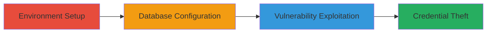

---
tags:
  - xss
  - swagger-ui
  - acronis
  - credential-theft
  - web-vulnerability
type: attack_chain
tools: []
tactics:
  - '[[Execution]]'
  - '[[Collection]]'
verified: false
platforms:
  - Web
  - Windows
submitted: true
complexity: medium
created_at: '2024-10-01T00:00:00Z'
procedures:
  - '[[procedures/Install-Acronis-Cloud-Manager]]'
  - '[[procedures/Set-Up-SQL-Server-Database]]'
  - '[[procedures/Exploit-XSS-in-Swagger-UI]]'
step_count: 3
techniques:
  - '[[JavaScript]]'
updated_at: '2025-12-14T17:28:58.855Z'
description: >-
  A multi-stage process to set up a local Acronis Cloud Manager environment,
  identify, and exploit a reflected XSS vulnerability in the Swagger UI
  endpoint, allowing arbitrary JavaScript execution to target admin users and
  steal credentials.
skill_level: intermediate
impact_level: high
id: f63e3631-82bc-4b25-9d3d-2f06e0f60a0b
validated: true
mitre_tactics:
  - '[[Execution]]'
  - '[[Collection]]'
mitre_techniques:
  - '[[JavaScript]]'
---
# XSS Exploitation in Acronis Cloud Manager Swagger UI via Unsanitized URL Parameter

Multi-stage attack chain demonstrating the setup of a local Acronis Cloud Manager environment to discover and exploit a reflected Cross-Site Scripting (XSS) vulnerability in the Swagger UI, enabling arbitrary JavaScript execution against admin users for credential theft or sensitive data access.

## Chain Metrics Dashboard

| Metric | Value |
|--------|-------|
| Chain Status | Unverified |
| Total Steps | 3 |
| Execution Time | ~60 minutes |
| Skill Level | Intermediate |
| Complexity | Medium |
| Impact Level | High |

## Attack Flow Visualization

## Prerequisites & Requirements

### Required Tools

- Browser for accessing Swagger UI
- Windows machine for local installation

### Target Environment

- Windows OS
- Ports: 16080 (web portal)
- Services: SQL Server Express
- Tech stack: Swagger UI with outdated dom-purify

### Initial Access Requirements

- Local administrative access on Windows
- No network exposure required (local setup)
- Download access to Acronis trial

## Detailed Attack Procedures

### Step 1: Environment Setup
procedure: [[procedures/Install-Acronis-Cloud-Manager]]

**Objective**: Install the Acronis Cloud Manager console and web portal on a local Windows machine to replicate the vulnerable environment.

**Instructions**: Download the Acronis Cloud Manager free trial from the official site and follow the installation guide to set up the console and web portal.

**Expected Output**: Successful installation with web portal accessible at https://localhost:16080.

**Success Indicators**:
- Acronis Cloud Manager console launches without errors
- Web portal loads on port 16080

### Step 2: Database Configuration
procedure: [[procedures/Set-Up-SQL-Server-Database]]

**Objective**: Install and configure SQL Server Express to support the Acronis setup, creating necessary database connections.

**Instructions**: Download and install SQL Server Express and Management Studio, then create a database user during Acronis configuration.

**Expected Output**: Database connected successfully to Acronis Cloud Manager.

**Success Indicators**:
- SQL Server running and accessible
- Acronis setup completes database integration

### Step 3: Vulnerability Exploitation
procedure: [[procedures/Exploit-XSS-in-Swagger-UI]]

**Objective**: Access the Swagger UI endpoint and inject an XSS payload via the 'url' parameter to execute arbitrary JavaScript, targeting admin authentication flows.

**Instructions**: Navigate to the Swagger UI URL with a malicious 'url' parameter, such as https://localhost:16080/swagger/index.html?url=javascript:alert('XSS'), to reflect and execute the payload due to inadequate sanitization by the outdated dom-purify library.

**Expected Output**: JavaScript alert or script execution in the browser context, potentially capturing credentials from the Authorize button.

**Success Indicators**:
- Payload executes without sanitization
- Admin session data accessible via injected script

## Attack Chain Summary

### Key Achievements

1. Local replication of the vulnerable Acronis Cloud Manager environment
2. Identification of reflected XSS in Swagger UI 'url' parameter
3. Demonstration of JavaScript execution for potential credential theft targeting admin users

## Technique & Tactic Coverage

### MITRE ATT&CK Techniques

- [[JavaScript]]

### MITRE ATT&CK Tactics

- [[Execution]]
- [[Collection]]

---
*Last updated: 2024-10-01T00:00:00Z*
