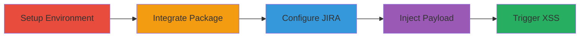

---
tags:
  - xss
  - jira
  - atlasboard
  - node.js
  - javascript-injection
type: attack_chain
tools:
  - '[[tools/npm]]'
  - '[[tools/atlasboard]]'
  - '[[tools/git]]'
  - '[[tools/node]]'
tactics:
  - '[[Execution]]'
  - '[[Initial Access]]'
verified: false
platforms:
  - Web
  - Node.js
submitted: true
complexity: medium
created_at: '2023-10-01T00:00:00Z'
procedures:
  - '[[procedures/Setup-Atlasboard-Environment]]'
  - '[[procedures/Integrate-Atlassian-Package]]'
  - '[[procedures/Configure-JIRA-Integration]]'
  - '[[procedures/Inject-XSS-Payload-in-JIRA]]'
  - '[[procedures/Launch-Dashboard-and-Trigger-XSS]]'
step_count: 5
techniques:
  - '[[JavaScript]]'
  - '[[Drive-by Compromise]]'
updated_at: '2025-12-14T03:16:30.397Z'
description: >-
  A multi-stage attack exploiting a reflected XSS vulnerability in the
  atlasboard-atlassian-package by injecting malicious JavaScript into JIRA issue
  summaries, leading to client-side code execution on the Atlasboard dashboard.
skill_level: intermediate
impact_level: high
id: f55dc032-22ba-44e3-8409-f83c2feb7c25
validated: true
mitre_tactics:
  - '[[Execution]]'
  - '[[Initial Access]]'
mitre_techniques:
  - '[[JavaScript]]'
  - '[[Drive-by Compromise]]'
---
# XSS Exploitation in Atlasboard Blockers Widget via JIRA Issue Summary Injection

Multi-stage attack chain demonstrating exploitation of a Cross-site Scripting (XSS) vulnerability in the 'blockers' widget of the atlasboard-atlassian-package Node.js module. The attack leverages unsanitized JIRA issue summaries to inject and execute malicious JavaScript on the Atlasboard dashboard, potentially allowing attackers to steal session cookies, user data, or perform other client-side attacks against dashboard viewers.

## Chain Metrics Dashboard

| Metric | Value |
|--------|-------|
| Chain Status | Unverified |
| Total Steps | 5 |
| Execution Time | ~15 minutes |
| Skill Level | Intermediate |
| Complexity | Medium |
| Impact Level | High |

## Attack Flow Visualization



## Prerequisites & Requirements

### Required Tools

- [[tools/npm]]
- [[tools/atlasboard]]
- [[tools/git]]
- [[tools/node]]

### Target Environment

- Node.js runtime (v8+ recommended)
- Access to a JIRA instance with permissions to create/modify issues
- Network access to JIRA server and local dashboard hosting
- Ports: 3000 (default for Atlasboard server)

### Initial Access Requirements

- Permissions to install Node.js packages globally
- Valid credentials for JIRA issue creation/modification
- Local machine for running the dashboard server

## Detailed Attack Procedures

### Step 1: Setup Atlasboard Environment
procedure: [[procedures/Setup-Atlasboard-Environment]]

**Objective**: Install and initialize the Atlasboard framework to create a base for the vulnerable dashboard.

**Instructions**: Begin by installing Atlasboard globally using [[commands/npm-install-atlasboard]]:

```bash
npm install -g atlasboard
```

Then create a new dashboard directory with [[commands/atlasboard-new-dashboard]]:

```bash
atlasboard new mywallboard
```

Navigate into the directory using [[commands/cd-to-dashboard]]:

```bash
cd mywallboard/
```

**Expected Output**: Atlasboard installed, new dashboard directory created with initial structure, and current working directory changed.

**Success Indicators**:
- 'atlasboard' command available in PATH
- 'mywallboard' directory exists with config files
- Shell prompt shows 'mywallboard' as current directory

### Step 2: Integrate Atlassian Package
procedure: [[procedures/Integrate-Atlassian-Package]]

**Objective**: Add the vulnerable atlasboard-atlassian-package as a submodule to enable JIRA integration widgets.

**Instructions**: Initialize a Git repository in the dashboard directory using [[commands/git-init]]:

```bash
git init
```

Add the Atlassian package submodule with [[commands/git-submodule-add-atlassian]]:

```bash
git submodule add https://bitbucket.org/atlassian/atlasboard-atlassian-package packages/atlassian
```

**Expected Output**: Git repository initialized, submodule cloned into 'packages/atlassian', and .gitmodules file updated.

**Success Indicators**:
- '.git' directory present in 'mywallboard'
- 'packages/atlassian' directory contains the package source
- 'git submodule status' shows the submodule registered

### Step 3: Configure JIRA Integration
procedure: [[procedures/Configure-JIRA-Integration]]

**Objective**: Edit the dashboard configuration to connect to a target JIRA server and fetch issues via JQL.

**Instructions**: Manually edit the configuration file in 'packages/atlassian/dashboards/example1.json' to include the JIRA server URL and a JQL query, such as:

```json
{
  "jira_server": "https://your-jira-instance.atlassian.net",
  "jql": "project = \"YOUR-PROJECT\" ORDER BY priority DESC"
}
```

Ensure authentication details are set if required (e.g., API token).

**Expected Output**: JSON file updated with valid JIRA connection details.

**Success Indicators**:
- Configuration file parses without errors
- JQL query is valid and returns issues when tested in JIRA
- No syntax errors in JSON

### Step 4: Inject XSS Payload in JIRA
procedure: [[procedures/Inject-XSS-Payload-in-JIRA]]

**Objective**: Create or modify a JIRA issue to include a malicious script in the summary field, exploiting the lack of sanitization.

**Instructions**: Log into the JIRA portal and create a new issue. Set the summary to include a payload like:

'test<script>alert(1)</script>'

Save the issue and verify it appears in the configured JQL query results.

**Expected Output**: New JIRA issue created with the injected payload visible in the summary.

**Success Indicators**:
- Issue appears in JIRA search results for the JQL
- Payload text renders as plain text in JIRA UI (but will execute in Atlasboard)
- No errors on issue creation

### Step 5: Launch Dashboard and Trigger XSS
procedure: [[procedures/Launch-Dashboard-and-Trigger-XSS]]

**Objective**: Start the Atlasboard server and access the dashboard to render the vulnerable widget, executing the injected script.

**Instructions**: From the 'mywallboard' directory, start the server using [[commands/atlasboard-start]] or [[commands/node-start-js]]:

```bash
atlasboard start
```

or

```bash
node start.js
```

Access the dashboard at 'http://localhost:3000/example1' in a browser.

**Expected Output**: Server logs show startup on port 3000, dashboard loads with JIRA issues, and alert(1) popup executes due to XSS.

**Success Indicators**:
- Server running without errors
- Dashboard displays blockers widget with injected content
- JavaScript alert or console log from payload triggers in browser

## Attack Chain Summary

### Key Achievements

1. Successful setup of a vulnerable Atlasboard instance integrated with JIRA
2. Injection of arbitrary JavaScript via JIRA issue summary
3. Client-side execution of malicious code on dashboard viewers' browsers

## Technique & Tactic Coverage

### MITRE ATT&CK Techniques

- [[JavaScript]]
- [[Drive-by Compromise]]

### MITRE ATT&CK Tactics

- [[Execution]]
- [[Initial Access]]

---

*Last updated: 2023-10-01T00:00:00Z*
