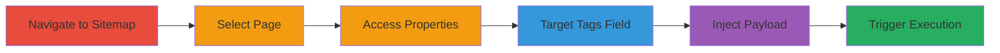

---
tags:
  - xss
  - concrete-cms
  - web-vulnerability
  - javascript-injection
type: attack_chain
tools: []
tactics:
  - '[[Execution]]'
verified: false
platforms:
  - Web
submitted: true
complexity: medium
created_at: '2024-10-01T00:00:00Z'
procedures:
  - '[[procedures/Exploit-XSS-in-Concrete-CMS-Tags-Field]]'
step_count: 6
techniques:
  - '[[JavaScript]]'
updated_at: '2025-12-14T03:15:53.230Z'
description: >-
  A multi-step attack demonstrating reflected XSS in the Custom Attributes
  'tags' field of Concrete CMS page properties, enabling arbitrary JavaScript
  execution in the authenticated user's browser for potential session hijacking.
skill_level: intermediate
impact_level: high
id: d929ec10-522a-428f-bf74-05f07522db82
validated: true
mitre_tactics:
  - '[[Execution]]'
mitre_techniques:
  - '[[JavaScript]]'
---
# XSS Exploitation in Concrete CMS Custom Attributes Tags Field

Multi-stage attack chain demonstrating a complete attack workflow for exploiting a reflected Cross-Site Scripting (XSS) vulnerability in Concrete CMS.

## Chain Metrics Dashboard

| Metric | Value |
|--------|-------|
| Chain Status | Unverified |
| Total Steps | 6 |
| Execution Time | ~5 minutes |
| Skill Level | Intermediate |
| Complexity | Medium |
| Impact Level | High |

## Attack Flow Visualization

## Prerequisites & Requirements

### Required Tools

- Web browser (e.g., Chrome with developer tools for payload testing)

### Target Environment

- Concrete CMS installation (version vulnerable to this issue, e.g., pre-patch for CVE-2015-XXXX or similar)
- PHP-based web server
- Authenticated access to the dashboard

### Initial Access Requirements

- Valid user credentials with permissions to edit page properties (e.g., editor or admin role)
- Direct network access to the Concrete CMS instance
- No prior access needed beyond authentication

## Detailed Attack Procedures

### Step 1: Navigate to the Sitemap Explore Page
procedure: [[procedures/Exploit-XSS-in-Concrete-CMS-Tags-Field]]

**Objective**: Gain access to the sitemap to locate editable pages.

**Instructions**: Open the Concrete CMS dashboard in your browser and navigate to the sitemap explore section.

**Expected Output**: The sitemap interface loads, displaying page hierarchy.

**Success Indicators**:
- Sitemap explore page is accessible at `/index.php/dashboard/sitemap/explore/`
- No authentication errors

### Step 2: Select the Blog Page
procedure: [[procedures/Exploit-XSS-in-Concrete-CMS-Tags-Field]]

**Objective**: Identify a target page with editable properties, such as a blog page.

**Instructions**: In the sitemap, locate and click on the 'blog' entry (assuming a Blog page type exists in the site structure).

**Expected Output**: The selected page details load in the interface.

**Success Indicators**:
- Blog page is highlighted and selected
- Page properties option becomes available

### Step 3: Access Page Properties
procedure: [[procedures/Exploit-XSS-in-Concrete-CMS-Tags-Field]]

**Objective**: Enter the editing mode for the page to access custom attributes.

**Instructions**: From the selected page, navigate to the properties section of the interface.

**Expected Output**: Page properties panel opens, showing editable fields.

**Success Indicators**:
- Properties tab or section is visible and accessible
- Edit mode is active without errors

### Step 4: Go to Custom Attributes and Select Tags Field
procedure: [[procedures/Exploit-XSS-in-Concrete-CMS-Tags-Field]]

**Objective**: Locate the vulnerable 'tags' field within custom attributes.

**Instructions**: In the properties panel, expand or select the Custom Attributes section and focus on the 'tags' input field.

**Expected Output**: The tags field input box is ready for editing.

**Success Indicators**:
- Custom Attributes section loads
- Tags field is editable

### Step 5: Inject XSS Payload
procedure: [[procedures/Exploit-XSS-in-Concrete-CMS-Tags-Field]]

**Objective**: Insert a malicious JavaScript payload into the tags field to test for XSS.

**Instructions**: In the tags field, append or replace with the payload: `">`. This breaks out of the HTML context and executes JavaScript on error.

**Expected Output**: Payload is entered without immediate validation errors.

**Success Indicators**:
- Payload text is accepted in the field
- No client-side sanitization blocks the input

### Step 6: Trigger XSS
procedure: [[procedures/Exploit-XSS-in-Concrete-CMS-Tags-Field]]

**Objective**: Save the changes to execute the injected script in the browser context.

**Instructions**: Submit or save the form to persist the tags and trigger the reflection of the payload.

**Expected Output**: An alert dialog pops up with '4', confirming JavaScript execution.

**Success Indicators**:
- Alert(4) executes in the browser
- No server-side sanitization prevents execution

## Attack Chain Summary

### Key Achievements

1. Successful navigation and selection of a vulnerable page in Concrete CMS.
2. Injection of arbitrary JavaScript via the unsanitized tags field.
3. Achievement of code execution in the authenticated user's session, enabling potential session theft or further admin actions.

## Technique & Tactic Coverage

### MITRE ATT&CK Techniques

- [[JavaScript]]

### MITRE ATT&CK Tactics

- [[Execution]]

---
*Last updated: 2024-10-01T00:00:00Z*
