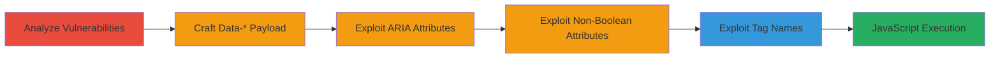

# XSS Exploitation in Ruby on Rails Tag Helpers via Malicious Attributes and Tags

Multi-stage attack chain demonstrating exploitation of XSS flaws in Ruby on Rails tag helpers, where insufficient sanitization of user-controlled input in attribute names and tag names allows injection of malicious HTML and JavaScript. This leads to arbitrary code execution, enabling data theft, phishing, or network scanning in reflected or stored XSS scenarios.

## Chain Metrics Dashboard

| Metric | Value |
|--------|-------|
| Chain Status | Unverified |
| Total Steps | 5 |
| Execution Time | ~10 minutes |
| Skill Level | Intermediate |
| Complexity | Medium |
| Impact Level | High |

## Attack Flow Visualization

## Prerequisites & Requirements

### Required Tools

- None (requires access to Rails application source or vulnerable endpoint)

### Target Environment

- Ruby on Rails application using ActionView helpers
- ERB views processing user input in tag helpers
- Web platform with URL parameters or stored input

### Initial Access Requirements

- Ability to supply input via URL parameters or forms
- Access to a vulnerable Rails endpoint (e.g., reflected via GET params)
- No credentials needed for reflected XSS; stored XSS may require user registration

## Detailed Attack Procedures

### Step 1: Analyze Vulnerabilities
procedure: [[procedures/Analyze-Rails-Tag-Helpers-for-XSS-Protections]]

**Objective**: Identify insufficient XSS protections in Rails tag helpers to find injection points.

**Instructions**: Review the source code of ActionView::Helpers::FormTagHelper and ActionView::Helpers::TagHelper modules. Focus on methods like check_box_tag, label_tag, tag, and content_tag, checking for lack of character restrictions in attribute names and tag names.

**Expected Output**: Confirmation of no sanitization for user-controlled keys in options hashes or tag arguments.

**Success Indicators**:
- Identified methods without attribute name validation
- Noted potential breakout points in HTML generation

### Step 2: Craft Data-* Payload
procedure: [[procedures/Craft-XSS-Payload-for-Data-Attributes-in-Check-Box-Tag]]

**Objective**: Inject malicious payload into prefixed HTML data-* attributes using user-controlled keys in options hash.

**Instructions**: In a vulnerable ERB view, use check_box_tag with a user-controlled key from params: `check_box_tag('thename', 'thevalue', false, data: { params[:payload] => 'thevalueofdata' })`. Supply payload via URL parameter, e.g., `payload=something="something">
 'thevalueofaria' })`. Apply the same payload as in Step 2 to break out and inject the img tag with onerror handler.

**Expected Output**: HTML attribute closure followed by injected script execution.

**Success Indicators**:
- JavaScript alert triggers
- Injected elements visible in browser inspector

### Step 4: Exploit Non-Boolean Attributes
procedure: [[procedures/Exploit-Non-Boolean-Attributes-in-Options-Hash]]

**Objective**: Leverage user-controlled input as attribute names for non-boolean attributes to enable breakout.

**Instructions**: Use check_box_tag with direct user input as key: `check_box_tag('thename', 'thevalue', false, params[:malicious_input] => 'theothervalue')`. Inject payload to close the attribute and add script tags.

**Expected Output**: Attribute injection leads to malformed HTML executing arbitrary JS.

**Success Indicators**:
- Successful payload execution
- No sanitization errors in Rails logs

### Step 5: Exploit Tag Names
procedure: [[procedures/Exploit-Tag-and-Content-Tag-Methods-with-Malicious-Tag-Names]]

**Objective**: Inject malicious tag names in tag and content_tag methods to directly insert executable elements.

**Instructions**: Call `tag(params[:malicious_input])`, `tag.public_send(params[:malicious_input].to_sym)`, or `content_tag(params[:malicious_input])`. Use URL-encoded payload: `img%20src=%22/nonexistent%22%20onerror=%22alert(1)%22`.

**Expected Output**: Rendered `` tag executes JS.

**Success Indicators**:
- Alert confirms exploitation
- Custom tag injected without Rails errors

## Attack Chain Summary

### Key Achievements

1. Identified multiple injection points in Rails helpers
2. Demonstrated attribute and tag name breakouts for XSS
3. Achieved arbitrary JS execution for data exfiltration or phishing

## Technique & Tactic Coverage

### MITRE ATT&CK Techniques

- [[JavaScript]]
- [[Exploit Public-Facing Application]]

### MITRE ATT&CK Tactics

- [[Execution]]
- [[Collection]]

---
*Last updated: 2023-10-01T00:00:00Z*
