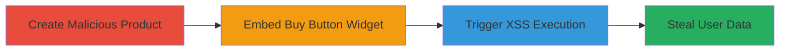

---
tags:
  - xss
  - shopify
  - javascript
  - client-side-attack
type: attack_chain
tools: []
tactics:
  - '[[Execution]]'
  - '[[Collection]]'
verified: false
platforms:
  - Web
submitted: true
complexity: medium
procedures:
  - '[[procedures/Create-Malicious-Product-with-XSS-Payload-in-Shopify]]'
  - '[[procedures/Embed-Buy-Button-to-Trigger-XSS-Execution]]'
step_count: 2
techniques:
  - '[[JavaScript]]'
  - '[[Steal Web Session Cookie]]'
description: >-
  A multi-stage attack exploiting a Cross-Site Scripting (XSS) vulnerability in
  Shopify's Buy Button channel by injecting malicious JavaScript into product
  descriptions and triggering execution via embedded widgets.
skill_level: intermediate
impact_level: high
id: 00cdcbf0-13d7-4d1e-9d5c-a27aa0baa5a3
created_at: '2025-12-14T03:16:08.140Z'
updated_at: '2025-12-14T03:16:08.140Z'
validated: true
mitre_tactics:
  - '[[Execution]]'
  - '[[Collection]]'
mitre_techniques:
  - '[[JavaScript]]'
  - '[[Steal Web Session Cookie]]'
---
# XSS Exploitation in Shopify Buy Button via Unsanitized Product Descriptions

Multi-stage attack chain demonstrating a complete attack workflow exploiting XSS in Shopify's Buy Button channel.

## Chain Metrics Dashboard

| Metric | Value |
|--------|-------|
| Chain Status | Unverified |
| Total Steps | 2 |
| Execution Time | ~5 minutes |
| Skill Level | Intermediate |
| Complexity | Medium |
| Impact Level | High |

## Attack Flow Visualization

## Prerequisites & Requirements

### Required Tools

- Shopify admin access (attacker account)
- A target website for embedding the Buy Button

### Target Environment

- Shopify platform (my.shopify.com)
- Web browser for viewing embedded widget
- No specific ports or services beyond standard HTTPS

### Initial Access Requirements

- Valid Shopify merchant account for creating products
- Access to embed code generation
- No prior network position needed; operates client-side

## Detailed Attack Procedures

### Step 1: Create Malicious Product
procedure: [[procedures/Create-Malicious-Product-with-XSS-Payload-in-Shopify]]

**Objective**: Inject a malicious JavaScript payload into a product description to prepare for XSS execution.

**Instructions**: Log in to the Shopify admin panel, navigate to Products, create a new product, and insert the XSS payload into the description field. The payload uses an image tag with an onerror event to execute JavaScript.

**Expected Output**: Product created successfully with the payload stored in the description.

**Success Indicators**:
- Product appears in the admin list without errors
- Description field saves the HTML/JavaScript payload

### Step 2: Embed Buy Button and Trigger XSS
procedure: [[procedures/Embed-Buy-Button-to-Trigger-XSS-Execution]]

**Objective**: Generate and embed the Buy Button widget using a template that renders the unsanitized product description, leading to JavaScript execution in the viewer's browser.

**Instructions**: In the Shopify admin, go to the Buy Button embed page, select the product, choose the third template for website embedding, copy the embed code, and paste it into a test HTML page. Load the page in a browser to trigger the payload.

**Expected Output**: The embedded widget displays, and the XSS payload executes, such as prompting the document.cookie.

**Success Indicators**:
- JavaScript alert or prompt appears in the browser
- Console logs show execution of arbitrary code

## Attack Chain Summary

### Key Achievements

1. Successful injection of XSS payload into Shopify product description
2. Triggering of client-side JavaScript execution via Buy Button widget
3. Potential theft of user cookies or session data from viewers

## Technique & Tactic Coverage

### MITRE ATT&CK Techniques

- [[JavaScript]]
- [[Steal Web Session Cookie]]

### MITRE ATT&CK Tactics

- [[Execution]]
- [[Collection]]

---
*Last updated: 2023-10-01*
