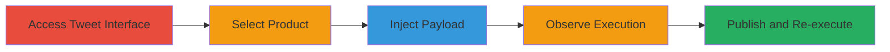

# XSS Exploitation in Shopify Tweet Creation for Arbitrary JavaScript Execution

Multi-stage attack chain demonstrating a complete attack workflow exploiting insufficient input sanitization in Shopify's tweet creation interface.

## Chain Metrics Dashboard

| Metric | Value |
|--------|-------|
| Chain Status | Unverified |
| Total Steps | 5 |
| Execution Time | ~2 minutes |
| Skill Level | Beginner |
| Complexity | Low |
| Impact Level | High |

## Attack Flow Visualization

## Prerequisites & Requirements

### Required Tools

- Web browser (e.g., Chrome, Firefox)

### Target Environment

- Shopify admin dashboard with tweet creation feature enabled
- Twitter integration active
- Authenticated session as a Shopify user

### Initial Access Requirements

- Valid Shopify account credentials
- Network access to Shopify's web application
- No prior access needed beyond authentication

## Detailed Attack Procedures

### Step 1: Access Tweet Creation Interface
procedure: [[procedures/Exploit-XSS-in-Shopify-Tweet-Creation]]

**Objective**: Navigate to the tweet creation feature within the Shopify dashboard to prepare for payload injection.

**Instructions**: Log in to the Shopify admin panel and locate the tweet creation option, typically under product sharing or social media integration features.

**Expected Output**: The tweet creation interface loads, including fields for message content and product selection.

**Success Indicators**:
- Tweet creation form is visible and editable
- User is authenticated in the session

### Step 2: Select a Product
procedure: [[procedures/Exploit-XSS-in-Shopify-Tweet-Creation]]

**Objective**: Associate a product with the tweet to enable the message content field for input.

**Instructions**: In the tweet creation interface, browse and select any product from the Shopify catalog to link it to the tweet.

**Expected Output**: The product is selected, and the message content field becomes active for user input.

**Success Indicators**:
- Product is displayed in the tweet preview
- Message field is enabled

### Step 3: Inject Malicious Payload
procedure: [[procedures/Exploit-XSS-in-Shopify-Tweet-Creation]]

**Objective**: Enter a JavaScript payload into the message field to trigger XSS upon input validation or rendering.

**Instructions**: In the message content field, input the payload: ``. This payload uses an invalid image source to trigger an onerror event executing JavaScript.

**Expected Output**: The payload is entered, and an alert box immediately pops up displaying the document domain (e.g., 'admin.shopify.com').

**Success Indicators**:
- Alert executes on input without publishing
- JavaScript runs in the context of the Shopify session

### Step 4: Observe Initial XSS Execution
procedure: [[procedures/Exploit-XSS-in-Shopify-Tweet-Creation]]

**Objective**: Verify the vulnerability by confirming JavaScript execution triggered solely by inputting the payload.

**Instructions**: After entering the payload, observe the browser's behavior without further actions. The XSS should fire due to improper escaping during field rendering or validation.

**Expected Output**: JavaScript alert confirms execution, proving arbitrary code injection is possible.

**Success Indicators**:
- No additional actions required for execution
- Alert shows domain, indicating session context

### Step 5: Publish Tweet to Re-trigger XSS
procedure: [[procedures/Exploit-XSS-in-Shopify-Tweet-Creation]]

**Objective**: Publish the tweet to demonstrate persistent or re-triggered execution, simulating real-world impact like session hijacking.

**Instructions**: Click the 'Publish' button on the tweet creation form while the payload remains in the message field.

**Expected Output**: The tweet publishes, and the XSS payload executes again, potentially allowing further malicious actions like cookie theft.

**Success Indicators**:
- Tweet is created and visible
- Second alert or JavaScript execution occurs post-publish

## Attack Chain Summary

### Key Achievements

1. Immediate JavaScript execution upon payload input in the tweet message field
2. Confirmation of vulnerability through domain alert in authenticated session
3. Re-execution on publish, enabling potential data exfiltration or session hijacking

## Technique & Tactic Coverage

### MITRE ATT&CK Techniques

- [[JavaScript]]

### MITRE ATT&CK Tactics

- [[Execution]]
- [[Collection]]

---
*Last updated: 2023-10-01T00:00:00Z*
