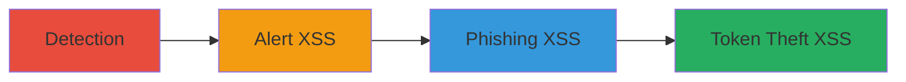

---
tags:
  - xss
  - swagger-ui
  - javascript-injection
  - token-theft
type: attack_chain
tools:
  - '[[tools/Custom-Swagger-UI-Detection-Module]]'
tactics:
  - '[[Initial Access]]'
  - '[[Execution]]'
  - '[[Collection]]'
commands:
  - '[[commands/open-xss-alert-url]]'
  - '[[commands/open-xss-phishing-url]]'
  - '[[commands/open-xss-token-theft-url]]'
platforms:
  - Web
complexity: medium
procedures:
  - '[[procedures/Detect-Exposed-Swagger-UI-Endpoints]]'
  - '[[procedures/Craft-XSS-Payload-for-Alert]]'
  - '[[procedures/Craft-XSS-Payload-for-Phishing]]'
  - '[[procedures/Craft-XSS-Payload-for-Token-Theft]]'
step_count: 4
techniques:
  - '[[Exploit Public-Facing Application]]'
  - '[[JavaScript]]'
description: >-
  Multi-stage attack chain exploiting XSS in exposed Swagger-UI to inject
  JavaScript and steal authentication tokens
skill_level: intermediate
impact_level: high
id: 481b45e6-6ff6-4053-b3a6-defcdf8bec4f
created_at: '2025-12-13T23:56:20.475Z'
updated_at: '2025-12-13T23:56:20.475Z'
verified: false
validated: true
submitted: true
mitre_tactics:
  - '[[Initial Access]]'
  - '[[Execution]]'
  - '[[Collection]]'
mitre_techniques:
  - '[[Exploit Public-Facing Application]]'
  - '[[JavaScript]]'
---
# XSS Exploitation in Swagger-UI via ConfigUrl for Token Theft

Multi-stage attack chain demonstrating the discovery and exploitation of an XSS vulnerability in an exposed Swagger-UI endpoint on a web application, allowing arbitrary JavaScript execution for phishing, alerts, or stealing authentication tokens from localStorage, potentially leading to account takeover.

## Chain Metrics Dashboard

| Metric | Value |
|--------|-------|
| Chain Status | Unverified |
| Total Steps | 4 |
| Execution Time | ~10 minutes |
| Skill Level | Intermediate |
| Complexity | Medium |
| Impact Level | High |

## Attack Flow Visualization



## Prerequisites & Requirements

### Required Tools

- [[tools/Custom-Swagger-UI-Detection-Module]]
- [[tools/Browser]]

### Target Environment

- Web platform
- Services: Jamf Pro, Swagger-UI
- Network access to the target URL: https://jamfpro.shopifycloud.com/classicapi/doc/

### Initial Access Requirements

- No credentials required for detection and basic exploitation
- Authenticated session needed for token theft
- Public internet access

## Detailed Attack Procedures

### Step 1: Detect Exposed Swagger-UI Endpoint
procedure: [[procedures/Detect-Exposed-Swagger-UI-Endpoints]]

**Objective**: Identify exposed Swagger-UI instances across target domains to find vulnerable endpoints.

**Instructions**: Use the custom detection module to scan for Swagger-UI instances. Run the module against the target domain:

```bash
# Assuming the custom module is a script, e.g., python detect_swagger.py -d shopifycloud.com
```

**Expected Output**: List of detected endpoints, including https://jamfpro.shopifycloud.com/classicapi/doc/.

**Success Indicators**:
- Vulnerable endpoint identified
- Confirmation of old Swagger-UI version exposed

### Step 2: Craft and Test XSS for Alert
procedure: [[procedures/Craft-XSS-Payload-for-Alert]]

**Objective**: Inject and execute a simple JavaScript alert via the configUrl parameter.

**Instructions**: Craft the malicious URL and open it in a browser using [[commands/open-xss-alert-url]]:

```bash
echo 'Open in browser: https://jamfpro.shopifycloud.com/classicapi/doc/?configUrl=data:text/html;base64,encoded-payload-for-alert'
```

**Expected Output**: An alert box displaying a message like 'XSS'.

**Success Indicators**:
- Alert box appears
- JavaScript execution confirmed

### Step 3: Craft and Test XSS for Phishing Page
procedure: [[procedures/Craft-XSS-Payload-for-Phishing]]

**Objective**: Render a phishing page via injected JavaScript to capture user credentials.

**Instructions**: Craft the malicious URL and open it in a browser using [[commands/open-xss-phishing-url]]:

```bash
echo 'Open in browser: https://jamfpro.shopifycloud.com/classicapi/doc/?configUrl=data:text/html;base64,encoded-payload-for-phishing'
```

**Expected Output**: A phishing page rendered in the application context.

**Success Indicators**:
- Phishing page loads
- User interaction possible for credential theft

### Step 4: Craft and Test XSS for Token Theft
procedure: [[procedures/Craft-XSS-Payload-for-Token-Theft]]

**Objective**: Steal authentication tokens from localStorage after user authentication.

**Instructions**: Authenticate to the application, then craft and open the malicious URL in a browser using [[commands/open-xss-token-theft-url]]:

```bash
echo 'Open in browser: https://jamfpro.shopifycloud.com/classicapi/doc/?configUrl=data:text/html;base64,encoded-payload-for-token-theft'
```

**Expected Output**: Alert or exfiltration of the authToken from localStorage.

**Success Indicators**:
- Token value displayed or sent to attacker
- Potential for account takeover

## Attack Chain Summary

### Key Achievements

1. Discovery of vulnerable Swagger-UI endpoint
2. Successful XSS injection for arbitrary JS execution
3. Theft of authentication tokens leading to account takeover

## Technique & Tactic Coverage

### MITRE ATT&CK Techniques

- [[Exploit Public-Facing Application]]
- [[JavaScript]]

### MITRE ATT&CK Tactics

- [[Initial Access]]
- [[Execution]]
- [[Collection]]

*Last updated: 2023-10-01*
