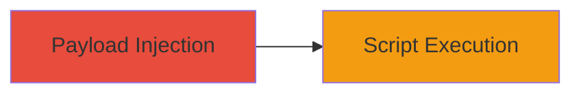

# XSS Exploitation in VK.com Product Selection via Input Validation Flaw

Multi-stage attack chain demonstrating a complete attack workflow.

## Chain Metrics Dashboard

| Metric | Value |
|--------|-------|
| Chain Status | Unverified |
| Total Steps | 1 |
| Execution Time | ~5 minutes |
| Skill Level | Intermediate |
| Complexity | Low |
| Impact Level | Low |

## Attack Flow Visualization

## Prerequisites & Requirements

### Required Tools

- Web browser with developer tools (e.g., Chrome DevTools)

### Target Environment

- VK.com web application
- Access to product creation or editing features
- No specific ports or services required beyond standard HTTPS (port 443)

### Initial Access Requirements

- Valid VK.com account with permission to create or edit products
- Network access to vk.com
- No prior elevated access needed

## Detailed Attack Procedures

### Step 1: Inject and Trigger XSS Payload
procedure: [[procedures/Inject-Malicious-Script-into-VK-Product-Fields]]

**Objective**: Inject a malicious JavaScript payload into product input fields and trigger its execution when a victim selects or views the product, leading to arbitrary code execution in the browser context.

**Instructions**: Log in to VK.com with an account that allows product creation. Navigate to the product creation or editing interface. In the product fields (e.g., name, description, or other input areas), enter a payload such as ``. Save the product. Then, either select the product yourself or entice another user (e.g., via social engineering) to view or select it, which renders the unescaped input and executes the script.

**Expected Output**: An alert box or other scripted behavior appears in the victim's browser upon product selection or viewing.

**Success Indicators**:
- Payload is accepted without sanitization during input
- Script executes (e.g., alert pops up) when product is selected or viewed
- Browser console shows JavaScript execution errors or logs if using more advanced payloads

## Attack Chain Summary

### Key Achievements

1. Successful injection of unsanitized JavaScript into product fields
2. Execution of arbitrary code in the victim's browser context
3. Demonstration of low-severity impact without server-side compromise

## Technique & Tactic Coverage

### MITRE ATT&CK Techniques

- [[JavaScript]]

### MITRE ATT&CK Tactics

- [[Execution]]

---
*Last updated: 2023-10-01T00:00:00Z*
