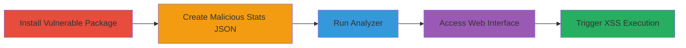

---
tags:
  - xss
  - node.js
  - webpack
  - third-party-module
  - local-execution
type: attack_chain
tools:
  - '[[tools/npm]]'
  - '[[tools/node]]'
  - '[[tools/git]]'
  - '[[tools/webpack]]'
  - '[[tools/webpack-bundle-analyzer]]'
tactics:
  - '[[Execution]]'
verified: false
platforms:
  - Node.js
  - Web
submitted: true
created_at: '2023-10-01T00:00:00Z'
procedures:
  - '[[procedures/Install-Vulnerable-webpack-bundle-analyzer]]'
  - '[[procedures/Create-Malicious-Webpack-Stats-JSON]]'
  - '[[procedures/Run-Analyzer-on-Malicious-JSON]]'
  - '[[procedures/Access-Web-Interface-to-Trigger-XSS]]'
  - '[[procedures/Reproduce-with-Git-Clone-and-Build]]'
step_count: 5
techniques:
  - '[[JavaScript]]'
updated_at: '2025-12-14T03:16:36.986Z'
description: >-
  A multi-stage attack chain exploiting a Cross-site Scripting (XSS)
  vulnerability in webpack-bundle-analyzer version 3.0.3, where unsanitized file
  and directory names from malicious third-party modules are injected into the
  viewer.ejs template, leading to arbitrary JavaScript execution in the
  developer's browser upon accessing the local web interface.
id: 8f678bf2-36a5-46b9-85ca-91db3df9f061
validated: true
mitre_tactics:
  - '[[Execution]]'
mitre_techniques:
  - '[[JavaScript]]'
---
# XSS Exploitation in webpack-bundle-analyzer via Malicious Third-Party Module Names

Multi-stage attack chain demonstrating exploitation of a Cross-site Scripting (XSS) vulnerability in the webpack-bundle-analyzer Node.js module (version 3.0.3). An attacker controlling a third-party module crafts malicious file and directory names that are not sanitized before being rendered in the viewer.ejs template. When a developer analyzes a webpack stats JSON file influenced by such a module, accessing the local web interface at http://localhost:8888 executes arbitrary JavaScript in the browser, potentially leading to code execution in the developer's environment.

## Chain Metrics Dashboard

| Metric | Value |
|--------|-------|
| Chain Status | Unverified |
| Total Steps | 5 |
| Execution Time | ~10 minutes |
| Skill Level | Intermediate |
| Complexity | Medium |
| Impact Level | High |

## Attack Flow Visualization



## Prerequisites & Requirements

### Required Tools

- [[tools/npm]]
- [[tools/node]]
- [[tools/git]]
- [[tools/webpack]]
- [[tools/webpack-bundle-analyzer]]

### Target Environment

- Node.js runtime (version compatible with webpack-bundle-analyzer 3.0.3)
- Local web browser
- Port 8888 available

### Initial Access Requirements

- Control over a third-party module or ability to craft webpack stats JSON with malicious names
- Developer environment with npm access

## Detailed Attack Procedures

### Step 1: Install Vulnerable Package
procedure: [[procedures/Install-Vulnerable-webpack-bundle-analyzer]]

**Objective**: Set up the vulnerable webpack-bundle-analyzer module in the local environment.

**Instructions**: Use [[commands/npm-install-webpack-bundle-analyzer]] to install the vulnerable version.

```bash
npm i webpack-bundle-analyzer
```

**Expected Output**: Installation logs confirming webpack-bundle-analyzer@3.0.3 is added to node_modules.

**Success Indicators**:
- Package installed successfully
- node_modules/webpack-bundle-analyzer directory created

### Step 2: Create Malicious Webpack Stats JSON
procedure: [[procedures/Create-Malicious-Webpack-Stats-JSON]]

**Objective**: Craft a webpack stats JSON file containing unsanitized malicious asset names to inject XSS payload.

**Instructions**: Manually create poc.json with an asset name like '</script><script>alert(1)</script>main.js' in the assets array of the stats object.

**Expected Output**: Valid JSON file ready for analyzer input.

**Success Indicators**:
- JSON file parses without errors
- Malicious payload embedded in asset names

### Step 3: Run Analyzer on Malicious JSON
procedure: [[procedures/Run-Analyzer-on-Malicious-JSON]]

**Objective**: Execute the analyzer on the crafted JSON to start the local server with injected payload.

**Instructions**: Use [[commands/node-run-analyzer]] to launch the analyzer.

```bash
node ./node_modules/webpack-bundle-analyzer/lib/bin/analyzer.js poc.json
```

**Expected Output**: Server starts at http://127.0.0.1:8888 with message "Webpack Bundle Analyzer is started".

**Success Indicators**:
- Local server running on port 8888
- No errors in console output

### Step 4: Access Web Interface to Trigger XSS
procedure: [[procedures/Access-Web-Interface-to-Trigger-XSS]]

**Objective**: Load the analyzer's web interface to execute the injected JavaScript payload.

**Instructions**: Open a browser and navigate to http://localhost:8888.

**Expected Output**: Page loads with treemap visualization; alert(1) or injected script executes immediately.

**Success Indicators**:
- JavaScript alert or console execution observed
- Payload breaks out of script tags in viewer.ejs

### Step 5: Full Reproduction with Clone and Build
procedure: [[procedures/Reproduce-with-Git-Clone-and-Build]]

**Objective**: Demonstrate the attack in a controlled webpack build environment with malicious third-party module.

**Instructions**: Clone the POC repo using [[commands/git-clone-poc]], change directory with [[commands/cd-poc-directory]], install deps with [[commands/npm-install-poc]], then build with [[commands/npm-run-build]].

```bash
git clone https://github.com/inkz/poc-webpack-bundle-analyzer.git
cd poc-webpack-bundle-analyzer/
npm install
npm run build
```

**Expected Output**: Build completes, analyzer starts at http://localhost:8888, payload executes on access.

**Success Indicators**:
- Repository cloned and dependencies installed
- Build generates stats with malicious names
- XSS triggers on interface load

## Attack Chain Summary

### Key Achievements

1. Successful installation of vulnerable package
2. Injection of XSS payload via webpack stats
3. Local server execution leading to browser-based code execution
4. Full reproduction confirming third-party module control

## Technique & Tactic Coverage

### MITRE ATT&CK Techniques

- [[JavaScript]]

### MITRE ATT&CK Tactics

- [[Execution]]

---
*Last updated: 2023-10-01T00:00:00Z*
