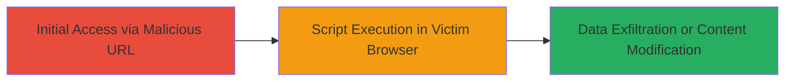

---
tags:
  - xss
  - web
  - dod
  - vulnerability
  - injection
type: attack_chain
tools: []
tactics:
  - '[[Execution]]'
  - '[[Collection]]'
commands: []
platforms:
  - Web
complexity: low
procedures:
  - '[[procedures/Demonstrate-XSS-via-Crafted-URL]]'
step_count: 1
techniques:
  - '[[JavaScript]]'
description: >-
  Demonstration of a cross-site scripting (XSS) vulnerability on a U.S.
  Department of Defense website by crafting a malicious URL to inject and
  execute scripts in a victim's browser.
skill_level: beginner
impact_level: high
id: d1a0d1ed-afe8-4a06-9710-0ebaae3a621d
created_at: '2025-12-14T03:15:41.335Z'
updated_at: '2025-12-14T03:15:41.335Z'
verified: false
validated: true
submitted: true
mitre_tactics:
  - '[[Execution]]'
  - '[[Collection]]'
mitre_techniques:
  - '[[JavaScript]]'
---
# XSS Exploitation via Crafted URL on DoD Website

## Overview

This attack chain outlines the identification and demonstration of a cross-site scripting (XSS) vulnerability on a U.S. Department of Defense (DoD) website. The vulnerability allows an attacker to craft a specially formatted URL that, when visited by a victim, injects and executes malicious JavaScript in the victim's browser. This can lead to the theft of session cookies, disclosure of sensitive information, or unauthorized modification of the webpage content. The attack relies on insufficient input sanitization or output encoding on an unspecified endpoint or parameter, making it exploitable through social engineering to lure users to the malicious URL.

## Chain Metrics Dashboard

| Metric | Value |
|--------|-------|
| Chain Status | Unverified |
| Total Steps | 1 |
| Execution Time | ~1 minute |
| Skill Level | Beginner |
| Complexity | Low |
| Impact Level | High |

## Attack Flow Visualization

## Prerequisites & Requirements

### Required Tools

- Web browser for testing (e.g., Chrome Developer Tools)

### Target Environment

- Web application on a DoD website
- Vulnerable endpoint accepting user-controlled input via URL parameters
- No specific services/ports required beyond standard HTTP/HTTPS (ports 80/443)

### Initial Access Requirements

- Ability to craft and distribute URLs (e.g., via email or social engineering)
- No prior credentials or network access needed; exploitable by any user visiting the URL

## Detailed Attack Procedures

### Step 1: Craft and Demonstrate Malicious URL
procedure: [[procedures/Demonstrate-XSS-via-Crafted-URL]]

**Objective**: Identify a vulnerable parameter on the DoD website and craft a URL that injects a malicious script to execute in the victim's browser, demonstrating potential for session hijacking or content manipulation.

**Instructions**: Analyze the target website for reflectable parameters (e.g., search fields, error messages). Append a test payload to a URL parameter, such as a reflected input field. For example, if a search parameter is vulnerable, construct a URL like `https://target.dod.mil/search?q=`. Visit the URL in a browser to confirm execution. To simulate real impact, replace the alert with code to exfiltrate cookies, e.g., `https://target.dod.mil/search?q=`.

**Expected Output**: The script executes, popping an alert or sending data to the attacker's server.

**Success Indicators**:
- Malicious script executes without errors (e.g., alert box appears)
- Browser console shows JavaScript injection
- Network requests to attacker's domain confirm exfiltration

## Attack Chain Summary

### Key Achievements

1. Successful injection of JavaScript via a crafted URL on a high-security DoD website
2. Demonstration of potential session information theft
3. Highlighting of content modification risks without authentication

## Technique & Tactic Coverage

### MITRE ATT&CK Techniques

- [[JavaScript]]

### MITRE ATT&CK Tactics

- [[Execution]]
- [[Collection]]

---
*Last updated: 2023-10-01*
