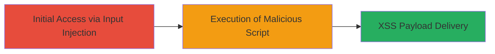

---
tags:
  - xss
  - rails
  - ruby
  - sanitizer
  - web
type: attack_chain
tools: []
tactics:
  - '[[Initial Access]]'
  - '[[Execution]]'
verified: false
platforms:
  - Web
submitted: true
complexity: medium
created_at: '2024-01-01T00:00:00Z'
procedures:
  - '[[procedures/Exploit-XSS-in-Rails-HTML-Sanitizer]]'
step_count: 1
techniques:
  - '[[Exploit Public-Facing Application]]'
  - '[[JavaScript]]'
updated_at: '2025-12-14T00:11:09.133Z'
description: >-
  Demonstrates exploitation of an XSS vulnerability in the rails-html-sanitizer
  gem, allowing injection of malicious attributes that persist after
  sanitization, leading to script execution in Ruby on Rails applications.
skill_level: intermediate
impact_level: high
id: ca529f55-0c17-482c-9d2d-35a5b9105e63
validated: true
mitre_tactics:
  - '[[Initial Access]]'
  - '[[Execution]]'
mitre_techniques:
  - '[[Exploit Public-Facing Application]]'
  - '[[JavaScript]]'
---
# XSS Exploitation via Malicious Attributes in Rails HTML Sanitizer

Multi-stage attack chain demonstrating a complete attack workflow exploiting an XSS vulnerability in the rails-html-sanitizer gem used by Ruby on Rails applications.

## Chain Metrics Dashboard

| Metric | Value |
|--------|-------|
| Chain Status | Unverified |
| Total Steps | 1 |
| Execution Time | ~5 minutes |
| Skill Level | Intermediate |
| Complexity | Medium |
| Impact Level | High |

## Attack Flow Visualization

## Prerequisites & Requirements

### Required Tools

- Browser developer tools for testing
- Access to a vulnerable Ruby on Rails application

### Target Environment

- Ruby on Rails application using rails-html-sanitizer gem (versions affected: prior to patch)
- Web platform with user input sanitization via Rails' sanitize method
- No specific ports required beyond standard HTTP/HTTPS (80/443)

### Initial Access Requirements

- Ability to submit user input (e.g., comments, posts) that gets sanitized and rendered as HTML
- No prior credentials needed if the input field is public
- Network access to the target web application

## Detailed Attack Procedures

### Step 1: Inject Crafted HTML for XSS Bypass
procedure: [[procedures/Exploit-XSS-in-Rails-HTML-Sanitizer]]

**Objective**: Submit specially-crafted HTML input to the Rails application to bypass sanitization, allowing malicious attributes like javascript: URIs to persist and execute XSS when rendered.

**Instructions**: Identify an input field in the target Rails application that uses the sanitize method (e.g., a comment or bio field). Craft a payload using entity-encoded or specially structured HTML to evade attribute removal. For example, use a link with a javascript: href that the sanitizer fails to strip due to the vulnerability. Submit the input via the web form or API endpoint. Once processed and rendered, the malicious attribute will execute JavaScript in the victim's browser context.

Example payload: `<a href="&#x6a;&#x61;&#x76;&#x61;&#x73;&#x63;&#x72;&#x69;&#x70;&#x74;&#x3a;&#x61;&#x6c;&#x65;&#x72;&#x74;&#x28;&#x27;&#x58;&#x53;&#x53;&#x27;&#x29;">Click me</a>` (entity-encoded javascript:alert('XSS')).

**Expected Output**: The sanitized HTML output retains the malicious href attribute, and clicking the link or rendering triggers an alert box or other script execution.

**Success Indicators**:
- Malicious attribute persists in the application's output HTML (inspect via browser dev tools)
- JavaScript executes, e.g., alert pops up or network requests are made from the victim's session

## Attack Chain Summary

### Key Achievements

1. Bypassed HTML sanitization in rails-html-sanitizer to inject executable attributes
2. Achieved XSS execution in the context of the Rails application
3. Demonstrated potential for session hijacking, data theft, or further attacks via injected scripts

## Technique & Tactic Coverage

### MITRE ATT&CK Techniques

- [[Exploit Public-Facing Application]]
- [[JavaScript]]

### MITRE ATT&CK Tactics

- [[Initial Access]]
- [[Execution]]

---
*Last updated: 2024-01-01T00:00:00Z*
