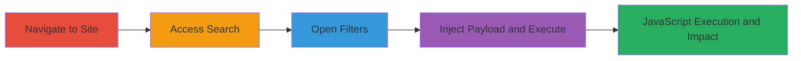

---
tags:
  - xss
  - reflected-xss
  - javascript-injection
  - web-vulnerability
type: attack_chain
tools:
  - '[[tools/YouTube-XSS-Demonstration]]'
tactics:
  - '[[Execution]]'
verified: false
platforms:
  - Web
submitted: true
complexity: low
procedures:
  - '[[procedures/Exploit-Reflected-XSS-in-Search-Filters]]'
step_count: 4
techniques:
  - '[[JavaScript]]'
description: >-
  A multi-step process to exploit a reflected Cross-Site Scripting (XSS)
  vulnerability in the search form filters of mtnplay.co.zm, allowing arbitrary
  JavaScript execution in users' browsers for potential session hijacking or
  data theft.
skill_level: beginner
impact_level: high
id: 6199f343-3df5-4fa0-ae01-fca2bbbdd060
created_at: '2025-12-13T23:52:34.106Z'
updated_at: '2025-12-13T23:52:34.106Z'
validated: true
mitre_tactics:
  - '[[Execution]]'
mitre_techniques:
  - '[[JavaScript]]'
---
# XSS Exploitation via Search Form Filters on MTN Play Website

Multi-stage attack chain demonstrating the exploitation of a reflected XSS vulnerability in the search functionality of the MTN Play website (mtnplay.co.zm). The attack involves navigating to the site, accessing the search interface, opening filters, and injecting malicious JavaScript payloads into form fields like Track, Album, or Artist. Without proper input sanitization, the payload executes in the victim's browser, enabling theft of session cookies, keystroke logging, or phishing overlays.

## Chain Metrics Dashboard

| Metric | Value |
|--------|-------|
| Chain Status | Unverified |
| Total Steps | 4 |
| Execution Time | ~2 minutes |
| Skill Level | Beginner |
| Complexity | Low |
| Impact Level | High |

## Attack Flow Visualization

## Prerequisites & Requirements

### Required Tools

- Web browser (e.g., Chrome, Firefox)
- [[tools/YouTube-XSS-Demonstration]] for visual walkthrough

### Target Environment

- Web platform
- Publicly accessible website: http://www.mtnplay.co.zm
- No specific services or ports required beyond standard HTTP/HTTPS (port 80/443)

### Initial Access Requirements

- Internet access to the target site
- No credentials needed (public-facing)
- Victim must interact with the search results page

## Detailed Attack Procedures

### Step 1: Navigate to the Main Page

**Objective**: Access the entry point of the MTN Play website to begin the search interaction.

**Instructions**: Open a web browser and directly visit the main page URL.

**Expected Output**: The homepage of mtnplay.co.zm loads, displaying music and media content.

**Success Indicators**:
- Page loads without errors
- Site is responsive and search elements are visible

### Step 2: Access the Search Functionality

**Objective**: Enter the search interface where the vulnerable form resides.

**Instructions**: From the homepage, click the search button or append search parameters to the URL to load the search page.

**Expected Output**: The search interface appears, allowing queries for tracks, albums, or artists.

**Success Indicators**:
- Search bar and related UI elements are present
- URL includes search event parameters

### Step 3: Click on the Filter Button

**Objective**: Open the filter form containing the vulnerable input fields.

**Instructions**: In the search results or interface, locate and click the filter button to expand the form options.

**Expected Output**: Filter form opens with fields for Track, Album, Artist, etc.

**Success Indicators**:
- Form fields are editable
- No immediate validation errors on load

### Step 4: Input JavaScript Payload in Form Fields

procedure: [[procedures/Exploit-Reflected-XSS-in-Search-Filters]]

**Objective**: Inject and trigger malicious JavaScript to execute in the context of the user's browser.

**Instructions**: Enter a test payload like `` into a filter field (e.g., Track), apply the filter or submit the search, and observe execution on the results page.

**Expected Output**: An alert box pops up with 'XSS', confirming JavaScript execution. For real attacks, replace with payloads for cookie theft (e.g., ``).

**Success Indicators**:
- JavaScript executes without sanitization
- Alert or redirected behavior occurs
- In a real scenario, data exfiltration to attacker-controlled server

## Attack Chain Summary

### Key Achievements

1. Successful navigation and access to vulnerable search filters
2. Injection of arbitrary JavaScript via unsanitized form fields
3. Execution of client-side code leading to potential session hijacking or data theft

## Technique & Tactic Coverage

### MITRE ATT&CK Techniques

- [[JavaScript]]

### MITRE ATT&CK Tactics

- [[Execution]]

---
*Last updated: 2023-10-01*
