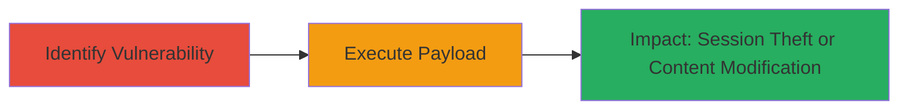

# XSS Exploitation via Unsanitized URL Parameter on DoD Website

Multi-stage attack chain demonstrating a complete attack workflow for exploiting a reflected cross-site scripting (XSS) vulnerability on a U.S. Department of Defense (DoD) website. The chain involves identifying the vulnerable URL parameter and crafting a payload to execute malicious JavaScript in users' browsers, potentially leading to session hijacking or content manipulation.

## Chain Metrics Dashboard

| Metric | Value |
|--------|-------|
| Chain Status | Unverified |
| Total Steps | 2 |
| Execution Time | ~5 minutes |
| Skill Level | Intermediate |
| Complexity | Low |
| Impact Level | High |

## Attack Flow Visualization

## Prerequisites & Requirements

### Required Tools

- Browser developer tools for inspection
- URL encoder (built-in or online)

### Target Environment

- Web platform
- Publicly accessible DoD website
- No specific ports or services required beyond HTTP/HTTPS

### Initial Access Requirements

- Internet access to the target website
- No credentials needed for public-facing pages
- Ability to craft and visit URLs

## Detailed Attack Procedures

### Step 1: Identify Reflected XSS in URL Parameter
procedure: [[procedures/Identify-Reflected-XSS-in-URL-Parameter]]

**Objective**: Locate a URL parameter that reflects user input without sanitization, enabling JavaScript injection.

**Instructions**: Inspect the DoD website's pages for search or query parameters. Test by appending a simple payload like `` to the parameter and observe if it executes in the browser.

For example, if the vulnerable page is `https://dod.example.gov/search?q=query`, modify to `https://dod.example.gov/search?q=`.

Use browser developer tools to confirm reflection in the HTML source.

**Expected Output**: Alert box pops up or script executes, confirming the vulnerability.

**Success Indicators**:
- Malicious script reflected and executed in the page
- No encoding or escaping applied to the input

### Step 2: Execute XSS Payload via Crafted URL
procedure: [[procedures/Execute-XSS-Payload-via-Crafted-URL]]

**Objective**: Deliver a malicious payload to a victim user, tricking them into visiting the crafted URL to execute the script.

**Instructions**: Encode the payload to bypass basic filters if present, e.g., use `javascript:alert(document.cookie)` for session theft. Share the URL via phishing or social engineering.

Example crafted URL: `https://dod.example.gov/search?q=`.

Monitor the attacker's server for exfiltrated data.

**Expected Output**: Victim's browser executes the script, sending session data to the attacker.

**Success Indicators**:
- Script execution in victim's browser
- Receipt of sensitive data like session cookies on attacker's endpoint

## Attack Chain Summary

### Key Achievements

1. Identified unsanitized URL parameter on DoD site
2. Demonstrated payload execution leading to potential session revelation
3. Highlighted risks of reflected XSS in public-facing web applications

## Technique & Tactic Coverage

### MITRE ATT&CK Techniques

- [[Exploit Public-Facing Application]]
- [[JavaScript]]

### MITRE ATT&CK Tactics

- [[Initial Access]]
- [[Execution]]
- [[Collection]]

---
*Last updated: 2023-10-01T00:00:00Z*
