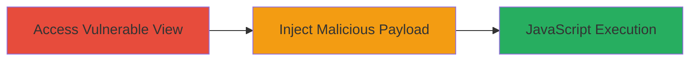

---
tags:
  - xss
  - ruby-on-rails
  - link_to
  - javascript-url
type: attack_chain
tools: []
tactics:
  - '[[Initial Access]]'
  - '[[Execution]]'
verified: false
platforms:
  - Web
submitted: true
created_at: '2023-10-01T00:00:00Z'
procedures:
  - '[[procedures/Access-Vulnerable-Rails-View-with-link_to]]'
  - '[[procedures/Inject-javascript-Payload-into-link_to-Parameter]]'
step_count: 2
techniques:
  - '[[Exploit Public-Facing Application]]'
  - '[[JavaScript]]'
updated_at: '2025-12-14T03:15:27.087Z'
description: >-
  Demonstrates a cross-site scripting attack by injecting a malicious
  javascript: URL into untrusted parameters passed to the Rails link_to helper,
  leading to arbitrary JavaScript execution.
id: 8b93e1ac-41f8-4991-b479-1586584fc730
validated: true
mitre_tactics:
  - '[[Initial Access]]'
  - '[[Execution]]'
mitre_techniques:
  - '[[Exploit Public-Facing Application]]'
  - '[[JavaScript]]'
---
# XSS Exploitation via Untrusted Parameters in Ruby on Rails link_to Helper

Multi-stage attack chain demonstrating a complete XSS workflow in a Ruby on Rails application where untrusted user input is passed directly to the link_to helper without sanitization.

## Chain Metrics Dashboard

| Metric | Value |
|--------|-------|
| Chain Status | Unverified |
| Total Steps | 2 |
| Execution Time | ~1 minutes |
| Skill Level | Intermediate |
| Complexity | Low |
| Impact Level | High |

## Attack Flow Visualization

## Prerequisites & Requirements

### Required Tools

- Web browser (e.g., Chrome Developer Tools for inspection)

### Target Environment

- Ruby on Rails web application
- Vulnerable view using link_to with untrusted params (e.g., params[:back])
- No specific ports; standard HTTP/HTTPS (80/443)

### Initial Access Requirements

- Network access to the Rails application
- Ability to interact with URL parameters
- No prior credentials needed for reflected XSS

## Detailed Attack Procedures

### Step 1: Access Vulnerable Rails View
procedure: [[procedures/Access-Vulnerable-Rails-View-with-link_to]]

**Objective**: Locate and access the Rails view that renders a link_to helper using untrusted user parameters, such as params[:back], to confirm the vulnerability setup.

**Instructions**: Navigate to the endpoint that triggers the vulnerable view. For example, visit a URL like `http://target-app.com/path?back=/safe/page` to observe the generated link in the HTML source. Inspect the page source to verify the link_to output, such as `<a href="/safe/page">Back</a>`, ensuring params are directly inserted without escaping.

**Expected Output**: The page renders with a functional back link based on the parameter value.

**Success Indicators**:
- Page loads without errors
- HTML source shows link_to using the provided parameter value

### Step 2: Inject javascript: Payload
procedure: [[procedures/Inject-javascript-Payload-into-link_to-Parameter]]

**Objective**: Append a malicious javascript: URL to the parameter to cause the link_to helper to generate an executable script link, enabling XSS upon user interaction.

**Instructions**: Modify the URL parameter to include an encoded javascript: payload, e.g., `http://target-app.com/path?back=javascript%3Aalert%28document.domain%29`. Load the page and inspect the source to confirm the output: `<a href="javascript:alert(document.domain)">Back</a>`. Click the link to trigger execution.

**Expected Output**: The link renders with the javascript: href, and clicking it executes the alert (or other JS) in the victim's browser context.

**Success Indicators**:
- Malicious href appears in HTML source
- JavaScript executes (e.g., alert box appears) when link is clicked
- No server-side filtering of the javascript: scheme

## Attack Chain Summary

### Key Achievements

1. Identified lack of sanitization in Rails link_to for untrusted params
2. Injected and executed arbitrary JavaScript via URL parameter
3. Demonstrated potential for data theft or session hijacking

## Technique & Tactic Coverage

### MITRE ATT&CK Techniques

- [[Exploit Public-Facing Application]]
- [[JavaScript]]

### MITRE ATT&CK Tactics

- [[Initial Access]]
- [[Execution]]

---
*Last updated: 2023-10-01T00:00:00Z*
