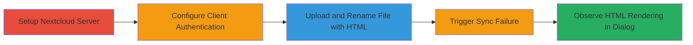

---
tags:
  - xss
  - nextcloud
  - desktop-client
  - file-injection
type: attack_chain
tools: []
tactics:
  - '[[Execution]]'
verified: false
platforms:
  - Windows 10
  - Web
submitted: true
complexity: medium
created_at: '2023-10-01T00:00:00Z'
procedures:
  - '[[procedures/Exploit-XSS-in-Nextcloud-File-Name-Handling]]'
step_count: 9
techniques:
  - '[[JavaScript]]'
updated_at: '2025-12-13T23:52:44.246Z'
description: >-
  Demonstrates a cross-site scripting vulnerability in the Nextcloud Desktop
  Client by injecting HTML into file names, leading to arbitrary HTML rendering
  in synchronization notifications.
skill_level: intermediate
impact_level: high
id: efefe4f6-5668-49a5-9823-5a1e9a792dd4
validated: true
mitre_tactics:
  - '[[Execution]]'
mitre_techniques:
  - '[[JavaScript]]'
---
# XSS Injection in Nextcloud Desktop Client via Malicious File Names

Multi-stage attack chain demonstrating a complete attack workflow exploiting improper file name sanitization in Nextcloud's desktop synchronization notifications.

## Chain Metrics Dashboard

| Metric | Value |
|--------|-------|
| Chain Status | Unverified |
| Total Steps | 9 |
| Execution Time | ~30 minutes |
| Skill Level | Intermediate |
| Complexity | Medium |
| Impact Level | High |

## Attack Flow Visualization

## Prerequisites & Requirements

### Required Tools

- Nextcloud Server instance
- Nextcloud Desktop Client

### Target Environment

- Nextcloud Server (web-based)
- Windows 10 with Nextcloud Desktop Client
- Required services: Nextcloud web interface and desktop sync
- Network access: Local network or internet access to server

### Initial Access Requirements

- Administrative access to set up Nextcloud server
- User credentials for Nextcloud account
- No prior access needed beyond standard user privileges

## Detailed Attack Procedures

### Step 1: Install Nextcloud Server
procedure: [[procedures/Exploit-XSS-in-Nextcloud-File-Name-Handling]]

**Objective**: Set up a Nextcloud server instance to host files for synchronization testing.

**Instructions**: Download and install the Nextcloud server application on a compatible host machine. Follow the official installation guide to configure the server with a database and web server (e.g., Apache or Nginx).

**Expected Output**: A running Nextcloud server accessible via web browser at the configured URL.

**Success Indicators**:
- Server dashboard loads successfully
- File upload functionality is available

### Step 2: Log into Nextcloud Server Account
procedure: [[procedures/Exploit-XSS-in-Nextcloud-File-Name-Handling]]

**Objective**: Authenticate to the server to gain access for file operations.

**Instructions**: Open a web browser, navigate to the Nextcloud server URL, and log in using valid credentials. If no account exists, create one during setup.

**Expected Output**: User dashboard displayed with file management options.

**Success Indicators**:
- Successful login without errors
- Access to personal files section

### Step 3: Install Nextcloud Desktop Client
procedure: [[procedures/Exploit-XSS-in-Nextcloud-File-Name-Handling]]

**Objective**: Prepare the victim-side environment by installing the desktop client on a Windows 10 machine.

**Instructions**: Download the Nextcloud Desktop Client from the official website and run the installer on a Windows 10 system. Complete the installation wizard.

**Expected Output**: Nextcloud icon appears in the system tray, indicating the client is ready.

**Success Indicators**:
- Installation completes without errors
- Client launches successfully

### Step 4: Log into Nextcloud Account from Desktop Client
procedure: [[procedures/Exploit-XSS-in-Nextcloud-File-Name-Handling]]

**Objective**: Connect the desktop client to the server for synchronization.

**Instructions**: Launch the Nextcloud Desktop Client, enter the server URL, and authenticate using the same credentials as the server login.

**Expected Output**: Client connects and begins monitoring for sync changes.

**Success Indicators**:
- Synchronization status shows as connected
- No authentication errors

### Step 5: Upload File to Nextcloud Server
procedure: [[procedures/Exploit-XSS-in-Nextcloud-File-Name-Handling]]

**Objective**: Introduce a file into the system that can be manipulated for the exploit.

**Instructions**: Using the web interface, navigate to the files section and upload any arbitrary file (e.g., a text document).

**Expected Output**: File appears in the file list on the server.

**Success Indicators**:
- Upload completes successfully
- File is visible in the dashboard

### Step 6: Rename Uploaded File with HTML Tags
procedure: [[procedures/Exploit-XSS-in-Nextcloud-File-Name-Handling]]

**Objective**: Inject malicious HTML into the file name to exploit the lack of sanitization.

**Instructions**: In the web interface, right-click the uploaded file, select rename, and set the name to include HTML tags, such as '<h1><b><i><u>MikeIsAStar' followed by a file extension (e.g., .txt). Save the change.

**Expected Output**: File renamed on the server without rejection.

**Success Indicators**:
- Rename operation succeeds
- File name displays with the injected HTML in the web UI (though not rendered there)

### Step 7: Trigger Synchronization Failure
procedure: [[procedures/Exploit-XSS-in-Nextcloud-File-Name-Handling]]

**Objective**: Force the desktop client to generate a failed sync notification involving the malicious file.

**Instructions**: Modify network settings or server configuration temporarily to cause a sync failure (e.g., disconnect briefly or simulate an error). Wait for the client to attempt synchronization of the renamed file.

**Expected Output**: Notification in the system tray indicating sync issues.

**Success Indicators**:
- Sync error notification appears
- File listed in the error details

### Step 8: Open Main Dialog Window
procedure: [[procedures/Exploit-XSS-in-Nextcloud-File-Name-Handling]]

**Objective**: Access the UI element where the vulnerability manifests.

**Instructions**: Click on the system tray icon for Nextcloud Desktop Client to open the main activity dialog or notifications window.

**Expected Output**: Dialog opens showing sync status and details.

**Success Indicators**:
- Dialog loads without crashing
- Sync notifications are visible

### Step 9: Observe HTML Rendering
procedure: [[procedures/Exploit-XSS-in-Nextcloud-File-Name-Handling]]

**Objective**: Verify the XSS by confirming HTML injection and rendering.

**Instructions**: Inspect the notification or file list in the dialog; the file name should render the HTML tags as formatted elements (e.g., bold, italic text).

**Expected Output**: Malicious file name displays as actual HTML (e.g., <h1> header with bold/italic/underlined text) instead of escaped text.

**Success Indicators**:
- HTML tags are interpreted and styled in the UI
- Potential for script injection if extended to include <script> tags

## Attack Chain Summary

### Key Achievements

1. Successful setup of Nextcloud environment for testing
2. Injection of unsanitized HTML into file names via server interface
3. Rendering of arbitrary HTML in the desktop client's notification dialog, enabling potential script execution

## Technique & Tactic Coverage

### MITRE ATT&CK Techniques

- [[JavaScript]]

### MITRE ATT&CK Tactics

- [[Execution]]

---
*Last updated: 2023-10-01T00:00:00Z*
