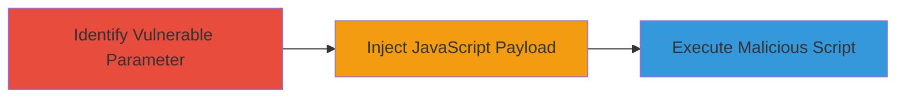

# XSS Injection via Unsanitized Input Parameter on GM.com

Multi-stage attack chain demonstrating a complete attack workflow.

## Chain Metrics Dashboard

| Metric | Value |
|--------|-------|
| Chain Status | Unverified |
| Total Steps | 1 |
| Execution Time | ~5 minutes |
| Skill Level | Intermediate |
| Complexity | Medium |
| Impact Level | High |

## Attack Flow Visualization



## Prerequisites & Requirements

### Required Tools

- Browser developer tools
- [[commands/curl-xss-test]]

### Target Environment

- Web platform
- Accessible GM.com website
- No specific services/ports beyond standard HTTP/HTTPS (80/443)

### Initial Access Requirements

- Public access to GM.com
- No credentials required for initial testing
- Network access to the internet

## Detailed Attack Procedures

### Step 1: Identify and Exploit XSS Vulnerability
procedure: [[procedures/Inject-JavaScript-via-Unsanitized-Input-Parameter]]

**Objective**: Identify the vulnerable input parameter and inject a JavaScript payload to execute arbitrary code in the victim's browser.

**Instructions**: Begin by navigating to the target page on GM.com and locating the input parameter (e.g., a search or form field). Test for XSS by appending a simple payload like `<script>alert('XSS')</script>` to the parameter value. Use [[commands/curl-xss-test]] to simulate the request:

```bash
curl -G "https://www.gm.com/search" --data-urlencode "q=<script>alert('XSS')</script>" -o response.html
```

Inspect the response.html file or browser output for the executed alert, confirming the injection.

**Expected Output**: The JavaScript payload executes, displaying an alert or performing other actions like stealing cookies.

**Success Indicators**:
- Alert box appears in the browser
- Payload reflected without sanitization in the response
- Potential for session hijacking if cookies are accessed

## Attack Chain Summary

### Key Achievements

1. Successful identification of unsanitized input parameter
2. Injection and execution of arbitrary JavaScript
3. Potential for data theft or session hijacking in user browsers

## Technique & Tactic Coverage

### MITRE ATT&CK Techniques

- [[JavaScript]]

### MITRE ATT&CK Tactics

- [[Execution]]

---
*Last updated: 2023-10-01T00:00:00Z*
