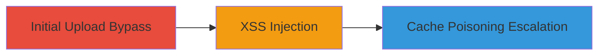

---
tags:
  - xss
  - cache-poisoning
  - file-upload-bypass
  - web-exploitation
type: attack_chain
tools:
  - '[[tools/Burp-Suite]]'
tactics:
  - '[[Initial Access]]'
  - '[[Execution]]'
commands:
  - '[[commands/intercept-http-request]]'
  - '[[commands/modify-upload-parameters]]'
  - '[[commands/sign-oauth-request]]'
platforms:
  - Web
complexity: medium
procedures:
  - '[[procedures/Bypass-File-Upload-Restrictions]]'
  - '[[procedures/Inject-XSS-Payload-via-Modified-Upload]]'
  - '[[procedures/Escalate-to-Cache-Poisoning]]'
step_count: 3
techniques:
  - '[[Exploit Public-Facing Application]]'
  - '[[JavaScript]]'
description: >-
  Multi-stage attack exploiting file upload bypass on upload.twitter.com to
  inject XSS and perform cache poisoning on ton.twitter.com
skill_level: intermediate
impact_level: high
id: 30493857-2416-4b0c-a449-f9606db56bdd
created_at: '2025-12-13T23:56:20.142Z'
updated_at: '2025-12-13T23:56:20.142Z'
verified: false
validated: true
submitted: true
mitre_tactics:
  - '[[Initial Access]]'
  - '[[Execution]]'
mitre_techniques:
  - '[[Exploit Public-Facing Application]]'
  - '[[JavaScript]]'
---
# XSS and Cache Poisoning via Twitter File Upload Bypass

Multi-stage attack chain demonstrating how to bypass file upload restrictions on upload.twitter.com, inject XSS payloads, and escalate to cache poisoning on ton.twitter.com using unknown file extensions and HTML5 AppCache.

## Chain Metrics Dashboard

| Metric | Value |
|--------|-------|
| Chain Status | Unverified |
| Total Steps | 3 |
| Execution Time | ~10 minutes |
| Skill Level | Intermediate |
| Complexity | Medium |
| Impact Level | High |

## Attack Flow Visualization



## Prerequisites & Requirements

### Required Tools

- [[tools/Burp-Suite]]

### Target Environment

- Web platform
- Services: Twitter Ads, upload.twitter.com, ton.twitter.com
- Network access requirements: Access to Twitter Ads audience manager

### Initial Access Requirements

- Credential requirements: Valid Twitter account with access to Ads manager
- Network position: Standard internet access
- Prior access needed: None

## Detailed Attack Procedures

### Step 1: Bypass File Upload Restrictions
procedure: [[procedures/Bypass-File-Upload-Restrictions]]

**Objective**: Navigate to the upload interface and intercept the request to modify file extensions for bypassing restrictions.

**Instructions**: First, navigate to Twitter Ads audience manager and initiate a file upload. Intercept the HTTP request using [[tools/Burp-Suite]]. Modify the blobstore_url parameter to an unknown extension using [[commands/modify-upload-parameters]]:

```bash
# Example in Burp Repeater: Change _blobstore_url_ from 1440354519600.txt to 1440354519600.test
```

**Expected Output**: The request is modified and forwarded successfully without rejection.

**Success Indicators**:
- File extension changed to unknown type
- Upload proceeds without errors

### Step 2: Inject XSS Payload via Modified Upload
procedure: [[procedures/Inject-XSS-Payload-via-Modified-Upload]]

**Objective**: Replace the file content with an XSS payload and complete the upload to store malicious content.

**Instructions**: In the intercepted request, replace the content parameter with an XSS vector using [[commands/modify-upload-parameters]]:

```bash
# Example: Set _content_ to <script>alert(1)</script>
```

Complete the upload process. Sign the file with OAuth token using [[commands/sign-oauth-request]] to make it accessible:

```bash
# Use OAuth signing tool or library to generate signed URL
```

**Expected Output**: File uploaded and served without Content-Type header, enabling XSS.

**Success Indicators**:
- XSS payload stored and executable
- File accessible via signed request

### Step 3: Escalate to Cache Poisoning
procedure: [[procedures/Escalate-to-Cache-Poisoning]]

**Objective**: Use the uploaded file to poison the cache via HTML5 AppCache for persistent control.

**Instructions**: Upload a cache manifest file with malicious content using the previous bypass method. Access the file to trigger cache poisoning, allowing persistent XSS or content replacement on ton.twitter.com.

**Expected Output**: Victim's browser cache poisoned, leading to persistent exploitation.

**Success Indicators**:
- Cache manifest served and applied
- Persistent XSS or content control achieved

## Attack Chain Summary

### Key Achievements

1. Bypassed file upload restrictions using unknown extensions
2. Injected and executed XSS payloads on ton.twitter.com
3. Achieved persistent cache poisoning for ongoing control

## Technique & Tactic Coverage

### MITRE ATT&CK Techniques

- [[Exploit Public-Facing Application]]
- [[JavaScript]]

### MITRE ATT&CK Tactics

- [[Initial Access]]
- [[Execution]]

*Last updated: 2023-10-01*
