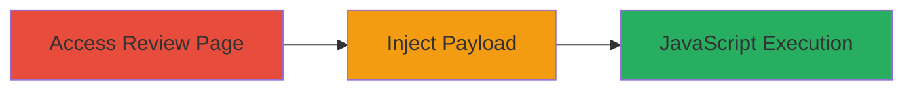

# XSS and HTML Injection via Message Field in Localize Phrase Review

Multi-stage attack chain demonstrating a complete attack workflow targeting the Localize platform's phrase review feature.

## Chain Metrics Dashboard

| Metric | Value |
|--------|-------|
| Chain Status | Unverified |
| Total Steps | 1 |
| Execution Time | ~1 minute |
| Skill Level | Beginner |
| Complexity | Low |
| Impact Level | High |

## Attack Flow Visualization



## Prerequisites & Requirements

### Required Tools

- Web browser (e.g., Chrome, Firefox)

### Target Environment

- Localize platform web application
- Access to phrase review endpoint (e.g., /review/{id}/languages/{id})
- Authenticated session as a reviewer or approver

### Initial Access Requirements

- Valid user credentials for the Localize platform
- Network access to the target URL (http://www.localize.io)
- No prior elevated access needed; standard user permissions suffice

## Detailed Attack Procedures

### Step 1: Access and Exploit Review Message Field
procedure: [[procedures/Inject-XSS-Payload-in-Localize-Review-Message-Field]]

**Objective**: Navigate to the phrase review page and inject a malicious payload into the message field to trigger JavaScript execution upon rendering.

**Instructions**: Open a web browser and log in to the Localize platform with reviewer credentials. Navigate to the phrase review endpoint, such as http://www.localize.io/review/3C/languages/3. While approving or reviewing a phrase, enter the following XSS payload into the message input field:

```html
<object data="data:text/html;base64,PHN2Zy9vbmxvYWQ9YWxlcnQoNCk+"></object>
```

This payload uses a base64-encoded SVG element with an onload attribute to execute JavaScript (alert(4)). Submit the message to trigger execution when the content is rendered or viewed by other users.

**Expected Output**: Upon submission and rendering (e.g., when another user views the reviewed phrase), an alert box displays "4", confirming JavaScript execution.

**Success Indicators**:
- Alert or other JS effect triggers in the browser
- No sanitization errors; payload renders as intended
- Potential for further payloads to steal session cookies or redirect users

## Attack Chain Summary

### Key Achievements

1. Successful injection of HTML and JavaScript without sanitization
2. Arbitrary code execution in the context of interacting users' browsers
3. Demonstration of risks including session hijacking and data theft

## Technique & Tactic Coverage

### MITRE ATT&CK Techniques

- [[JavaScript]]

### MITRE ATT&CK Tactics

- [[Execution]]
- [[Collection]]

---
*Last updated: 2023-10-01T00:00:00Z*
