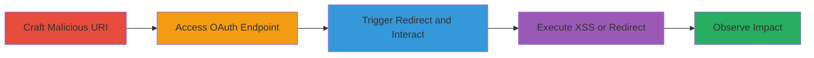

---
tags:
  - xss
  - open-redirect
  - oauth
  - javascript-uri
type: attack_chain
tools: []
tactics:
  - '[[Execution]]'
  - '[[Initial Access]]'
verified: false
platforms:
  - Web
submitted: true
complexity: medium
created_at: '2023-10-01T00:00:00Z'
procedures:
  - '[[procedures/Craft-Malicious-Redirect-URI-for-XSS]]'
  - '[[procedures/Trigger-OAuth-Authorization-Redirect]]'
  - '[[procedures/Observe-XSS-Execution]]'
  - '[[procedures/Exploit-Open-Redirect-with-Invalid-Parameters]]'
step_count: 4
techniques:
  - '[[JavaScript]]'
  - '[[Drive-by Compromise]]'
updated_at: '2025-12-14T03:16:07.916Z'
description: >-
  Exploits improper validation of the redirect_uri parameter in Uber's OAuth
  endpoint to achieve XSS via javascript: URIs and open redirects with invalid
  parameters.
skill_level: intermediate
impact_level: high
id: 49764b71-3038-4f8b-a87a-4c601faa1f90
validated: true
mitre_tactics:
  - '[[Execution]]'
  - '[[Initial Access]]'
mitre_techniques:
  - '[[JavaScript]]'
  - '[[Drive-by Compromise]]'
---
# XSS and Open Redirect via Malicious redirect_uri in Uber OAuth

Multi-stage attack chain demonstrating exploitation of Uber's OAuth authorization endpoint through improper redirect_uri validation, leading to XSS and open redirects.

## Chain Metrics Dashboard

| Metric | Value |
|--------|-------|
| Chain Status | Unverified |
| Total Steps | 4 |
| Execution Time | ~5 minutes |
| Skill Level | Intermediate |
| Complexity | Medium |
| Impact Level | High |

## Attack Flow Visualization



## Prerequisites & Requirements

### Required Tools

- Web browser (e.g., Firefox with redirects disabled or Opera Mini for maximum effect)

### Target Environment

- Web platform
- OAuth service on https://login.uber.com
- No specific ports required; standard HTTPS (443)

### Initial Access Requirements

- Public access to Uber's OAuth authorize endpoint
- No credentials needed for initial testing
- Ability to craft and access URLs in a browser

## Detailed Attack Procedures

### Step 1: Craft Malicious Redirect URI for XSS
procedure: [[procedures/Craft-Malicious-Redirect-URI-for-XSS]]

**Objective**: Construct a malicious redirect_uri using javascript: protocol to inject and execute arbitrary JavaScript on the uber.com domain.

**Instructions**: Create the OAuth authorization URL with a javascript: URI in the redirect_uri parameter. The URI should include a payload like alert(document.domain) encoded properly.

Example URL:

```url
https://login.uber.com/oauth/authorize?client_id=MXeE1dl-5R3yTCbufMHsfz3KhfY2UGyS&response_type=code&scope=profile&redirect_uri=javascript:%2F%2Fgoog.com%2F%250Aalert%28document.domain%29%3B%2F%2F
```

**Expected Output**: A validly formed URL ready to access in a browser.

**Success Indicators**:
- URL parses without errors
- javascript: scheme is present and encoded

### Step 2: Trigger OAuth Authorization Redirect
procedure: [[procedures/Trigger-OAuth-Authorization-Redirect]]

**Objective**: Access the crafted URL to reach the authorization page and simulate user interaction to initiate the redirect.

**Instructions**: Open the URL from Step 1 in a vulnerable browser (e.g., Opera Mini or Firefox with 302 redirects disabled). The endpoint will present an Allow/Deny page.

**Expected Output**: Authorization consent page loads on login.uber.com.

**Success Indicators**:
- Page loads without blocking the javascript: URI
- Allow or Deny buttons are visible

### Step 3: Observe XSS Execution
procedure: [[procedures/Observe-XSS-Execution]]

**Objective**: Interact with the page to trigger the redirect, leading to execution of the JavaScript payload in the uber.com context.

**Instructions**: Click the Allow or Deny button on the authorization page. This triggers a 302 redirect via Location header to the javascript: URI. In affected browsers, it executes the payload; otherwise, an error page with a clickable link to the URI appears.

Example error page link:

```url
javascript://goog.com/%0Aalert(document.domain);//?error=access_denied#_
```

If needed, click the link to execute.

**Expected Output**: Alert box showing "uber.com" or execution of the JS payload.

**Success Indicators**:
- JavaScript executes in uber.com context
- Potential for session theft or account hijacking demonstrated

### Step 4: Exploit Open Redirect with Invalid Parameters
procedure: [[procedures/Exploit-Open-Redirect-with-Invalid-Parameters]]

**Objective**: Use invalid parameters to bypass interaction and directly redirect to an arbitrary site, chaining with XSS if desired.

**Instructions**: Construct and access a URL with invalid response_type (e.g., "invalid") and a malicious redirect_uri, such as to x.com with an alert payload.

Example URL:

```url
https://login.uber.com/oauth/authorize?client_id=p2Onb3CmBMMx9bJU5nfmRao-0cpZ8pWV&response_type=invalid&scope=profile&redirect_uri=javascript%3A%2F%2Fx.com%2F%250Aalert(1)%3B%2F%2F
```

Open in browser to trigger direct redirect.

**Expected Output**: Immediate redirect to the specified URI without user interaction.

**Success Indicators**:
- Direct redirection to attacker-controlled site
- No validation blocks the arbitrary URI

## Attack Chain Summary

### Key Achievements

1. Successful XSS execution in uber.com context via javascript: URI
2. Account hijacking potential through session theft in mobile/legacy browsers
3. Non-interactive open redirect for phishing or chaining attacks
4. Demonstration of validation flaw allowing arbitrary schemes

## Technique & Tactic Coverage

### MITRE ATT&CK Techniques

- [[JavaScript]]
- [[Drive-by Compromise]]

### MITRE ATT&CK Tactics

- [[Execution]]
- [[Initial Access]]

---
*Last updated: 2023-10-01T00:00:00Z*
