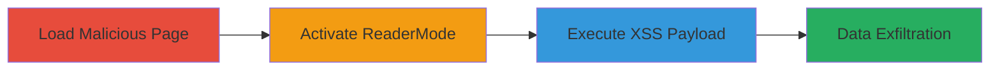

---
tags:
  - xss
  - brave
  - ios
  - readermode
  - csp-bypass
  - javascript-injection
type: attack_chain
tools: []
tactics:
  - '[[Execution]]'
  - '[[Collection]]'
verified: false
platforms:
  - iOS
  - WebView
submitted: true
complexity: medium
created_at: '2023-10-01T00:00:00Z'
procedures:
  - '[[procedures/Load-Malicious-Webpage-with-Author-Meta-Injection]]'
  - '[[procedures/Activate-ReaderMode-in-Brave-iOS]]'
  - '[[procedures/Observe-XSS-Execution-in-ReaderMode]]'
step_count: 3
techniques:
  - '[[JavaScript]]'
updated_at: '2025-12-13T23:52:55.818Z'
description: >-
  A cross-site scripting attack exploiting a relaxed CSP in Brave iOS ReaderMode
  by injecting a malicious author meta tag, leading to arbitrary JavaScript
  execution on localhost ReaderMode pages.
skill_level: intermediate
impact_level: high
id: 677df238-d033-4461-83af-e1c5b9c4d24e
validated: true
mitre_tactics:
  - '[[Execution]]'
  - '[[Collection]]'
mitre_techniques:
  - '[[JavaScript]]'
---
# XSS in Brave iOS ReaderMode via Author Meta Tag Injection

Multi-stage attack chain demonstrating a complete XSS exploitation workflow in Brave iOS's ReaderMode feature.

## Chain Metrics Dashboard

| Metric | Value |
|--------|-------|
| Chain Status | Unverified |
| Total Steps | 3 |
| Execution Time | ~2 minutes |
| Skill Level | Intermediate |
| Complexity | Medium |
| Impact Level | High |

## Attack Flow Visualization

## Prerequisites & Requirements

### Required Tools

- None (manual browser interaction)

### Target Environment

- Brave iOS browser (vulnerable version with relaxed CSP in ReaderMode)
- Required services/ports: localhost:6571 (ReaderMode server)
- Network access requirements: Ability to load external webpages in Brave iOS

### Initial Access Requirements

- No credentials required
- User must have Brave iOS installed and access to load arbitrary URLs
- Prior access needed: None, but target must visit the malicious page

## Detailed Attack Procedures

### Step 1: Load Malicious Webpage
procedure: [[procedures/Load-Malicious-Webpage-with-Author-Meta-Injection]]

**Objective**: Deliver a webpage containing a malicious <meta name="author"> tag that injects a script payload exploitable in ReaderMode.

**Instructions**: Open Brave iOS and navigate to a controlled malicious URL, such as https://csrf.jp/2021/brave/author_xss.php, which embeds the payload <meta name="author" content="Evil &lt;script nonce=%READER-TITLE-NONCE%&gt;alert(document.location);&lt;/script&gt;!--"> in the HTML source.

**Expected Output**: The page loads normally without immediate execution, but the meta tag is present in the DOM.

**Success Indicators**:
- Page loads successfully in Brave iOS
- Inspect source to confirm malicious meta tag presence

### Step 2: Activate ReaderMode
procedure: [[procedures/Activate-ReaderMode-in-Brave-iOS]]

**Objective**: Trigger the ReaderMode feature, which processes the page's meta author content and inserts it unescaped into the ReaderMode template, replacing placeholders like %READER-CREDITS% and %READER-TITLE-NONCE%.

**Instructions**: With the malicious page loaded, tap the ReaderMode button (typically an icon resembling lines or a book) in the address bar. This invokes ReaderModeUtils.swift to generate the ReaderMode page at http://localhost:6571/reader-mode?uri={uri}&uuidkey={value}.

**Expected Output**: The page switches to ReaderMode view, hosted on localhost:6571, with the author content inserted.

**Success Indicators**:
- ReaderMode activates without errors
- URL changes to localhost:6571/reader-mode with uri and uuidkey parameters visible

### Step 3: Observe XSS Execution
procedure: [[procedures/Observe-XSS-Execution-in-ReaderMode]]

**Objective**: Confirm arbitrary JavaScript execution due to the unescaped script insertion, allowing potential theft of cross-origin content or access to privileged pages via the captured uuidkey.

**Instructions**: Upon ReaderMode activation, the injected script executes automatically. Monitor for the alert dialog showing document.location, which reveals the localhost URL including the uuidkey.

**Expected Output**: An alert box pops up displaying the full ReaderMode URL, e.g., http://localhost:6571/reader-mode?uri=https%3A%2F%2Fcsrf.jp%2F2021%2Fbrave%2Fauthor_xss.php&uuidkey=somevalue.

**Success Indicators**:
- JavaScript alert triggers
- UUID key captured for potential further exploitation (e.g., accessing Brave's privileged pages)

## Attack Chain Summary

### Key Achievements

1. Successful injection of malicious script via author meta tag
2. Bypass of CSP using the ReaderMode nonce
3. Arbitrary JS execution on localhost, enabling data theft and privilege escalation

## Technique & Tactic Coverage

### MITRE ATT&CK Techniques

- [[JavaScript]]

### MITRE ATT&CK Tactics

- [[Execution]]
- [[Collection]]

---
*Last updated: 2023-10-01T00:00:00Z*
