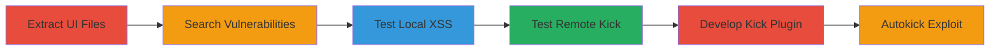

---
tags:
  - xss
  - rce
  - csgo
  - panorama-ui
  - steam
type: attack_chain
tools:
  - '[[tools/grep]]'
  - '[[tools/SourceMod]]'
  - '[[tools/Metamod]]'
  - '[[tools/CS:GO-Dedicated-Server]]'
tactics:
  - '[[Initial Access]]'
  - '[[Execution]]'
  - '[[Discovery]]'
commands:
  - '[[commands/disconnect-html-test]]'
  - '[[commands/kickid-test]]'
  - '[[commands/sm-kick-test]]'
  - '[[commands/sm-testkick-rce]]'
platforms:
  - Windows
complexity: medium
procedures:
  - '[[procedures/Extract-and-Analyze-Panorama-UI-Files]]'
  - '[[procedures/Search-for-Vulnerable-HTML-Tags]]'
  - '[[procedures/Test-Local-Disconnect-XSS-Injection]]'
  - '[[procedures/Test-Remote-Kick-Functionality]]'
  - '[[procedures/Develop-and-Test-XSS-Kick-Plugin]]'
  - '[[procedures/Implement-Zero-Interaction-Autokick-Exploit]]'
step_count: 6
techniques:
  - '[[Drive-by Compromise]]'
  - '[[JavaScript]]'
  - '[[Malicious File]]'
description: >-
  Exploitation of XSS vulnerability in CS:GO's Panorama UI to achieve remote
  code execution by tricking users into joining malicious servers and triggering
  kick messages with malicious payloads.
skill_level: intermediate
impact_level: high
id: 99867390-9837-4f1e-8685-c8868f4ffe3b
created_at: '2025-12-11T06:10:15.666Z'
updated_at: '2025-12-11T06:10:15.666Z'
verified: false
validated: true
submitted: true
mitre_tactics:
  - '[[TA0001]]'
  - '[[TA0002]]'
  - '[[TA0007]]'
mitre_techniques:
  - '[[T1189]]'
  - '[[T1059.007]]'
  - '[[T1204.002]]'
---
# XSS in CS:GO Panorama UI Leading to Remote Code Execution via Kick Messages

Multi-stage attack chain demonstrating the discovery and exploitation of an XSS vulnerability in CS:GO's Panorama UI, allowing arbitrary JavaScript execution and remote code execution on victim machines by hosting malicious servers and using custom kick plugins.

## Chain Metrics Dashboard

| Metric | Value |
|--------|-------|
| Chain Status | Unverified |
| Total Steps | 6 |
| Execution Time | ~30 minutes |
| Skill Level | Intermediate |
| Complexity | Medium |
| Impact Level | High |

## Attack Flow Visualization



## Prerequisites & Requirements

### Required Tools

- [[tools/grep]]
- [[tools/SourceMod]]
- [[tools/Metamod]]
- [[tools/CS:GO-Dedicated-Server]]

### Target Environment

- Windows
- CS:GO client installed
- Dedicated CS:GO server for testing

### Initial Access Requirements

- Ability to host a malicious CS:GO server
- Trick victim into joining the server
- No prior credentials needed

## Detailed Attack Procedures

### Step 1: Extract UI Files - [[procedures/Extract-and-Analyze-Panorama-UI-Files]]

**Objective**: Extract Panorama UI files from CS:GO installation to begin vulnerability hunting.

**Instructions**: Unzip the Panorama code.pbin file located at steamapps\common\Counter-Strike Global Offensive\csgo\panorama\code.pbin to access UI layout files.

**Expected Output**: Extracted XML files ready for analysis.

**Success Indicators**:
- UI files successfully unzipped
- Files like popup_generic.xml are accessible

### Step 2: Search for Vulnerabilities - [[procedures/Search-for-Vulnerable-HTML-Tags]]

**Objective**: Identify tags allowing raw HTML parsing.

**Instructions**: Use [[tools/grep]] to search all Panorama layout files for 'html="true"'.

```bash
grep -r 'html="true"' panorama/layout/
```

Look for matches in files like chat.xml and popup_generic.xml.

**Expected Output**: List of files with vulnerable tags.

**Success Indicators**:
- Vulnerable tags identified in popup_generic.xml
- Confirmation of raw HTML parsing potential

### Step 3: Test Local XSS - [[procedures/Test-Local-Disconnect-XSS-Injection]]

**Objective**: Verify HTML injection in local disconnect messages.

**Instructions**: Execute [[commands/disconnect-html-test]] in the CS:GO console to test image loading.

```bash
disconnect ""
```

Run twice to confirm caching and parsing.

**Expected Output**: Image displays in disconnect popup.

**Success Indicators**:
- External image loads successfully
- HTML parsing confirmed

### Step 4: Test Remote Kick - [[procedures/Test-Remote-Kick-Functionality]]

**Objective**: Test kick commands on a dedicated server for payload delivery.

**Instructions**: Use [[commands/kickid-test]] or [[commands/sm-kick-test]] with SourceMod on a dedicated server.

```bash
kickid <player_id>
```

```bash
sm_kick <player> "message"
```

Note character limits and switch to KickClient() if needed.

**Expected Output**: Player kicked with custom message.

**Success Indicators**:
- Successful kick without character restrictions using plugins
- Payload delivery tested

### Step 5: Develop Kick Plugin - [[procedures/Develop-and-Test-XSS-Kick-Plugin]]

**Objective**: Create a plugin for delivering XSS payload via kick.

**Instructions**: Develop testkick.smx plugin and execute [[commands/sm-testkick-rce]].

```bash
sm_testkick <a onmouseover="javascript:SteamOverlayAPI.OpenExternalBrowserURL('file://C:/Windows/System32/calc.exe')">The remote host stopped receiving communications and closed the connection</a>
```

Trigger on mouseover.

**Expected Output**: Calc.exe launches on victim machine.

**Success Indicators**:
- JavaScript executes on mouseover
- RCE achieved

### Step 6: Autokick Exploit - [[procedures/Implement-Zero-Interaction-Autokick-Exploit]]

**Objective**: Automate exploitation without user interaction.

**Instructions**: Develop autokick.smx plugin that hooks player_spawned event and kicks with payload after delay.

**Expected Output**: Automatic kick and payload trigger on join.

**Success Indicators**:
- Mouse defaults to center, triggering mouseover
- Zero-interaction RCE

## Attack Chain Summary

### Key Achievements

1. Discovery of XSS in Panorama UI
2. Remote payload delivery via kicks
3. Full RCE on victim systems

## Technique & Tactic Coverage

### MITRE ATT&CK Techniques

- [[Drive-by Compromise]]
- [[JavaScript]]
- [[Malicious File]]

### MITRE ATT&CK Tactics

- [[Initial Access]]
- [[Execution]]
- [[Discovery]]

*Last updated: 2023-10-01*
